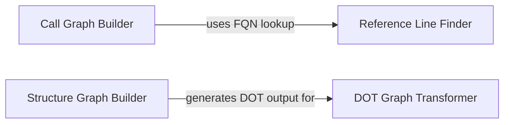

## Component Details

The Static Analysis Core component is responsible for performing comprehensive static analysis of the codebase. Its primary functions include constructing detailed call graphs to illustrate function and method invocation flows, building structure graphs to represent module and class relationships, and accurately locating fully qualified names within the source code. This component heavily relies on static analysis capabilities, particularly leveraging tools like Pylint and Pyreverse, to generate various artifacts such as DOT graph files and structured data, which are then consumed by other components within the larger system for further processing and insights.

### Reference Line Finder
This component is responsible for finding the start and end line numbers of a class, function, or method given its fully qualified name within a Python source code. It parses the source code into an Abstract Syntax Tree (AST) and traverses it to locate the specified node. For older Python versions, it includes a `LineCounter` to approximate the end line number.

**Related Classes/Methods**:

- <a href="https://github.com/CodeBoarding/CodeBoarding/blob/master/static_analyzer/reference_lines.py#L4-L52" target="_blank" rel="noopener noreferrer">`CodeBoarding.static_analyzer.reference_lines:find_fqn_location` (4:52)</a>
- <a href="https://github.com/CodeBoarding/CodeBoarding/blob/master/static_analyzer/reference_lines.py#L21-L30" target="_blank" rel="noopener noreferrer">`CodeBoarding.static_analyzer.reference_lines.find_fqn_location.find_node` (21:30)</a>
- `CodeBoarding.static_analyzer.reference_lines.find_fqn_location.LineCounter` (full file reference)
- `CodeBoarding.static_analyzer.reference_lines.find_fqn_location.LineCounter.visit` (full file reference)

### DOT Graph Transformer
This component transforms a DOT graph file, typically generated by tools like Pyreverse, into a JSON representation of package-level relationships. It loads the DOT file, scans the repository directory using a BFS approach to identify Python packages, and then filters the graph edges to include only those connections between identified packages.

**Related Classes/Methods**:

- <a href="https://github.com/CodeBoarding/CodeBoarding/blob/master/static_analyzer/pylint_graph_transform.py#L9-L65" target="_blank" rel="noopener noreferrer">`CodeBoarding.static_analyzer.pylint_graph_transform.DotGraphTransformer` (9:65)</a>
- <a href="https://github.com/CodeBoarding/CodeBoarding/blob/master/static_analyzer/pylint_graph_transform.py#L10-L13" target="_blank" rel="noopener noreferrer">`CodeBoarding.static_analyzer.pylint_graph_transform.DotGraphTransformer:__init__` (10:13)</a>
- <a href="https://github.com/CodeBoarding/CodeBoarding/blob/master/static_analyzer/pylint_graph_transform.py#L15-L19" target="_blank" rel="noopener noreferrer">`CodeBoarding.static_analyzer.pylint_graph_transform.DotGraphTransformer._load` (15:19)</a>
- <a href="https://github.com/CodeBoarding/CodeBoarding/blob/master/static_analyzer/pylint_graph_transform.py#L21-L42" target="_blank" rel="noopener noreferrer">`CodeBoarding.static_analyzer.pylint_graph_transform.DotGraphTransformer.bfs_scan_directory` (21:42)</a>
- <a href="https://github.com/CodeBoarding/CodeBoarding/blob/master/static_analyzer/pylint_graph_transform.py#L44-L65" target="_blank" rel="noopener noreferrer">`CodeBoarding.static_analyzer.pylint_graph_transform.DotGraphTransformer.transform` (44:65)</a>

### Call Graph Builder
This component builds a static call graph of Python code. It traverses Python files within a specified root directory, parses them into ASTs, and identifies function and method calls. It then constructs a directed graph where nodes represent functions/methods and edges represent calls between them. It also handles argument collection and attempts to resolve callee names.

**Related Classes/Methods**:

- <a href="https://github.com/CodeBoarding/CodeBoarding/blob/master/static_analyzer/pylint_analyze/call_graph_builder.py#L90-L245" target="_blank" rel="noopener noreferrer">`CodeBoarding.static_analyzer.pylint_analyze.call_graph_builder.CallGraphBuilder` (90:245)</a>
- <a href="https://github.com/CodeBoarding/CodeBoarding/blob/master/static_analyzer/pylint_analyze/call_graph_builder.py#L10-L37" target="_blank" rel="noopener noreferrer">`CodeBoarding.static_analyzer.pylint_analyze.call_graph_builder.DiGraph` (10:37)</a>
- <a href="https://github.com/CodeBoarding/CodeBoarding/blob/master/static_analyzer/pylint_analyze/call_graph_builder.py#L18-L21" target="_blank" rel="noopener noreferrer">`CodeBoarding.static_analyzer.pylint_analyze.call_graph_builder.DiGraph:add_edge` (18:21)</a>
- <a href="https://github.com/CodeBoarding/CodeBoarding/blob/master/static_analyzer/pylint_analyze/call_graph_builder.py#L15-L16" target="_blank" rel="noopener noreferrer">`CodeBoarding.static_analyzer.pylint_analyze.call_graph_builder.DiGraph:add_node` (15:16)</a>
- <a href="https://github.com/CodeBoarding/CodeBoarding/blob/master/static_analyzer/pylint_analyze/call_graph_builder.py#L61-L87" target="_blank" rel="noopener noreferrer">`CodeBoarding.static_analyzer.pylint_analyze.call_graph_builder:_collect_arguments` (61:87)</a>
- <a href="https://github.com/CodeBoarding/CodeBoarding/blob/master/static_analyzer/pylint_analyze/call_graph_builder.py#L40-L58" target="_blank" rel="noopener noreferrer">`CodeBoarding.static_analyzer.pylint_analyze.call_graph_builder._expr_to_str` (40:58)</a>
- <a href="https://github.com/CodeBoarding/CodeBoarding/blob/master/static_analyzer/pylint_analyze/call_graph_builder.py#L100-L105" target="_blank" rel="noopener noreferrer">`CodeBoarding.static_analyzer.pylint_analyze.call_graph_builder.CallGraphBuilder:__init__` (100:105)</a>
- <a href="https://github.com/CodeBoarding/CodeBoarding/blob/master/static_analyzer/pylint_analyze/call_graph_builder.py#L107-L125" target="_blank" rel="noopener noreferrer">`CodeBoarding.static_analyzer.pylint_analyze.call_graph_builder.CallGraphBuilder:build` (107:125)</a>
- <a href="https://github.com/CodeBoarding/CodeBoarding/blob/master/static_analyzer/pylint_analyze/call_graph_builder.py#L127-L135" target="_blank" rel="noopener noreferrer">`CodeBoarding.static_analyzer.pylint_analyze.call_graph_builder.CallGraphBuilder._iter_py_files` (127:135)</a>
- <a href="https://github.com/CodeBoarding/CodeBoarding/blob/master/static_analyzer/pylint_analyze/call_graph_builder.py#L137-L159" target="_blank" rel="noopener noreferrer">`CodeBoarding.static_analyzer.pylint_analyze.call_graph_builder.CallGraphBuilder._process_file` (137:159)</a>
- <a href="https://github.com/CodeBoarding/CodeBoarding/blob/master/static_analyzer/pylint_analyze/call_graph_builder.py#L161-L168" target="_blank" rel="noopener noreferrer">`CodeBoarding.static_analyzer.pylint_analyze.call_graph_builder.CallGraphBuilder._visit_module` (161:168)</a>
- <a href="https://github.com/CodeBoarding/CodeBoarding/blob/master/static_analyzer/pylint_analyze/call_graph_builder.py#L174-L195" target="_blank" rel="noopener noreferrer">`CodeBoarding.static_analyzer.pylint_analyze.call_graph_builder.CallGraphBuilder._visit_function` (174:195)</a>
- <a href="https://github.com/CodeBoarding/CodeBoarding/blob/master/static_analyzer/pylint_analyze/call_graph_builder.py#L170-L171" target="_blank" rel="noopener noreferrer">`CodeBoarding.static_analyzer.pylint_analyze.call_graph_builder.CallGraphBuilder._qual_name` (170:171)</a>
- <a href="https://github.com/CodeBoarding/CodeBoarding/blob/master/static_analyzer/pylint_analyze/call_graph_builder.py#L198-L216" target="_blank" rel="noopener noreferrer">`CodeBoarding.static_analyzer.pylint_analyze.call_graph_builder.CallGraphBuilder._resolve_callee` (198:216)</a>
- <a href="https://github.com/CodeBoarding/CodeBoarding/blob/master/static_analyzer/pylint_analyze/call_graph_builder.py#L219-L224" target="_blank" rel="noopener noreferrer">`CodeBoarding.static_analyzer.pylint_analyze.call_graph_builder.CallGraphBuilder._as_string` (219:224)</a>
- <a href="https://github.com/CodeBoarding/CodeBoarding/blob/master/static_analyzer/pylint_analyze/call_graph_builder.py#L236-L245" target="_blank" rel="noopener noreferrer">`CodeBoarding.static_analyzer.pylint_analyze.call_graph_builder.CallGraphBuilder.fix_reference_name` (236:245)</a>

### Structure Graph Builder
This component is responsible for building a structure graph, likely representing class and module relationships, by leveraging the `pyreverse` tool. It collects Python file paths within a given directory and then executes `pyreverse` to generate the graph data.

**Related Classes/Methods**:

- <a href="https://github.com/CodeBoarding/CodeBoarding/blob/master/static_analyzer/pylint_analyze/structure_graph_builder.py#L10-L51" target="_blank" rel="noopener noreferrer">`CodeBoarding.static_analyzer.pylint_analyze.structure_graph_builder.StructureGraphBuilder` (10:51)</a>
- <a href="https://github.com/CodeBoarding/CodeBoarding/blob/master/static_analyzer/pylint_analyze/structure_graph_builder.py#L18-L46" target="_blank" rel="noopener noreferrer">`CodeBoarding.static_analyzer.pylint_analyze.structure_graph_builder.StructureGraphBuilder:run_pyreverse` (18:46)</a>
- <a href="https://github.com/CodeBoarding/CodeBoarding/blob/master/static_analyzer/pylint_analyze/structure_graph_builder.py#L48-L51" target="_blank" rel="noopener noreferrer">`CodeBoarding.static_analyzer.pylint_analyze.structure_graph_builder.StructureGraphBuilder:build` (48:51)</a>
- <a href="https://github.com/CodeBoarding/CodeBoarding/blob/master/static_analyzer/pylint_analyze/structure_graph_builder.py#L54-L71" target="_blank" rel="noopener noreferrer">`CodeBoarding.static_analyzer.pylint_analyze.structure_graph_builder:collect_paths` (54:71)</a>
- <a href="https://github.com/CodeBoarding/CodeBoarding/blob/master/static_analyzer/pylint_analyze/structure_graph_builder.py#L59-L68" target="_blank" rel="noopener noreferrer">`CodeBoarding.static_analyzer.pylint_analyze.structure_graph_builder.collect_paths._walk` (59:68)</a>

### [FAQ](https://github.com/CodeBoarding/GeneratedOnBoardings/tree/main?tab=readme-ov-file#faq)