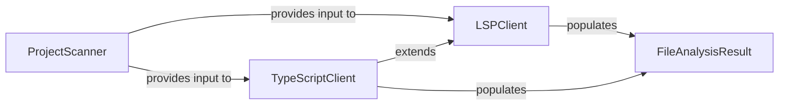

## Details

The `Static Analysis Engine` subsystem is primarily encapsulated within the `static_analyzer` package. Its core components include the `scanner` module for initial project scanning and the `lsp_client` subpackage, which handles Language Server Protocol (LSP) communication for detailed code analysis.

### ProjectScanner [[Expand]](./ProjectScanner.md)
Initiates the static analysis process by scanning the project repository. It identifies relevant source files, determines programming languages used, and extracts basic project metadata. This component acts as the initial data gatherer, preparing the input for more detailed LSP-based analysis.

**Related Classes/Methods**:

- `ProjectScanner`:13-66

### LSPClient [[Expand]](./LSPClient.md)
Serves as the generic Language Server Protocol client. It manages the communication lifecycle with an LSP server (initialization, sending requests, receiving responses, shutdown). It orchestrates the detailed static analysis for individual files and the entire workspace, extracting symbols, imports, call graphs, and class hierarchies.

**Related Classes/Methods**:

- `LSPClient`:37-923

### TypeScriptClient [[Expand]](./TypeScriptClient.md)
A specialized implementation of `LSPClient` tailored for TypeScript projects. It handles TypeScript-specific initialization parameters, workspace configuration (e.g., processing `tsconfig.json`), and file discovery, ensuring the LSP server is correctly set up for TypeScript analysis. This component exemplifies the extensibility of the static analysis engine for different programming languages.

**Related Classes/Methods**:

- `TypeScriptClient`:10-214

### FileAnalysisResult [[Expand]](./FileAnalysisResult.md)
A data structure used to encapsulate the comprehensive static analysis results for a single source file. It stores extracted information such as imports, symbols (functions, classes), call relationships, class hierarchies, and external references. This acts as the structured output of the static analysis phase.

**Related Classes/Methods**:

- `FileAnalysisResult`:22-34

### [FAQ](https://github.com/CodeBoarding/GeneratedOnBoardings/tree/main?tab=readme-ov-file#faq)