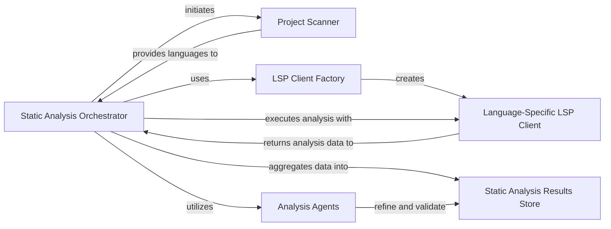

## Details

The static analysis subsystem is orchestrated by the `DiagramGenerator`, which first employs a `ProjectScanner` to identify programming languages within the repository. An `LSP Client Factory` then creates `Language-Specific LSP Clients` for each detected language. These clients perform detailed static analysis, extracting various code artifacts, which are then aggregated into a `StaticAnalysisResults` store. Finally, a suite of `Analysis Agents` further processes, refines, and validates this collected data, ultimately producing the structured analysis output used for diagram generation. This multi-stage process ensures comprehensive and accurate code analysis.

### Static Analysis Orchestrator
This component, embodied by the `DiagramGenerator` class, orchestrates the entire static analysis workflow. It initiates project scanning, manages the creation and execution of language-specific LSP clients, aggregates their results, and then uses various agents to refine and process this data for diagram generation.

**Related Classes/Methods**:

- <a href="https://github.com/CodeBoarding/CodeBoarding/blob/main/diagram_analysis/diagram_generator.py" target="_blank" rel="noopener noreferrer">`diagram_analysis.diagram_generator.DiagramGenerator:generate_static_analysis`</a>
- <a href="https://github.com/CodeBoarding/CodeBoarding/blob/main/diagram_analysis/diagram_generator.py" target="_blank" rel="noopener noreferrer">`diagram_analysis.diagram_generator.DiagramGenerator:generate_analysis`</a>

### Project Scanner
Responsible for scanning the codebase to identify all programming languages present within the repository. It provides this information to the `Static Analysis Orchestrator` to determine which language-specific analysis tools are required.

**Related Classes/Methods**:

- <a href="https://github.com/CodeBoarding/CodeBoarding/blob/main/static_analyzer/scanner.py" target="_blank" rel="noopener noreferrer">`static_analyzer.scanner.ProjectScanner:scan`</a>

### LSP Client Factory
This component is responsible for instantiating and configuring the appropriate language-specific LSP clients based on the identified programming languages. It abstracts the creation logic for different language analysis tools. The `create_clients` function serves this role.

**Related Classes/Methods**:

### Language-Specific LSP Client
This component represents an interface or concrete implementation for a specific programming language's LSP client. It connects to the respective Language Server, executes static analysis, and extracts various code analysis artifacts (e.g., references, call graphs, class hierarchies, package dependencies).

**Related Classes/Methods**:

- <a href="https://github.com/CodeBoarding/CodeBoarding/blob/main/static_analyzer/lsp_client/client.py" target="_blank" rel="noopener noreferrer">`static_analyzer.lsp_client.client.LSPClient:build_static_analysis`</a>

### Static Analysis Results Store
This component, represented by `StaticAnalysisResults`, serves as an aggregation and storage mechanism for all collected static analysis data from various language-specific LSP clients. It provides a unified structure for the raw analysis output before it's passed to subsequent interpretation or generation phases.

**Related Classes/Methods**:

- <a href="https://github.com/CodeBoarding/CodeBoarding/blob/main/static_analyzer/analysis_result.py#L6-L138" target="_blank" rel="noopener noreferrer">`static_analyzer.analysis_result.StaticAnalysisResults`:6-138</a>

### Analysis Agents
This group of components (MetaAgent, DetailsAgent, AbstractionAgent, PlannerAgent, ValidatorAgent, DiffAnalyzingAgent) is responsible for further processing, refining, validating, and planning the analysis based on the initial static analysis results. They apply feedback and generate the final structured analysis output.

**Related Classes/Methods**:

- <a href="https://github.com/CodeBoarding/CodeBoarding/blob/main/agents/meta_agent.py#L15-L37" target="_blank" rel="noopener noreferrer">`agents.meta_agent.MetaAgent`:15-37</a>
- <a href="https://github.com/CodeBoarding/CodeBoarding/blob/main/agents/details_agent.py#L16-L113" target="_blank" rel="noopener noreferrer">`agents.details_agent.DetailsAgent`:16-113</a>
- <a href="https://github.com/CodeBoarding/CodeBoarding/blob/main/agents/abstraction_agent.py#L14-L100" target="_blank" rel="noopener noreferrer">`agents.abstraction_agent.AbstractionAgent`:14-100</a>
- <a href="https://github.com/CodeBoarding/CodeBoarding/blob/main/agents/planner_agent.py#L13-L31" target="_blank" rel="noopener noreferrer">`agents.planner_agent.PlannerAgent`:13-31</a>
- <a href="https://github.com/CodeBoarding/CodeBoarding/blob/main/agents/validator_agent.py#L15-L143" target="_blank" rel="noopener noreferrer">`agents.validator_agent.ValidatorAgent`:15-143</a>
- <a href="https://github.com/CodeBoarding/CodeBoarding/blob/main/agents/diff_analyzer.py#L20-L136" target="_blank" rel="noopener noreferrer">`agents.diff_analyzer.DiffAnalyzingAgent`:20-136</a>

### [FAQ](https://github.com/CodeBoarding/GeneratedOnBoardings/tree/main?tab=readme-ov-file#faq)