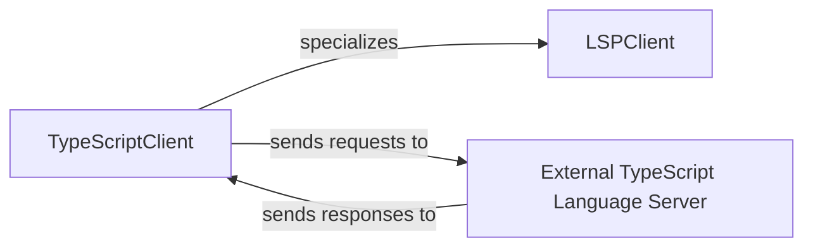

## Details

The static analysis engine for TypeScript projects is centered around the TypeScriptClient, which extends the generic LSPClient to provide language-specific functionalities. The TypeScriptClient acts as the primary interface, managing the communication with an External TypeScript Language Server by sending requests and receiving responses. It is also responsible for configuring the TypeScript workspace by processing configuration files like tsconfig.json and discovering relevant source files within the project. This design allows for a clear separation of concerns, with the LSPClient providing the core protocol handling and the TypeScriptClient adding the necessary language-specific intelligence and project setup, while offloading the heavy analysis to an external, specialized server.

### TypeScriptClient [[Expand]](./TypeScriptClient.md)
A specialized implementation of LSPClient tailored for TypeScript and JavaScript projects. It manages the lifecycle of the connection with the External TypeScript Language Server, including initialization, sending requests, and processing responses. This component is also responsible for TypeScript-specific workspace configuration (e.g., processing tsconfig.json, jsconfig.json, and package.json files via _process_config_files) and file discovery (_find_typescript_files) to ensure the LSP server is correctly set up for analysis. It handles the bootstrapping of the project by opening and closing sample files.

**Related Classes/Methods**:

- <a href="https://github.com/CodeBoarding/CodeBoarding/blob/main/static_analyzer/lsp_client/typescript_client.py#L10-L214" target="_blank" rel="noopener noreferrer">`static_analyzer.lsp_client.typescript_client.TypeScriptClient`:10-214</a>

### LSPClient [[Expand]](./LSPClient.md)
The foundational component that TypeScriptClient extends, providing general Language Server Protocol (LSP) client functionalities. It abstracts common communication patterns, request/response handling, and lifecycle management required for interacting with any LSP-compliant server. This component establishes the core mechanism for sending notifications and requests, and waiting for responses from an LSP server.

**Related Classes/Methods**:

### External TypeScript Language Server
An independent, external process or service that TypeScriptClient communicates with via the Language Server Protocol. This server performs the actual in-depth static analysis, type checking, and code intelligence for TypeScript and JavaScript, returning diagnostic information and structural data to the TypeScriptClient. As an external component, it does not have source code within this project.

**Related Classes/Methods**: _None_

### [FAQ](https://github.com/CodeBoarding/GeneratedOnBoardings/tree/main?tab=readme-ov-file#faq)