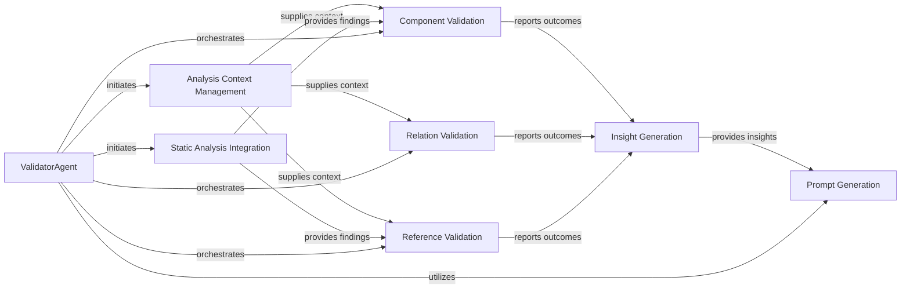

## Details

The `ValidatorAgent` subsystem serves as the core architectural validation engine, orchestrating a comprehensive process to ensure the accuracy and consistency of identified components, their relationships, and code references. It centralizes functionalities for managing codebase context, integrating static analysis findings, and performing detailed validation checks. All validation outcomes are synthesized by the `Insight Generation` responsibility, which then informs the `Prompt Generation` responsibility to create structured prompts for external Large Language Model (LLM) agents. This design establishes the `ValidatorAgent` as a robust, pipeline-driven component responsible for the end-to-end validation and preparatory steps for AI-driven architectural analysis.

### ValidatorAgent
The `ValidatorAgent` is the central orchestrator of the architectural validation process. It integrates and coordinates various internal functionalities to verify the correctness, consistency, and structural integrity of identified components, their relationships, and code references within the codebase. This component embodies a "Pipeline/Orchestration" pattern, guiding the validation through distinct stages from context acquisition to prompt generation for external systems.

**Related Classes/Methods**:

- <a href="https://github.com/CodeBoarding/CodeBoarding/blob/main/agents/validator_agent.py#L15-L143" target="_blank" rel="noopener noreferrer">`agents.validator_agent.ValidatorAgent`:15-143</a>

### Analysis Context Management
Provides a unified access point to the current codebase context, including repository details, file paths, language information, and Abstract Syntax Tree (AST) nodes. It acts as a central data provider for various validation steps.

**Related Classes/Methods**: _None_

### Static Analysis Integration
Integrates and leverages findings from external static analysis tools to enrich the validation process, providing additional data points and insights.

**Related Classes/Methods**:

- <a href="https://github.com/CodeBoarding/CodeBoarding/blob/main/agents/validator_agent.py" target="_blank" rel="noopener noreferrer">`agents.validator_agent.ValidatorAgent:static_analysis`</a>

### Component Validation
Focuses on verifying the correctness, completeness, and structural integrity of identified architectural components.

**Related Classes/Methods**:

- <a href="https://github.com/CodeBoarding/CodeBoarding/blob/main/agents/validator_agent.py" target="_blank" rel="noopener noreferrer">`agents.validator_agent.ValidatorAgent:validate_components`</a>

### Relation Validation
Assesses the validity, consistency, and logical correctness of relationships and interactions between different components and other code entities.

**Related Classes/Methods**:

- <a href="https://github.com/CodeBoarding/CodeBoarding/blob/main/agents/validator_agent.py" target="_blank" rel="noopener noreferrer">`agents.validator_agent.ValidatorAgent:validate_relations`</a>
- <a href="https://github.com/CodeBoarding/CodeBoarding/blob/main/agents/validator_agent.py" target="_blank" rel="noopener noreferrer">`agents.validator_agent.ValidatorAgent:validate_component_relations`</a>

### Reference Validation
Checks the accuracy, existence, and proper resolution of code references (e.g., imports, function calls, class instantiations) within the codebase.

**Related Classes/Methods**:

- <a href="https://github.com/CodeBoarding/CodeBoarding/blob/main/agents/validator_agent.py" target="_blank" rel="noopener noreferrer">`agents.validator_agent.ValidatorAgent:validate_references`</a>

### Insight Generation
Aggregates and synthesizes the results from all individual validation checks, providing a comprehensive assessment of the codebase's validity.

**Related Classes/Methods**: _None_

### Prompt Generation
Formulates structured prompts based on the aggregated validation results. These prompts are designed to guide external Large Language Model (LLM) agents for further analysis, refinement, or documentation generation.

**Related Classes/Methods**:

- <a href="https://github.com/CodeBoarding/CodeBoarding/blob/main/agents/validator_agent.py" target="_blank" rel="noopener noreferrer">`agents.validator_agent.ValidatorAgent:valid_component_prompt`</a>
- <a href="https://github.com/CodeBoarding/CodeBoarding/blob/main/agents/validator_agent.py" target="_blank" rel="noopener noreferrer">`agents.validator_agent.ValidatorAgent:valid_relations_prompt`</a>

### [FAQ](https://github.com/CodeBoarding/GeneratedOnBoardings/tree/main?tab=readme-ov-file#faq)