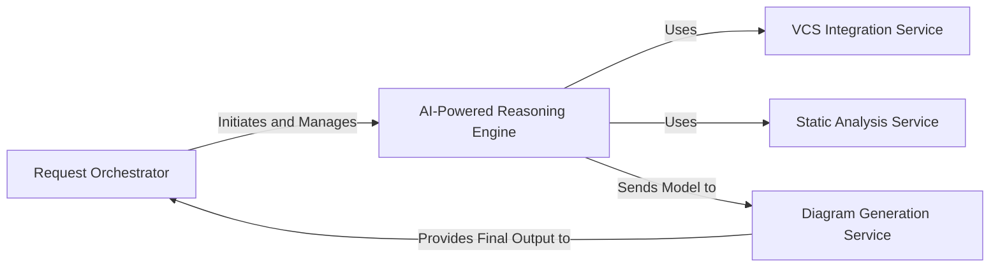

## Details

One paragraph explaining the functionality which is represented by this graph. What the main flow is and what is its purpose.

### Request Orchestrator [[Expand]](./Request_Orchestrator.md)
Serves as the primary entry point and orchestrator for the entire system. It exposes a RESTful API to accept analysis jobs, manages a job queue, and orchestrates the pipeline of services required to generate the final diagram. It is responsible for initiating the analysis and returning the final result upon completion.

**Related Classes/Methods**:

- `local_app.py`
- `github_action.py`

### VCS Integration Service
Handles all interactions with the version control system (Git). Its responsibilities include cloning the target repository, checking out specific branches, and providing tools to read file contents and compute differences (`git diff`) between commits. This service provides the raw source code and change history to the reasoning engine.

**Related Classes/Methods**:

- `repo_utils.py`
- `agents/tools/read_git_diff.py`

### Static Analysis Service
This service is responsible for low-level static code analysis. It takes source code provided by the VCS Integration Service and generates detailed structural representations, such as Control Flow Graphs (CFGs) and module dependencies. These graphs are the primary input for the AI engine.

**Related Classes/Methods**:

- `agents/tools/read_cfg.py`
- `agents/tools/read_structure.py`

### AI-Powered Reasoning Engine [[Expand]](./AI_Powered_Reasoning_Engine.md)
The intelligent core of the system. It uses a lead agent (`MetaAgent`) to coordinate a team of specialized AI agents (`Planner`, `Abstraction`). This engine consumes the structural graphs from the Static Analysis Service to reason about the software's architecture, identify key components, and build a high-level conceptual model.

**Related Classes/Methods**:

- `agents/meta_agent.py`
- `agents/planner_agent.py`
- `agents/abstraction_agent.py`

### Diagram Generation Service
The final stage in the pipeline. It receives the high-level conceptual model from the AI-Powered Reasoning Engine and translates it into a concrete visual representation. It generates the DOT graph file and any accompanying documentation (e.g., Markdown).

**Related Classes/Methods**:

- `diagram_analysis/diagram_generator.py`
- `output_generators/`

### [FAQ](https://github.com/CodeBoarding/GeneratedOnBoardings/tree/main?tab=readme-ov-file#faq)