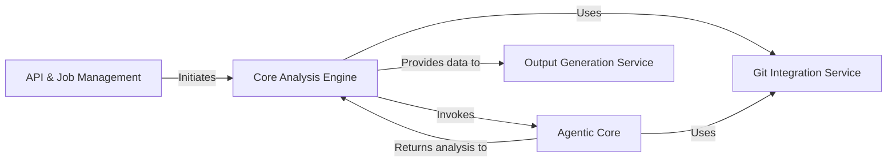

## Details

One paragraph explaining the functionality which is represented by this graph. What the main flow is and what is its purpose.

### API & Job Management [[Expand]](./API_Job_Management.md)
The user-facing entry point for the system, built on FastAPI for serverless compatibility. It is responsible for handling incoming HTTP requests to initiate analysis, creating and managing job states via a lightweight DuckDB database, and returning job identifiers to the client.

**Related Classes/Methods**:

- `local_app.py`
- `duckdb_crud.py`
- `github_action.py`

### Core Analysis Engine [[Expand]](./Core_Analysis_Engine.md)
The central orchestrator that manages the end-to-end analysis workflow. It is triggered by the API and coordinates the other components, starting with fetching the repository, invoking the AI agents for analysis, and finally passing the resulting data to the output generators.

**Related Classes/Methods**:

- `diagram_analysis/diagram_generator.py`

### Git Integration Service
A dedicated service that encapsulates all interactions with Git repositories. It provides a clean interface for cloning repositories, checking out specific commits or branches, and calculating code diffs, supplying the rest of the system with access to the source code and its history.

**Related Classes/Methods**:

- `repo_utils.py`
- `agents/tools/read_git_diff.py`

### Agentic Core [[Expand]](./Agentic_Core.md)
The intelligent heart of the application, built with LangGraph. It is a multi-agent system where specialized AI agents (e.g., Planner, Validator) collaborate to understand the codebase. This component is equipped with a suite of tools to perform static analysis, read files, and query the Git service for contextual information.

**Related Classes/Methods**:

- `agents/agent.py`
- `agents/planner_agent.py`
- `agents/validator_agent.py`
- `agents/abstraction_agent.py`
- `agents/details_agent.py`

### Output Generation Service [[Expand]](./Output_Generation_Service.md)
A modular service responsible for transforming the final, structured analysis data from the Core Analysis Engine into various human-readable formats. It contains separate generators for outputs like HTML, Markdown, and Sphinx documentation, making the system easily extensible.

**Related Classes/Methods**:

- `output_generators/html.py`
- `output_generators/markdown.py`
- `output_generators/sphinx.py`

### [FAQ](https://github.com/CodeBoarding/GeneratedOnBoardings/tree/main?tab=readme-ov-file#faq)