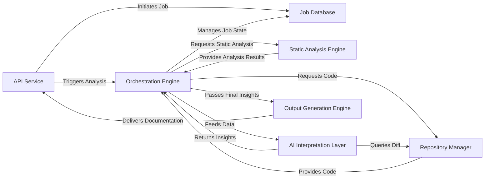

## Details

The CodeBoarding system operates as a sophisticated pipeline for automated architectural documentation. It begins with the API Service receiving a request, which is then logged and managed by the Job Database. The Orchestration Engine serves as the central nervous system, coordinating the entire analysis process. It first directs the Repository Manager to fetch the target codebase. This code then undergoes structural examination by the Static Analysis Engine. The resulting raw data is intelligently processed by the AI Interpretation Layer, a suite of agents that abstract, detail, plan, validate, and analyze changes within the architecture. Finally, the refined architectural insights are passed to the Output Generation Engine to produce various documentation formats, completing the cycle by making the output accessible via the API Service. This design emphasizes a clear, sequential flow, distinct component responsibilities, and extensibility for future language and AI model integrations.

### API Service [[Expand]](./API_Service.md)
The external interface for CodeBoarding, handling user requests, job initiation, and status retrieval.

**Related Classes/Methods**:

- `local_app`

### Job Database
Persistent storage for managing the lifecycle, status, and results of all documentation generation jobs.

**Related Classes/Methods**:

- `duckdb_crud`

### Orchestration Engine [[Expand]](./Orchestration_Engine.md)
The central control unit that manages the entire documentation generation pipeline, coordinating all analysis and generation stages.

**Related Classes/Methods**:

- `diagram_generator`

### Repository Manager [[Expand]](./Repository_Manager.md)
Manages all interactions with source code repositories, including cloning, fetching, and extracting version differences.

**Related Classes/Methods**:

- `__init__`:21-32
- `git_diff`:27-76

### Static Analysis Engine [[Expand]](./Static_Analysis_Engine.md)
Performs deep, language-specific analysis of source code to extract structural information without semantic interpretation.

**Related Classes/Methods**:

- `scanner`:13-66
- `client`:10-214

### AI Interpretation Layer [[Expand]](./AI_Interpretation_Layer.md)
A collection of specialized AI agents that interpret static analysis data to generate high-level architectural insights, including abstraction, detailing, planning, validation, and diff analysis.

**Related Classes/Methods**:

- `meta_agent`
- `abstraction_agent`
- `details_agent`
- `planner_agent`
- `validator_agent`
- `diff_analyzer`

### Output Generation Engine [[Expand]](./Output_Generation_Engine.md)
Transforms the final, validated architectural insights into various human-readable and diagram-friendly documentation formats.

**Related Classes/Methods**:

- `html`:36-50
- `markdown`:19-33
- `mdx`:53-67
- `sphinx`

### [FAQ](https://github.com/CodeBoarding/GeneratedOnBoardings/tree/main?tab=readme-ov-file#faq)