```mermaid
graph LR
    Static_Analysis_Core["Static Analysis Core"]
    Agent_Framework["Agent Framework"]
    Details_Agent["Details Agent"]
    Abstraction_Agent["Abstraction Agent"]
    Code_Exploration_Tools["Code Exploration Tools"]
    Outreach_Utilities["Outreach Utilities"]
    Agent_Framework -- "provides base for" --> Details_Agent
    Agent_Framework -- "provides base for" --> Abstraction_Agent
    Agent_Framework -- "utilizes" --> Code_Exploration_Tools
    Details_Agent -- "orchestrates analysis with" --> Static_Analysis_Core
    Abstraction_Agent -- "orchestrates analysis with" --> Static_Analysis_Core
    Code_Exploration_Tools -- "accesses data from" --> Static_Analysis_Core
    Static_Analysis_Core -- "generates artifacts for" --> Code_Exploration_Tools
    click Static_Analysis_Core href "https://github.com/CodeBoarding/GeneratedOnBoardings/blob/main/CodeBoarding/Static Analysis Core.md" "Details"
    click Agent_Framework href "https://github.com/CodeBoarding/GeneratedOnBoardings/blob/main/CodeBoarding/Agent Framework.md" "Details"
    click Details_Agent href "https://github.com/CodeBoarding/GeneratedOnBoardings/blob/main/CodeBoarding/Details Agent.md" "Details"
    click Abstraction_Agent href "https://github.com/CodeBoarding/GeneratedOnBoardings/blob/main/CodeBoarding/Abstraction Agent.md" "Details"
    click Code_Exploration_Tools href "https://github.com/CodeBoarding/GeneratedOnBoardings/blob/main/CodeBoarding/Code Exploration Tools.md" "Details"
    click Outreach_Utilities href "https://github.com/CodeBoarding/GeneratedOnBoardings/blob/main/CodeBoarding/Outreach Utilities.md" "Details"
```

## Component Details

The CodeBoarding project provides an intelligent agent-based system for comprehensive code analysis and understanding. It leverages static analysis techniques to build detailed representations of the codebase, which are then utilized by specialized agents (Details Agent and Abstraction Agent) to generate in-depth or high-level insights. The system also includes tools for code exploration and utilities for automating the outreach process by integrating analysis results into Git repositories.

### Static Analysis Core
This component is responsible for performing static analysis of the codebase, including building call graphs, structure graphs, and locating fully qualified names. It leverages Pylint for its analysis capabilities and generates artifacts consumed by other components.

**Related Classes/Methods**:

- <a href="https://github.com/CodeBoarding/CodeBoarding/blob/master/static_analyzer/reference_lines.py#L4-L52" target="_blank" rel="noopener noreferrer">`CodeBoarding.static_analyzer.reference_lines:find_fqn_location` (4:52)</a>
- <a href="https://github.com/CodeBoarding/CodeBoarding/blob/master/static_analyzer/pylint_graph_transform.py#L9-L65" target="_blank" rel="noopener noreferrer">`CodeBoarding.static_analyzer.pylint_graph_transform.DotGraphTransformer` (9:65)</a>
- <a href="https://github.com/CodeBoarding/CodeBoarding/blob/master/static_analyzer/pylint_analyze/call_graph_builder.py#L90-L245" target="_blank" rel="noopener noreferrer">`CodeBoarding.static_analyzer.pylint_analyze.call_graph_builder.CallGraphBuilder` (90:245)</a>
- <a href="https://github.com/CodeBoarding/CodeBoarding/blob/master/static_analyzer/pylint_analyze/structure_graph_builder.py#L10-L51" target="_blank" rel="noopener noreferrer">`CodeBoarding.static_analyzer.pylint_analyze.structure_graph_builder.StructureGraphBuilder` (10:51)</a>

### Agent Framework
This component provides the foundational structure for all intelligent agents within CodeBoarding. It defines common functionalities such as environment variable setup, language model (LLM) initialization, and mechanisms for invoking and parsing results from various tools. It also includes functionality to fix source code reference lines.

**Related Classes/Methods**:

- <a href="https://github.com/CodeBoarding/CodeBoarding/blob/master/agents/agent.py#L19-L89" target="_blank" rel="noopener noreferrer">`CodeBoarding.agents.agent.CodeBoardingAgent` (19:89)</a>

### Details Agent
The Details Agent specializes in performing in-depth analysis of the codebase. It focuses on generating detailed control flow graphs (CFG), sub-CFGs, enhancing structural understanding, and conducting comprehensive code analysis by orchestrating specific prompts and parsers.

**Related Classes/Methods**:

- <a href="https://github.com/CodeBoarding/CodeBoarding/blob/master/agents/details_agent.py#L12-L76" target="_blank" rel="noopener noreferrer">`CodeBoarding.agents.details_agent.DetailsAgent` (12:76)</a>

### Abstraction Agent
The Abstraction Agent is designed to provide a higher-level view of the codebase. Its primary responsibilities include generating abstract control flow graphs and analyzing source code to derive abstract representations and insights, using specific prompts and parsers for this purpose.

**Related Classes/Methods**:

- <a href="https://github.com/CodeBoarding/CodeBoarding/blob/master/agents/abstraction_agent.py#L11-L72" target="_blank" rel="noopener noreferrer">`CodeBoarding.agents.abstraction_agent.AbstractionAgent` (11:72)</a>

### Code Exploration Tools
This component provides a set of utility tools for agents to interact with the codebase. It includes functionalities for reading source code files, exploring package relationships, and understanding the overall code structure, acting as an interface to the underlying codebase and static analysis artifacts.

**Related Classes/Methods**:

- <a href="https://github.com/CodeBoarding/CodeBoarding/blob/master/agents/tools/read_packages.py#L25-L74" target="_blank" rel="noopener noreferrer">`CodeBoarding.agents.tools.read_packages.PackageRelationsTool` (25:74)</a>
- <a href="https://github.com/CodeBoarding/CodeBoarding/blob/master/agents/tools/read_source.py#L19-L137" target="_blank" rel="noopener noreferrer">`CodeBoarding.agents.tools.read_source.CodeExplorerTool` (19:137)</a>
- <a href="https://github.com/CodeBoarding/CodeBoarding/blob/master/agents/tools/read_structure.py#L12-L58" target="_blank" rel="noopener noreferrer">`CodeBoarding.agents.tools.read_structure.CodeStructureTool` (12:58)</a>

### Outreach Utilities
This component contains utility functions primarily used for external interactions with Git repositories. It automates tasks such as cloning repositories, copying generated analysis reports (markdown files) into a designated .codeboarding directory within the cloned repository, and then committing and pushing these changes.

**Related Classes/Methods**:

- `CodeBoarding.outreach_utils.pr_util` (full file reference)

### [FAQ](https://github.com/CodeBoarding/GeneratedOnBoardings/tree/main?tab=readme-ov-file#faq)