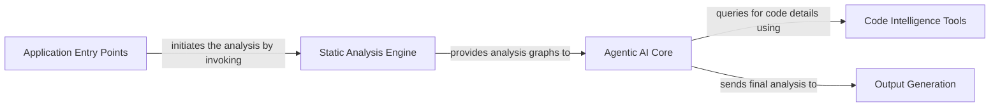

## Details

I have reviewed the feedback and the project's file structure. The original analysis correctly identified the high-level components, but it lacked specific source code references as pointed out. I will now update the analysis to include these references, based on my examination of the file structure and key files.

### Application Entry Points
Provides multiple interfaces (e.g., local script, GitHub Action) to initiate a code analysis task, acting as the trigger for the entire pipeline.

**Related Classes/Methods**:

- `local_app.py`
- `github_action.py`

### Static Analysis Engine
Parses the target source code using static analysis techniques to build foundational graph-based representations (e.g., call graphs) of the code's structure.

**Related Classes/Methods**:

- <a href="https://github.com/CodeBoarding/CodeBoarding/blob/main/diagram_analysis/diagram_generator.py#L23-L211" target="_blank" rel="noopener noreferrer">`diagram_analysis.diagram_generator.DiagramGenerator` (23:211)</a>

### Agentic AI Core [[Expand]](./Agentic_AI_Core.md)
The cognitive center of the system; it uses a team of specialized AI agents to collaboratively analyze and interpret the data from the Static Analysis Engine to build a high-level understanding of the software architecture.

**Related Classes/Methods**:

- `agents`
- `agents.agent.Agent`
- <a href="https://github.com/CodeBoarding/CodeBoarding/blob/main/agents/meta_agent.py#L9-L40" target="_blank" rel="noopener noreferrer">`agents.meta_agent.MetaAgent` (9:40)</a>
- <a href="https://github.com/CodeBoarding/CodeBoarding/blob/main/agents/planner_agent.py#L9-L27" target="_blank" rel="noopener noreferrer">`agents.planner_agent.PlannerAgent` (9:27)</a>

### Code Intelligence Tools
A collection of functions provided to the Agentic AI Core, enabling agents to perform "read" operations on the codebase (e.g., access files, analyze dependencies) to gather evidence and enrich their analysis.

**Related Classes/Methods**:

- `agents.tools`

### Output Generation
The final stage of the pipeline that takes the conceptual analysis from the AI Core and renders it into various user-friendly formats, such as diagrams, HTML reports, and Markdown files.

**Related Classes/Methods**:

- `output_generators`
- <a href="https://github.com/CodeBoarding/CodeBoarding/blob/main/output_generators/html.py#L124-L134" target="_blank" rel="noopener noreferrer">`output_generators.html.generate_html_file` (124:134)</a>
- <a href="https://github.com/CodeBoarding/CodeBoarding/blob/main/output_generators/markdown.py#L94-L101" target="_blank" rel="noopener noreferrer">`output_generators.markdown.generate_markdown_file` (94:101)</a>

### [FAQ](https://github.com/CodeBoarding/GeneratedOnBoardings/tree/main?tab=readme-ov-file#faq)