```mermaid
graph LR
    API_User_Interface_Layer["API & User Interface Layer"]
    Agent_Orchestration_Workflow_Management["Agent Orchestration & Workflow Management"]
    AI_Agent_Core_Specialized_Agents["AI Agent Core & Specialized Agents"]
    Agent_Tooling_External_Interaction["Agent Tooling & External Interaction"]
    Static_Code_Analysis_Engine["Static Code Analysis Engine"]
    Diagram_Visualization_Generation["Diagram & Visualization Generation"]
    Data_Management_Persistence["Data Management & Persistence"]
    LLM_Interaction_Core_Services["LLM Interaction & Core Services"]
    API_User_Interface_Layer -- "Initiates workflows" --> Agent_Orchestration_Workflow_Management
    API_User_Interface_Layer -- "Receives results" --> Agent_Orchestration_Workflow_Management
    Agent_Orchestration_Workflow_Management -- "Coordinates/Invokes" --> AI_Agent_Core_Specialized_Agents
    Agent_Orchestration_Workflow_Management -- "Interacts with" --> LLM_Interaction_Core_Services
    Agent_Orchestration_Workflow_Management -- "Stores/Retrieves data" --> Data_Management_Persistence
    Agent_Orchestration_Workflow_Management -- "Triggers" --> Static_Code_Analysis_Engine
    Agent_Orchestration_Workflow_Management -- "Triggers" --> Diagram_Visualization_Generation
    AI_Agent_Core_Specialized_Agents -- "Utilizes" --> Agent_Tooling_External_Interaction
    AI_Agent_Core_Specialized_Agents -- "Interacts with" --> LLM_Interaction_Core_Services
    AI_Agent_Core_Specialized_Agents -- "Consumes data from" --> Static_Code_Analysis_Engine
    AI_Agent_Core_Specialized_Agents -- "Stores outputs in" --> Data_Management_Persistence
    Agent_Tooling_External_Interaction -- "Provides capabilities to" --> AI_Agent_Core_Specialized_Agents
    Agent_Tooling_External_Interaction -- "Provides input to" --> Static_Code_Analysis_Engine
    Static_Code_Analysis_Engine -- "Provides data to" --> AI_Agent_Core_Specialized_Agents
    Static_Code_Analysis_Engine -- "Feeds data to" --> Diagram_Visualization_Generation
    Diagram_Visualization_Generation -- "Consumes input from" --> Static_Code_Analysis_Engine
    Diagram_Visualization_Generation -- "Stores diagrams in" --> Data_Management_Persistence
    Data_Management_Persistence -- "Provides data to" --> API_User_Interface_Layer
    Data_Management_Persistence -- "Accessed by" --> Agent_Orchestration_Workflow_Management
    Data_Management_Persistence -- "Accessed by" --> AI_Agent_Core_Specialized_Agents
    Data_Management_Persistence -- "Accessed by" --> Diagram_Visualization_Generation
    Data_Management_Persistence -- "Accessed by" --> LLM_Interaction_Core_Services
    LLM_Interaction_Core_Services -- "Accessed by" --> Agent_Orchestration_Workflow_Management
    LLM_Interaction_Core_Services -- "Accessed by" --> AI_Agent_Core_Specialized_Agents
```

## Details

One paragraph explaining the functionality which is represented by this graph. What the main flow is and what is its purpose.

### API & User Interface Layer
Serves as the primary interface for external interaction, handling incoming requests and defining public API endpoints, and presenting analysis results and diagrams to the user.

**Related Classes/Methods**: _None_

### Agent Orchestration & Workflow Management
Manages the overall flow of operations, coordinates multiple AI agents, and orchestrates complex analysis workflows, ensuring agents are invoked in the correct sequence and their outputs are handled.

**Related Classes/Methods**: _None_

### AI Agent Core & Specialized Agents
Provides the foundational structure for all AI agents and houses distinct AI agents, each designed for specific code analysis or understanding tasks (e.g., details extraction, planning, validation, abstraction, diff analysis).

**Related Classes/Methods**: _None_

### Agent Tooling & External Interaction
Offers a suite of specialized tools that AI agents can use to interact with the codebase, file system, documentation, and other external resources (e.g., Git repositories), acting as the interface for agents to retrieve specific information.

**Related Classes/Methods**: _None_

### Static Code Analysis Engine
Performs static code analysis to generate various structural and relational graphs of the codebase, such as call graphs and structure graphs, and includes components for building and transforming these graphs into standard formats.

**Related Classes/Methods**: _None_

### Diagram & Visualization Generation
Focuses on creating visual representations (diagrams) from the analyzed code data, taking structured information, often in graph format from the Static Code Analysis Engine, and rendering it into human-readable diagrams.

**Related Classes/Methods**: _None_

### Data Management & Persistence
Manages data storage, retrieval, and persistence for analysis results, configurations, and potentially cached information, including database models, connections (e.g., DuckDB), and repositories.

**Related Classes/Methods**: _None_

### LLM Interaction & Core Services
Provides shared services, primarily handling interactions with Large Language Models (LLMs) for AI-driven tasks, abstracting the LLM API calls, and potentially including caching mechanisms and other general utilities.

**Related Classes/Methods**: _None_

### [FAQ](https://github.com/CodeBoarding/GeneratedOnBoardings/tree/main?tab=readme-ov-file#faq)