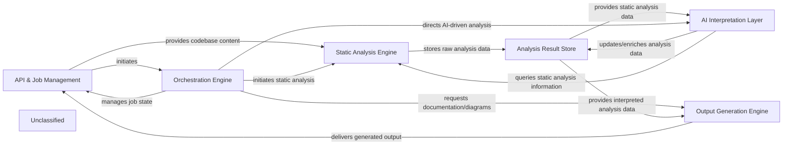

## Details

The `codeboarding` project operates as a sophisticated pipeline for transforming raw code into comprehensive architectural documentation and diagrams. The process begins with the API & Job Management component, which serves as the external interface, receiving user requests, cloning repositories, and initiating analysis jobs. This triggers the Orchestration Engine, the central coordinator that sequences the entire workflow. The Orchestration Engine first directs the Static Analysis Engine to perform deep code analysis, extracting structural and behavioral insights. These raw analysis results are then stored in the Analysis Result Store. Subsequently, the Orchestration Engine guides the AI Interpretation Layer, which leverages various LLM agents to interpret the static analysis data, generate high-level insights, and enrich the Analysis Result Store. Finally, the Output Generation Engine consumes the interpreted data from the Analysis Result Store to produce human-readable documentation and visual diagrams, which are then delivered back through the API & Job Management component. Data Models underpin the entire system, ensuring consistent data structures across all components.

### API & Job Management
Manages external requests, job lifecycle, repository interactions, and final output delivery.

**Related Classes/Methods**:

- <a href="https://github.com/codeboarding/codeboarding//bloblocal_app.py" target="_blank" rel="noopener noreferrer">`start_generation_job`</a>
- <a href="https://github.com/codeboarding/codeboarding//blobduckdb_crud.py" target="_blank" rel="noopener noreferrer">`insert_job`</a>
- <a href="https://github.com/codeboarding/codeboarding//blobrepo_utils/__init__.py" target="_blank" rel="noopener noreferrer">`clone_repository`</a>

### Orchestration Engine
The central workflow coordinator, sequencing analysis steps and directing data flow between components.

**Related Classes/Methods**:

- <a href="https://github.com/codeboarding/codeboarding//blobdiagram_analysis/diagram_generator.py" target="_blank" rel="noopener noreferrer">`generate_analysis`</a>

### Static Analysis Engine
Performs deep code analysis using LSP clients to extract structural and behavioral code information.

**Related Classes/Methods**:

- <a href="https://github.com/codeboarding/codeboarding//blobstatic_analyzer/lsp_client/client.py" target="_blank" rel="noopener noreferrer">`LSPClient.build_static_analysis`</a>
- <a href="https://github.com/codeboarding/codeboarding//blobstatic_analyzer/lsp_client/typescript_client.py" target="_blank" rel="noopener noreferrer">`TypeScriptClient._initialize`</a>

### Analysis Result Store
A dedicated repository for storing and managing all intermediate and final analysis results, including raw static data and AI-interpreted insights.

**Related Classes/Methods**:

- <a href="https://github.com/codeboarding/codeboarding//blobstatic_analyzer/analysis_result.py" target="_blank" rel="noopener noreferrer">`StaticAnalysisResults`</a>

### AI Interpretation Layer
Utilizes Large Language Models (LLMs) to interpret static analysis data, generate high-level insights, plan further analysis, and validate findings.

**Related Classes/Methods**:

- <a href="https://github.com/codeboarding/codeboarding//blobagents/agent.py" target="_blank" rel="noopener noreferrer">`CodeBoardingAgent._invoke`</a>
- <a href="https://github.com/codeboarding/codeboarding//blobagents/planner_agent.py" target="_blank" rel="noopener noreferrer">`PlannerAgent.plan_analysis`</a>
- <a href="https://github.com/codeboarding/codeboarding//blobagents/abstraction_agent.py" target="_blank" rel="noopener noreferrer">`AbstractionAgent.run`</a>
- <a href="https://github.com/codeboarding/codeboarding//blobagents/validator_agent.py" target="_blank" rel="noopener noreferrer">`ValidatorAgent.run`</a>

### Output Generation Engine
Transforms interpreted analysis results into various human-readable formats, suchs as Markdown, HTML documentation, and visual diagrams.

**Related Classes/Methods**:

- <a href="https://github.com/codeboarding/codeboarding//bloboutput_generators/markdown.py" target="_blank" rel="noopener noreferrer">`generate_markdown`</a>
- <a href="https://github.com/codeboarding/codeboarding//bloboutput_generators/html.py" target="_blank" rel="noopener noreferrer">`generate_html`</a>

### Unclassified
Component for all unclassified files and utility functions (Utility functions/External Libraries/Dependencies)

**Related Classes/Methods**: _None_

### [FAQ](https://github.com/CodeBoarding/GeneratedOnBoardings/tree/main?tab=readme-ov-file#faq)