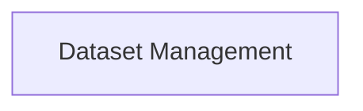

## Details

Corrected the source reference for the 'Dataset Management' component based on the feedback. The file 'cogdl/data/dataset.py' is now correctly referenced as the base class for dataset management.

### Dataset Management
Manages the loading, preprocessing, and access of graph datasets. It provides functionalities to handle various dataset formats and ensures data is in a suitable structure for model training and evaluation.

**Related Classes/Methods**:

- <a href="https://github.com/THUDM/CogDL/blob/master/cogdl/data/dataset.py#L1-L100" target="_blank" rel="noopener noreferrer">`cogdl.data.dataset.Dataset`:1-100</a>

### [FAQ](https://github.com/CodeBoarding/GeneratedOnBoardings/tree/main?tab=readme-ov-file#faq)