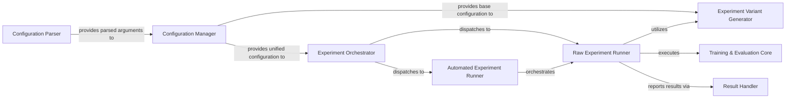

## Details

The CogDL experiment subsystem is designed around a clear separation of concerns, starting with the Configuration Parser and Configuration Manager for robust experiment setup. The Experiment Orchestrator acts as the central control, directing the flow to either a Raw Experiment Runner for predefined experiments or an Automated Experiment Runner for optimization. Both runners dynamically generate experiment variations using the Experiment Variant Generator (which receives its base configuration from the Configuration Manager) and execute the core training and evaluation logic via the Training & Evaluation Core. All experiment outcomes are systematically managed by the Result Handler, ensuring comprehensive result capture and reporting. This architecture ensures flexibility in experiment definition and execution, from single runs to complex automated optimizations.

### Configuration Parser
Defines and parses all command-line arguments necessary for configuring training, data, model, and dataset parameters. It's the initial point for external configuration input.

**Related Classes/Methods**:

- <a href="https://github.com/THUDM/CogDL/blob/master/cogdl/options.py#L97-L103" target="_blank" rel="noopener noreferrer">`cogdl.options.get_training_parser`:97-103</a>

### Configuration Manager
Consolidates default experiment settings with user-provided command-line arguments, creating a unified and complete configuration object for an experiment.

**Related Classes/Methods**:

- <a href="https://github.com/THUDM/CogDL/blob/master/cogdl/options.py#L121-L138" target="_blank" rel="noopener noreferrer">`cogdl.options.get_default_args`:121-138</a>

### Experiment Orchestrator
The primary entry point for initiating any experiment. It dispatches control to either explicit (raw_experiment) or automated (auto_experiment) workflows based on the parsed configuration.

**Related Classes/Methods**:

- <a href="https://github.com/THUDM/CogDL/blob/master/cogdl/experiments.py#L335-L370" target="_blank" rel="noopener noreferrer">`cogdl.experiments.experiment`:335-370</a>

### Raw Experiment Runner
Manages the execution of explicitly defined experiments. This includes generating specific experiment variants, initiating the training process for each, and handling result output.

**Related Classes/Methods**:

- <a href="https://github.com/THUDM/CogDL/blob/master/cogdl/experiments.py#L269-L299" target="_blank" rel="noopener noreferrer">`cogdl.experiments.raw_experiment`:269-299</a>

### Automated Experiment Runner
Orchestrates automated experiment workflows, such as hyperparameter optimization or AutoML strategies, by generating and executing multiple objectives to find optimal configurations.

**Related Classes/Methods**:

- <a href="https://github.com/THUDM/CogDL/blob/master/cogdl/experiments.py#L302-L316" target="_blank" rel="noopener noreferrer">`cogdl.experiments.auto_experiment`:302-316</a>

### Experiment Variant Generator
Creates diverse combinations of arguments or configurations, enabling the execution of multiple experiment variants from a base setup, crucial for comprehensive testing.

**Related Classes/Methods**:

- <a href="https://github.com/THUDM/CogDL/blob/master/cogdl/experiments.py#L238-L242" target="_blank" rel="noopener noreferrer">`cogdl.experiments.variant_args_generator`:238-242</a>

### Training & Evaluation Core
Encapsulates the fundamental training and evaluation logic for a single experiment configuration, managing the model training process and updating the best-performing setup.

**Related Classes/Methods**:

- <a href="https://github.com/THUDM/CogDL/blob/master/cogdl/experiments.py#L92-L230" target="_blank" rel="noopener noreferrer">`cogdl.experiments.train`:92-230</a>

### Result Handler
Manages the persistence, display, or logging of outcomes, metrics, and artifacts generated by completed experiments, ensuring results are accessible and recorded.

**Related Classes/Methods**:

- <a href="https://github.com/THUDM/CogDL/blob/master/cogdl/experiments.py#L245-L250" target="_blank" rel="noopener noreferrer">`cogdl.experiments.output_results`:245-250</a>

### [FAQ](https://github.com/CodeBoarding/GeneratedOnBoardings/tree/main?tab=readme-ov-file#faq)