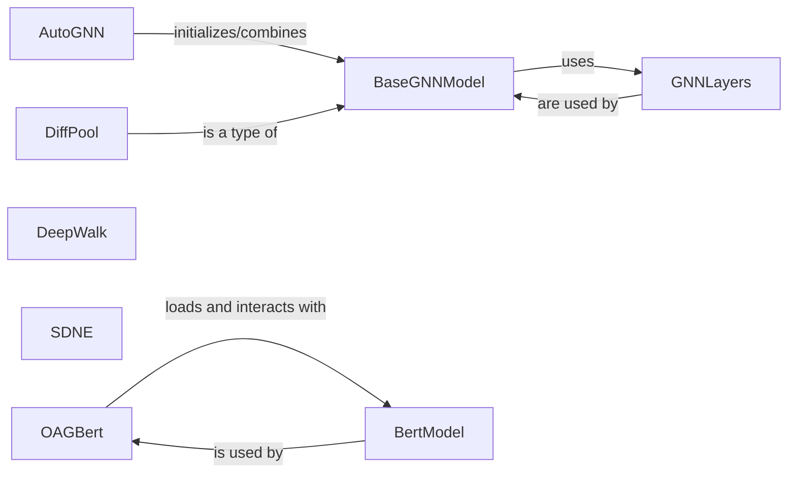

## Details

The `cogdl` project's core architecture for Graph Neural Networks (GNNs) and graph embeddings is structured around a set of abstract and foundational components. `BaseGNNModel` serves as the abstract base for all GNN implementations, ensuring a consistent interface for message passing and aggregation, and it leverages `GNNLayers` as modular building blocks for various GNN architectures. `AutoGNN` acts as an orchestrator, dynamically constructing and combining GNN models, showcasing the project's automated model design capabilities. Beyond GNNs, the system also integrates graph embedding algorithms like `DeepWalk` and `SDNE`, which focus on learning low-dimensional node representations. Furthermore, the `OAGBert` and `BertModel` components highlight the project's specialized integration of BERT for academic graph data, with `OAGBert` managing the interaction with the core `BertModel`.

### BaseGNNModel
Serves as the foundational abstract class for various GNNs, defining the common interface and core logic for message passing and aggregation. It is fundamental for establishing a consistent structure across different GNN implementations.

**Related Classes/Methods**:

- <a href="https://github.com/THUDM/CogDL/blob/master/cogdl/models/base_model.py#L5-L36" target="_blank" rel="noopener noreferrer">`cogdl.models.base_model.BaseModel`:5-36</a>

### GNNLayers
Provides atomic, reusable neural network layers (e.g., `gcn_layer`, `gat_layer`, `sage_layer`) that are building blocks for constructing GNN models within `cogdl.models.nn`. This component promotes modularity and reusability in GNN design.

**Related Classes/Methods**:

- <a href="https://github.com/THUDM/CogDL/blob/master/cogdl/layers" target="_blank" rel="noopener noreferrer">`cogdl.layers`</a>

### AutoGNN
Acts as a meta-model or orchestrator, responsible for initializing, combining, or selecting different GNN models, facilitating automated GNN architecture search or ensemble methods. It represents the project's capability for automated model design.

**Related Classes/Methods**:

- <a href="https://github.com/THUDM/CogDL/blob/master/cogdl/models/nn/autognn.py#L108-L268" target="_blank" rel="noopener noreferrer">`cogdl.models.nn.autognn.AutoGNN`:108-268</a>

### DiffPool
Implements differentiable graph pooling mechanisms, crucial for hierarchically reducing graph size or generating graph-level representations. It represents a specific, important GNN architecture component.

**Related Classes/Methods**:

- <a href="https://github.com/THUDM/CogDL/blob/master/cogdl/models/nn/diffpool.py" target="_blank" rel="noopener noreferrer">`cogdl.models.nn.diffpool`</a>

### DeepWalk
Focuses on learning low-dimensional node embeddings by simulating random walks on graphs and applying skip-gram-like models. It is a core representative of graph embedding algorithms.

**Related Classes/Methods**:

- <a href="https://github.com/THUDM/CogDL/blob/master/cogdl/models/emb/deepwalk.py" target="_blank" rel="noopener noreferrer">`cogdl.models.emb.deepwalk`</a>

### SDNE
Derives graph embeddings using techniques such as matrix factorization, spectral analysis, or deep autoencoders to preserve structural properties of the graph. It represents another distinct approach to graph embeddings.

**Related Classes/Methods**:

- <a href="https://github.com/THUDM/CogDL/blob/master/cogdl/models/emb/sdne.py" target="_blank" rel="noopener noreferrer">`cogdl.models.emb.sdne`</a>

### OAGBert
The primary entry point and orchestrator for OAG-BERT models, handling model loading and high-level interactions specific to academic graph data. It represents the specialized integration of BERT for graph contexts.

**Related Classes/Methods**:

- <a href="https://github.com/THUDM/CogDL/blob/master/cogdl/oag/oagbert.py" target="_blank" rel="noopener noreferrer">`cogdl.oag.oagbert`</a>

### BertModel
Implements the foundational BERT architecture, including its sub-components for token embeddings, attention mechanisms, and transformer layers. It is the core NLP model integrated into the OAG-BERT framework.

**Related Classes/Methods**:

- <a href="https://github.com/THUDM/CogDL/blob/master/cogdl/oag/bert_model.py" target="_blank" rel="noopener noreferrer">`cogdl.oag.bert_model`</a>

### [FAQ](https://github.com/CodeBoarding/GeneratedOnBoardings/tree/main?tab=readme-ov-file#faq)