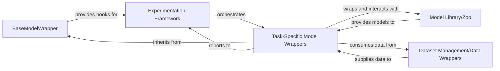

## Details

The cogdl.wrappers.model_wrapper subsystem acts as an adaptable interface between various machine learning models and the broader experimentation and data management infrastructure. It provides a standardized way to integrate diverse graph neural network models, manage their lifecycle during training and evaluation, and report performance metrics. This subsystem is crucial for enabling rapid experimentation and consistent evaluation across different model architectures and datasets. It interacts with the cogdl.models for model implementations, cogdl.data and cogdl.datasets for data handling, and cogdl.experiments for orchestrating the training and evaluation processes.

### BaseModelWrapper
The abstract base class for all model wrappers, defining a common interface and lifecycle methods (e.g., on_train_step, on_val_step, on_test_step). It serves as the primary extension point for task-specific adaptations and provides hooks for the Experimentation Framework.

**Related Classes/Methods**:

- <a href="https://github.com/THUDM/CogDL/blob/master/cogdl/wrappers/model_wrapper/base_model_wrapper.py" target="_blank" rel="noopener noreferrer">`cogdl.wrappers.model_wrapper.base_model_wrapper.BaseModelWrapper`</a>

### Task-Specific Model Wrappers
Concrete implementations extending BaseModelWrapper, each tailored to a specific machine learning task (e.g., graph clustering, node classification, link prediction, pretraining). They encapsulate task-specific logic, including loss functions, data transformations, and metric calculation. These wrappers interact with the Model Library/Zoo to utilize specific model architectures and consume data from Dataset Management/Data Wrappers. They report their performance and status to the Experimentation Framework.

**Related Classes/Methods**:

- <a href="https://github.com/THUDM/CogDL/blob/master/cogdl/wrappers/model_wrapper/clustering/daegc_mw.py#L10-L106" target="_blank" rel="noopener noreferrer">`cogdl.wrappers.model_wrapper.clustering.daegc_mw.DAEGCModelWrapper`:10-106</a>
- <a href="https://github.com/THUDM/CogDL/blob/master/cogdl/wrappers/model_wrapper/graph_classification/infograph_mw.py#L14-L101" target="_blank" rel="noopener noreferrer">`cogdl.wrappers.model_wrapper.graph_classification.infograph_mw.InfoGraphModelWrapper`:14-101</a>
- <a href="https://github.com/THUDM/CogDL/blob/master/cogdl/wrappers/model_wrapper/link_prediction/embedding_link_prediction_mw.py#L7-L20" target="_blank" rel="noopener noreferrer">`cogdl.wrappers.model_wrapper.link_prediction.embedding_link_prediction_mw.EmbeddingLinkPredictionModelWrapper`:7-20</a>
- <a href="https://github.com/THUDM/CogDL/blob/master/cogdl/wrappers/model_wrapper/node_classification/dgi_mw.py#L10-L67" target="_blank" rel="noopener noreferrer">`cogdl.wrappers.model_wrapper.node_classification.dgi_mw.DGIModelWrapper`:10-67</a>
- <a href="https://github.com/THUDM/CogDL/blob/master/cogdl/wrappers/model_wrapper/node_classification/grace_mw.py#L11-L95" target="_blank" rel="noopener noreferrer">`cogdl.wrappers.model_wrapper.node_classification.grace_mw.GRACEModelWrapper`:11-95</a>
- <a href="https://github.com/THUDM/CogDL/blob/master/cogdl/wrappers/model_wrapper/node_classification/grand_mw.py#L7-L62" target="_blank" rel="noopener noreferrer">`cogdl.wrappers.model_wrapper.node_classification.grand_mw.GRANDModelWrapper`:7-62</a>
- <a href="https://github.com/THUDM/CogDL/blob/master/cogdl/wrappers/model_wrapper/pretraining/gcc_mw.py#L20-L201" target="_blank" rel="noopener noreferrer">`cogdl.wrappers.model_wrapper.pretraining.gcc_mw.GCCModelWrapper`:20-201</a>

### Experimentation Framework
Orchestrates the training, validation, and testing phases of models. It utilizes the hooks provided by BaseModelWrapper to manage the experiment lifecycle, collect metrics, and log results. This component is responsible for driving the overall experimentation process.

**Related Classes/Methods**:

### Model Library/Zoo
Contains various pre-implemented model architectures (e.g., GCN, GAT, GraphSAGE) that the Task-Specific Model Wrappers can instantiate and utilize. It provides the core computational graphs for different graph neural network models.

**Related Classes/Methods**:

- <a href="https://github.com/THUDM/CogDL/blob/master/cogdl/models/__init__.py" target="_blank" rel="noopener noreferrer">`cogdl.models`</a>

### Dataset Management/Data Wrappers
Handles the loading, preprocessing, and batching of datasets. It provides standardized data structures and interfaces for Task-Specific Model Wrappers to consume data during training and evaluation.

**Related Classes/Methods**:

- <a href="https://github.com/THUDM/CogDL/blob/master/cogdl/data/__init__.py" target="_blank" rel="noopener noreferrer">`cogdl.data`</a>
- <a href="https://github.com/THUDM/CogDL/blob/master/cogdl/datasets/__init__.py" target="_blank" rel="noopener noreferrer">`cogdl.datasets`</a>

### [FAQ](https://github.com/CodeBoarding/GeneratedOnBoardings/tree/main?tab=readme-ov-file#faq)