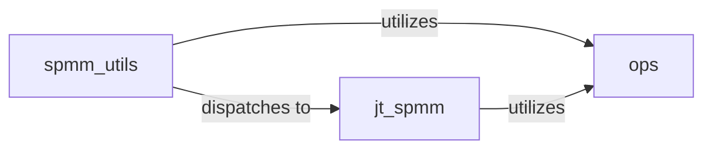

## Details

The `CogDL` project's sparse matrix operations subsystem is designed for efficient graph computations, primarily supporting Graph Neural Networks. The `spmm_utils` component serves as a flexible dispatcher, routing sparse matrix operations to optimized kernels based on the active deep learning backend. For Jittor-specific optimizations, `spmm_utils` leverages `jt_spmm`, a specialized component providing highly efficient sparse matrix-matrix multiplication. Both `spmm_utils` and `jt_spmm` depend on the `ops` component, which provides a foundational set of graph aggregation and element-wise operations essential for processing graph data in the Coordinate (COO) format. This architecture ensures adaptability across different backends while maintaining high performance for core graph operations.

### spmm_utils
This component serves as a versatile utility layer and central dispatcher for various sparse matrix operations. It provides general-purpose implementations for CPU-optimized SPMM, multi-head SPMM, edge softmax, and fused GAT operations, abstracting away backend-specific details where possible. It acts as an orchestration layer, directing calls to the most appropriate optimized kernel based on the current deep learning backend (e.g., PyTorch, Jittor).

**Related Classes/Methods**:

- <a href="https://github.com/THUDM/CogDL/blob/master/cogdl/utils/spmm_utils.py#L1-L9999" target="_blank" rel="noopener noreferrer">`spmm_utils`:1-9999</a>

### jt_spmm
Provides a highly optimized, Jittor-specific sparse matrix-matrix multiplication (SPMM) implementation. It functions as a specialized kernel designed to accelerate graph computations when Jittor is the chosen deep learning backend, ensuring efficient execution on compatible hardware.

**Related Classes/Methods**:

- <a href="https://github.com/THUDM/CogDL/blob/master/cogdl/operators/jt_spmm.py#L1-L9999" target="_blank" rel="noopener noreferrer">`jt_spmm`:1-9999</a>

### ops
Offers a collection of fundamental graph aggregation functions (e.g., sum, mean) and element-wise operations (e.g., add, multiply), primarily designed for the Coordinate (COO) format. These serve as low-level, reusable building blocks for constructing message-passing layers in Graph Neural Networks (GNNs), providing the basic arithmetic necessary for node feature aggregation.

**Related Classes/Methods**:

- <a href="https://github.com/THUDM/CogDL/blob/master/cogdl/models/nn/mixhop.py" target="_blank" rel="noopener noreferrer">`ops`</a>

### [FAQ](https://github.com/CodeBoarding/GeneratedOnBoardings/tree/main?tab=readme-ov-file#faq)