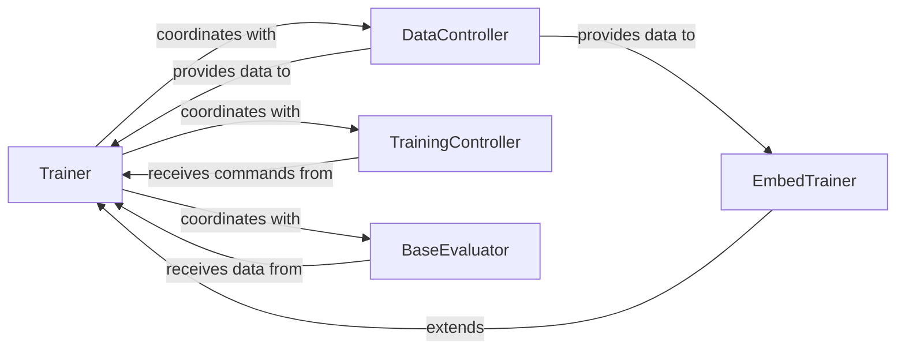

## Details

The `Training & Evaluation Engine` subsystem is primarily defined by the `cogdl/trainer/` package and the `cogdl/utils/evaluator.py` module. This subsystem is responsible for orchestrating the entire model training lifecycle, including data preparation, distributed training management, iterative optimization, and performance evaluation.

### Trainer
The core orchestrator of the training and evaluation loops. It manages epochs, optimization steps, and device placement, serving as the central hub for the training process.

**Related Classes/Methods**:

- <a href="https://github.com/THUDM/CogDL/blob/master/cogdl/trainer/trainer.py" target="_blank" rel="noopener noreferrer">`cogdl.trainer.trainer`</a>

### EmbedTrainer
A specialized trainer that extends the base `Trainer` to handle specific requirements and operations for graph embedding models, demonstrating the system's extensibility.

**Related Classes/Methods**:

- <a href="https://github.com/THUDM/CogDL/blob/master/cogdl/trainer/embed_trainer.py" target="_blank" rel="noopener noreferrer">`cogdl.trainer.embed_trainer`</a>

### DataController
Manages the preparation, loading, and distribution of data, especially critical for efficient distributed training setups. It ensures data is correctly formatted and accessible to the training process.

**Related Classes/Methods**:

- <a href="https://github.com/THUDM/CogDL/blob/master/cogdl/trainer/controller/data_controller.py" target="_blank" rel="noopener noreferrer">`cogdl.trainer.controller.data_controller`</a>

### TrainingController
Handles the setup and management of distributed training processes, such as PyTorch's Distributed Data Parallel (DDP), enabling scalable model training across multiple devices or nodes.

**Related Classes/Methods**:

- <a href="https://github.com/THUDM/CogDL/blob/master/cogdl/trainer/controller/training_controller.py" target="_blank" rel="noopener noreferrer">`cogdl.trainer.controller.training_controller`</a>

### BaseEvaluator
Provides the interface and concrete implementations for various quantitative evaluation metrics used to assess model performance post-training or during evaluation phases.

**Related Classes/Methods**:

- <a href="https://github.com/THUDM/CogDL/blob/master/cogdl/utils/evaluator.py" target="_blank" rel="noopener noreferrer">`cogdl.utils.evaluator`</a>

### [FAQ](https://github.com/CodeBoarding/GeneratedOnBoardings/tree/main?tab=readme-ov-file#faq)