```mermaid
graph LR
    Experiment_Orchestration_Configuration["Experiment Orchestration & Configuration"]
    Data_Management_Preprocessing["Data Management & Preprocessing"]
    Model_Library["Model Library"]
    Model_Task_Adapters["Model Task Adapters"]
    Training_Evaluation_Engine["Training & Evaluation Engine"]
    Optimized_Graph_Operations["Optimized Graph Operations"]
    Experiment_Orchestration_Configuration -- "configures data loading and preprocessing parameters" --> Data_Management_Preprocessing
    Experiment_Orchestration_Configuration -- "selects and initializes models based on experiment configuration" --> Model_Library
    Experiment_Orchestration_Configuration -- "initiates and monitors the training and evaluation process" --> Training_Evaluation_Engine
    Data_Management_Preprocessing -- "supplies batched and preprocessed data for model training and evaluation" --> Training_Evaluation_Engine
    Model_Library -- "provides the underlying model architectures to be adapted for specific tasks" --> Model_Task_Adapters
    Model_Library -- "utilizes optimized low-level operations for efficient graph computations within models" --> Optimized_Graph_Operations
    Model_Task_Adapters -- "invokes the forward pass and other model-specific computations on the selected model" --> Model_Library
    Model_Task_Adapters -- "sends model predictions, losses, and intermediate results for training updates and evaluation" --> Training_Evaluation_Engine
    Training_Evaluation_Engine -- "orchestrates the training steps, calling the adapter for forward/backward passes and updates" --> Model_Task_Adapters
    Training_Evaluation_Engine -- "reports final experiment results, logs, and status back to the orchestrator" --> Experiment_Orchestration_Configuration
    click Experiment_Orchestration_Configuration href "https://github.com/CodeBoarding/GeneratedOnBoardings/blob/main/CogDL/Experiment_Orchestration_Configuration.md" "Details"
    click Data_Management_Preprocessing href "https://github.com/CodeBoarding/GeneratedOnBoardings/blob/main/CogDL/Data_Management_Preprocessing.md" "Details"
    click Model_Library href "https://github.com/CodeBoarding/GeneratedOnBoardings/blob/main/CogDL/Model_Library.md" "Details"
    click Model_Task_Adapters href "https://github.com/CodeBoarding/GeneratedOnBoardings/blob/main/CogDL/Model_Task_Adapters.md" "Details"
    click Training_Evaluation_Engine href "https://github.com/CodeBoarding/GeneratedOnBoardings/blob/main/CogDL/Training_Evaluation_Engine.md" "Details"
    click Optimized_Graph_Operations href "https://github.com/CodeBoarding/GeneratedOnBoardings/blob/main/CogDL/Optimized_Graph_Operations.md" "Details"
```

## Details

The CogDL architecture is structured around a clear data and control flow, beginning with the Experiment Orchestration & Configuration component that defines and initiates the entire machine learning pipeline. This orchestrator directs the Data Management & Preprocessing component to prepare datasets, which are then fed into the Training & Evaluation Engine. The engine drives the iterative training process, interacting with Model Task Adapters that wrap specific models from the Model Library. These models leverage Optimized Graph Operations for high-performance computations. Throughout the process, the Training & Evaluation Engine assesses model performance and reports back to the orchestrator, ensuring a streamlined and efficient workflow for developing and evaluating Graph Neural Network models. This modular design allows for easy extension and integration of new models, datasets, and tasks, making CogDL a flexible toolkit for GNN research and application.

### Experiment Orchestration & Configuration [[Expand]](./Experiment_Orchestration_Configuration.md)
Manages the overall experiment lifecycle, from parsing command-line arguments and loading configurations to orchestrating the training and evaluation process. It serves as the central entry point for running ML experiments.

**Related Classes/Methods**:

- <a href="https://github.com/THUDM/CogDL/blob/master/cogdl/options.py" target="_blank" rel="noopener noreferrer">`cogdl/options.py`</a>
- <a href="https://github.com/THUDM/CogDL/blob/master/cogdl/configs.py" target="_blank" rel="noopener noreferrer">`cogdl/configs.py`</a>
- <a href="https://github.com/THUDM/CogDL/blob/master/cogdl/experiments.py" target="_blank" rel="noopener noreferrer">`cogdl/experiments.py`</a>

### Data Management & Preprocessing [[Expand]](./Data_Management_Preprocessing.md)
Handles loading, preprocessing, and transforming various graph datasets into an iterable, batched format suitable for model consumption, including task-specific data splits and augmentations.

**Related Classes/Methods**:

- <a href="https://github.com/THUDM/CogDL/blob/master/cogdl/datasets/" target="_blank" rel="noopener noreferrer">`cogdl/datasets/`</a>
- <a href="https://github.com/THUDM/CogDL/blob/master/cogdl/data/" target="_blank" rel="noopener noreferrer">`cogdl/data/`</a>
- <a href="https://github.com/THUDM/CogDL/blob/master/cogdl/wrappers/data_wrapper/" target="_blank" rel="noopener noreferrer">`cogdl/wrappers/data_wrapper/`</a>
- <a href="https://github.com/THUDM/CogDL/blob/master/cogdl/utils/graph_utils.py" target="_blank" rel="noopener noreferrer">`cogdl/utils/graph_utils.py`</a>

### Model Library [[Expand]](./Model_Library.md)
A comprehensive collection of various Graph Neural Network (GNN) architectures, graph embedding algorithms, and specialized integrations like OAG-BERT models.

**Related Classes/Methods**:

- <a href="https://github.com/THUDM/CogDL/blob/master/cogdl/models/nn/" target="_blank" rel="noopener noreferrer">`cogdl/models/nn/`</a>
- <a href="https://github.com/THUDM/CogDL/blob/master/cogdl/models/emb/" target="_blank" rel="noopener noreferrer">`cogdl/models/emb/`</a>
- <a href="https://github.com/THUDM/CogDL/blob/master/cogdl/oag/" target="_blank" rel="noopener noreferrer">`cogdl/oag/`</a>

### Model Task Adapters [[Expand]](./Model_Task_Adapters.md)
Wraps core models from the Model Library to adapt them for specific downstream tasks (e.g., node classification, link prediction, graph classification), handling task-specific loss calculation and metric reporting.

**Related Classes/Methods**:

- <a href="https://github.com/THUDM/CogDL/blob/master/cogdl/wrappers/model_wrapper/" target="_blank" rel="noopener noreferrer">`cogdl/wrappers/model_wrapper/`</a>

### Training & Evaluation Engine [[Expand]](./Training_Evaluation_Engine.md)
Manages the iterative training and evaluation loops, including optimizer updates, distributed training, device management, and quantitative assessment of model performance using various metrics.

**Related Classes/Methods**:

- <a href="https://github.com/THUDM/CogDL/blob/master/cogdl/trainer/" target="_blank" rel="noopener noreferrer">`cogdl/trainer/`</a>
- <a href="https://github.com/THUDM/CogDL/blob/master/cogdl/utils/evaluator.py" target="_blank" rel="noopener noreferrer">`cogdl/utils/evaluator.py`</a>

### Optimized Graph Operations [[Expand]](./Optimized_Graph_Operations.md)
Provides highly optimized, low-level operations crucial for efficient graph computations, such as sparse matrix multiplication and various aggregation functions, leveraging underlying hardware capabilities.

**Related Classes/Methods**:

- <a href="https://github.com/THUDM/CogDL/blob/master/cogdl/operators/" target="_blank" rel="noopener noreferrer">`cogdl/operators/`</a>
- <a href="https://github.com/THUDM/CogDL/blob/master/cogdl/utils/spmm_utils.py" target="_blank" rel="noopener noreferrer">`cogdl/utils/spmm_utils.py`</a>

### [FAQ](https://github.com/CodeBoarding/GeneratedOnBoardings/tree/main?tab=readme-ov-file#faq)