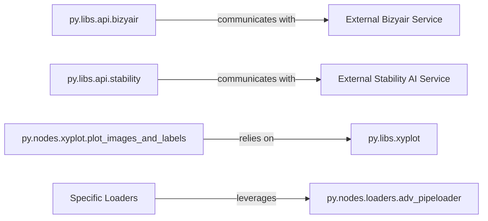

## Details

This subsystem focuses on integrating external AI services for image processing, managing advanced model loading, and providing robust visualization tools within the ComfyUI-Easy-Use project. It centralizes complex operations, making them accessible through simplified interfaces, and ensures seamless interaction with both internal utilities and external AI capabilities.

### py.libs.api.bizyair
Acts as the client for the Bizyair API, handling image captioning requests. It manages data encoding (e.g., image to base64), API key retrieval, and sending HTTP POST requests to the external service. This component streamlines the integration of external AI captioning capabilities into ComfyUI workflows.

**Related Classes/Methods**:

- <a href="https://github.com/yolain/ComfyUI-Easy-Use/blob/main/py/libs/api/bizyair.py" target="_blank" rel="noopener noreferrer">`py.libs.api.bizyair`</a>

### py.libs.api.stability
Serves as the client for the Stability AI API, facilitating direct image generation (SD3) and managing user account/balance information. This component enables direct interaction with Stability AI's generative models, offering an alternative or supplementary image generation method within ComfyUI.

**Related Classes/Methods**:

- <a href="https://github.com/yolain/ComfyUI-Easy-Use/blob/main/py/libs/api/stability.py" target="_blank" rel="noopener noreferrer">`py.libs.api.stability`</a>

### py.nodes.loaders.adv_pipeloader
Functions as a core, advanced pipeline loader. It encapsulates common loading logic, allowing various specialized loaders to reuse its functionality for different model types. This component centralizes and simplifies the process of loading diverse models, adhering to the "easy node" principle by abstracting complex loading procedures.

**Related Classes/Methods**:

- <a href="https://github.com/yolain/ComfyUI-Easy-Use/blob/main/py/nodes/loaders.py#L846-L920" target="_blank" rel="noopener noreferrer">`py.nodes.loaders.adv_pipeloader`:846-920</a>

### py.nodes.xyplot.plot_images_and_labels
This is the primary node responsible for visualizing images and their associated labels, crucial for analyzing and comparing outputs within workflows. It provides a user-friendly interface for visual inspection and analysis of generated content or intermediate pipeline results.

**Related Classes/Methods**:

- <a href="https://github.com/yolain/ComfyUI-Easy-Use/blob/main/py/nodes/xyplot.py" target="_blank" rel="noopener noreferrer">`py.nodes.xyplot.plot_images_and_labels`</a>

### External Bizyair Service
An external AI service providing image captioning capabilities. It is consumed by `py.libs.api.bizyair` and exists outside the project's codebase, hence no internal source code reference is applicable.

**Related Classes/Methods**: _None_

### External Stability AI Service
An external AI service providing image generation (SD3) capabilities. It is consumed by `py.libs.api.stability` and exists outside the project's codebase, hence no internal source code reference is applicable.

**Related Classes/Methods**: _None_

### Specific Loaders
A conceptual grouping representing various specialized loader components (e.g., a1111loader, comfyloader) that leverage the advanced pipeline loader (`py.nodes.loaders.adv_pipeloader`) to handle specific model formats or loading scenarios. As a conceptual grouping, it does not correspond to a single source code reference but rather encompasses multiple distinct loader implementations.

**Related Classes/Methods**: _None_

### py.libs.xyplot
A helper module providing utility functions and low-level plotting primitives. It supports `py.nodes.xyplot.plot_images_and_labels` by abstracting common plotting operations.

**Related Classes/Methods**:

- <a href="https://github.com/yolain/ComfyUI-Easy-Use/blob/main/py/libs/xyplot.py" target="_blank" rel="noopener noreferrer">`py.libs.xyplot`</a>

### [FAQ](https://github.com/CodeBoarding/GeneratedOnBoardings/tree/main?tab=readme-ov-file#faq)