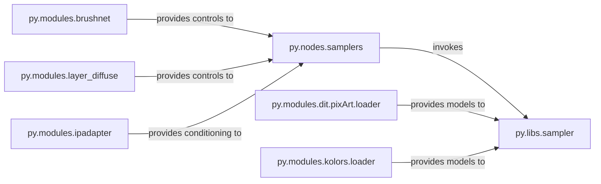

## Details

The Generative Core & Control subsystem is responsible for the iterative refinement of latent representations into images, forming the heart of the diffusion sampling process. It encompasses the core sampling algorithms, the primary user-facing nodes that initiate and manage image generation, and the specialized modules that integrate and apply various control mechanisms (e.g., BrushNet, IPAdapter, Layer Diffusion) and load specific foundational models (e.g., DiT/PixArt, Kolors) to precisely guide and enhance the generative output.

### py.libs.sampler
Implements and executes the core iterative diffusion sampling algorithms (e.g., common_ksampler, custom_ksampler). It is the fundamental engine that prepares noise and performs the latent refinement steps to generate images.

**Related Classes/Methods**:

- <a href="https://github.com/yolain/ComfyUI-Easy-Use/blob/main/py/libs/sampler.py#L1-L100" target="_blank" rel="noopener noreferrer">`py.libs.sampler`:1-100</a>

### py.nodes.samplers
Serves as the primary user-facing ComfyUI node for initiating and controlling the image generation process. It orchestrates calls to py.libs.sampler and integrates various specialized control models (e.g., BrushNet, Layer Diffusion) to guide the sampling.

**Related Classes/Methods**:

- <a href="https://github.com/yolain/ComfyUI-Easy-Use/blob/main/py/nodes/samplers.py#L1-L100" target="_blank" rel="noopener noreferrer">`py.nodes.samplers`:1-100</a>

### py.modules.brushnet
Manages the application of BrushNet models to guide the diffusion process based on input masks or brush strokes, enabling precise control over generated content. This includes functionalities for model updating and image preparation specific to BrushNet.

**Related Classes/Methods**:

- <a href="https://github.com/yolain/ComfyUI-Easy-Use/blob/main/py/modules/brushnet#L1-L100" target="_blank" rel="noopener noreferrer">`py.modules.brushnet`:1-100</a>

### py.modules.ipadapter
Integrates IPAdapter models to condition the diffusion process using image prompts, allowing for style transfer, content guidance, or face conditioning.

**Related Classes/Methods**:

- <a href="https://github.com/yolain/ComfyUI-Easy-Use/blob/main/py/modules/ipadapter#L1-L100" target="_blank" rel="noopener noreferrer">`py.modules.ipadapter`:1-100</a>

### py.modules.layer_diffuse
Provides functionality for generating images with explicit control over different layers or alpha channels, facilitating tasks like background separation or multi-layer composition within the diffusion process.

**Related Classes/Methods**:

- <a href="https://github.com/yolain/ComfyUI-Easy-Use/blob/main/py/modules/layer_diffuse#L1-L100" target="_blank" rel="noopener noreferrer">`py.modules.layer_diffuse`:1-100</a>

### py.modules.dit.pixArt.loader
Handles the loading and management of Diffusion Transformer (DiT) and PixArt models, including support for loading LoRA patches for these architectures, making them available for the core sampler.

**Related Classes/Methods**:

- <a href="https://github.com/yolain/ComfyUI-Easy-Use/blob/main/py/modules/dit/pixArt/loader.py#L1-L100" target="_blank" rel="noopener noreferrer">`py.modules.dit.pixArt.loader`:1-100</a>

### py.modules.kolors.loader
Loads and manages Kolors-specific diffusion models, including specialized UNet architectures and potentially associated text encoders, making them available for the core sampler.

**Related Classes/Methods**:

- <a href="https://github.com/yolain/ComfyUI-Easy-Use/blob/main/py/modules/kolors/loader.py#L1-L100" target="_blank" rel="noopener noreferrer">`py.modules.kolors.loader`:1-100</a>

### [FAQ](https://github.com/CodeBoarding/GeneratedOnBoardings/tree/main?tab=readme-ov-file#faq)