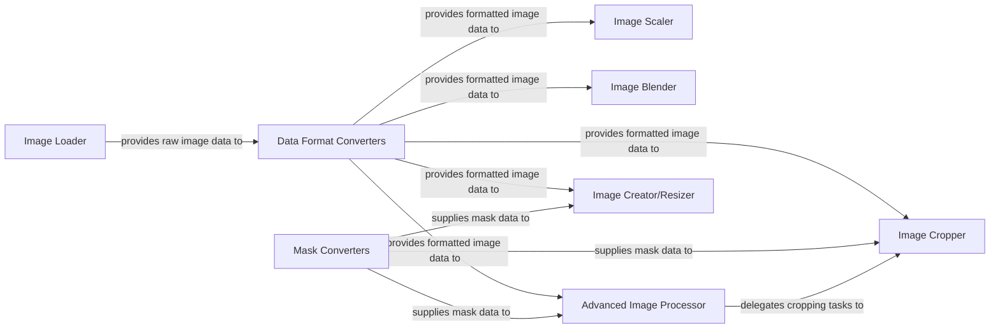

## Details

The `Image Transformation & Output` subsystem in `ComfyUI-Easy-Use` is a critical part of the generative AI workflow, focusing on preparing input images and refining generated outputs. It adheres to the project's architectural patterns of modular design and pipeline processing, encapsulating complex image operations into user-friendly nodes.

### Image Loader
Handles the loading of image files from the file system into the application's memory, serving as the entry point for image data into the transformation pipeline.

**Related Classes/Methods**:

- <a href="https://github.com/yolain/ComfyUI-Easy-Use/blob/main/py/nodes/image.py#L1800-L1823" target="_blank" rel="noopener noreferrer">`py.nodes.image.load_image`:1800-1823</a>

### Data Format Converters
Ensures interoperability by converting image data between common formats (NumPy arrays, PyTorch tensors, PIL Images), which is essential for seamless integration with various image processing libraries and models.

**Related Classes/Methods**:

- <a href="https://github.com/yolain/ComfyUI-Easy-Use/blob/main/py/libs/image.py#L20-L23" target="_blank" rel="noopener noreferrer">`py.libs.image.np2tensor`:20-23</a>
- <a href="https://github.com/yolain/ComfyUI-Easy-Use/blob/main/py/libs/image.py#L25-L29" target="_blank" rel="noopener noreferrer">`py.libs.image.tensor2np`:25-29</a>
- <a href="https://github.com/yolain/ComfyUI-Easy-Use/blob/main/py/libs/image.py#L14-L15" target="_blank" rel="noopener noreferrer">`py.libs.image.pil2tensor`:14-15</a>
- <a href="https://github.com/yolain/ComfyUI-Easy-Use/blob/main/py/libs/image.py#L17-L18" target="_blank" rel="noopener noreferrer">`py.libs.image.tensor2pil`:17-18</a>

### Mask Converters
Facilitates operations requiring masks by converting between image data and mask representations, crucial for tasks like inpainting, outpainting, or selective image manipulation.

**Related Classes/Methods**:

- <a href="https://github.com/yolain/ComfyUI-Easy-Use/blob/main/py/libs/image.py#L55-L61" target="_blank" rel="noopener noreferrer">`py.libs.image.image2mask`:55-61</a>
- <a href="https://github.com/yolain/ComfyUI-Easy-Use/blob/main/py/libs/image.py#L63-L70" target="_blank" rel="noopener noreferrer">`py.libs.image.mask2image`:63-70</a>

### Image Cropper
Extracts a specific region of interest from an image, often guided by mask data, allowing for precise focus on relevant image areas.

**Related Classes/Methods**:

- <a href="https://github.com/yolain/ComfyUI-Easy-Use/blob/main/py/nodes/image.py" target="_blank" rel="noopener noreferrer">`py.nodes.image.crop`</a>
- <a href="https://github.com/yolain/ComfyUI-Easy-Use/blob/main/py/nodes/image.py#L1570-L1653" target="_blank" rel="noopener noreferrer">`py.nodes.image.cropimage`:1570-1653</a>

### Image Scaler
Resizes images, primarily for downscaling to specific dimensions or by a given factor, optimizing images for different processing stages or output requirements.

**Related Classes/Methods**:

- <a href="https://github.com/yolain/ComfyUI-Easy-Use/blob/main/py/nodes/image.py#L315-L320" target="_blank" rel="noopener noreferrer">`py.nodes.image.image_scale_down_by`:315-320</a>
- <a href="https://github.com/yolain/ComfyUI-Easy-Use/blob/main/py/nodes/image.py#L338-L348" target="_blank" rel="noopener noreferrer">`py.nodes.image.image_scale_down_to_size`:338-348</a>

### Image Blender
Combines multiple images using various blending modes (e.g., overlay, multiply, screen), enabling complex image composition and layering.

**Related Classes/Methods**:

- <a href="https://github.com/yolain/ComfyUI-Easy-Use/blob/main/py/libs/image.py#L94-L105" target="_blank" rel="noopener noreferrer">`py.libs.image.blend_images`:94-105</a>

### Advanced Image Processor
Performs complex, often AI-driven, image transformations such as background removal, object segmentation, or image parsing, leveraging specialized models for sophisticated manipulations.

**Related Classes/Methods**:

- <a href="https://github.com/yolain/ComfyUI-Easy-Use/blob/main/py/nodes/image.py" target="_blank" rel="noopener noreferrer">`py.nodes.image.parsing`</a>

### Image Creator/Resizer
Generates new blank images or resizes existing ones, including functionalities for filling areas based on masks, providing foundational image canvases for further operations.

**Related Classes/Methods**:

- <a href="https://github.com/yolain/ComfyUI-Easy-Use/blob/main/py/nodes/image.py#L2037-L2101" target="_blank" rel="noopener noreferrer">`py.nodes.image.make`:2037-2101</a>

### [FAQ](https://github.com/CodeBoarding/GeneratedOnBoardings/tree/main?tab=readme-ov-file#faq)