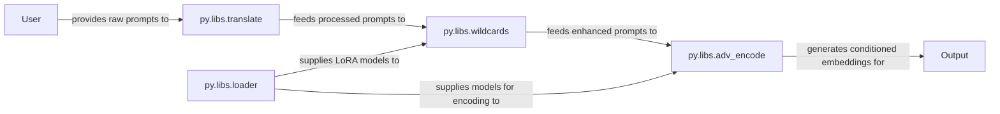

## Details

The `ComfyUI-Easy-Use` prompt processing subsystem orchestrates the transformation of raw user input into conditioned embeddings for AI model inference. It begins with the `py.libs.translate` component, which handles initial prompt translation and syntax correction. The processed prompts then flow to `py.libs.wildcards`, where dynamic elements and LoRA values are integrated for prompt enhancement. Concurrently, `py.libs.loader` serves as the central model management unit, supplying necessary LoRA models to `py.libs.wildcards` and various other AI models (CLIP, UNet, etc.) directly to `py.libs.adv_encode`. Finally, `py.libs.adv_encode` takes the refined prompts and the supplied models to generate the final conditioned embeddings, which are then passed to the `Output` for subsequent diffusion processes. This architecture ensures a modular and efficient pipeline for preparing prompts for advanced AI generation tasks.

### py.libs.loader
This component is the central hub for managing and providing AI models. It handles the loading, caching, and memory optimization of various model types, including checkpoints, VAEs, LoRAs, CLIP, and UNet models. Its primary responsibility is to ensure that the necessary models are readily available and efficiently managed for subsequent processing steps.

**Related Classes/Methods**:

- <a href="https://github.com/yolain/ComfyUI-Easy-Use/blob/main/py/libs/loader.py" target="_blank" rel="noopener noreferrer">`py.libs.loader`</a>

### py.libs.translate
Responsible for the initial linguistic processing of raw user prompts. This includes translating prompts (e.g., from Chinese to English) and performing syntax correction to ensure the prompts conform to the expected format for downstream components.

**Related Classes/Methods**:

- <a href="https://github.com/yolain/ComfyUI-Easy-Use/blob/main/py/libs/translate.py" target="_blank" rel="noopener noreferrer">`py.libs.translate`</a>

### py.libs.wildcards
This component enhances prompt flexibility by processing dynamic elements. It expands wildcard patterns within the prompt string and integrates LoRA values, effectively modifying and enriching the prompt before it undergoes final encoding.

**Related Classes/Methods**:

- <a href="https://github.com/yolain/ComfyUI-Easy-Use/blob/main/py/libs/wildcards.py" target="_blank" rel="noopener noreferrer">`py.libs.wildcards`</a>

### py.libs.adv_encode
This component represents the final stage of prompt processing, where the refined textual prompts are transformed into conditioned embeddings. It supports advanced features such as model-specific preparations (e.g., for SD3, XL) and intricate token manipulations to generate the precise conditioning required for the diffusion process.

**Related Classes/Methods**:

- <a href="https://github.com/yolain/ComfyUI-Easy-Use/blob/main/py/libs/adv_encode.py" target="_blank" rel="noopener noreferrer">`py.libs.adv_encode`</a>

### [FAQ](https://github.com/CodeBoarding/GeneratedOnBoardings/tree/main?tab=readme-ov-file#faq)