```mermaid
graph LR
    ComfyUI_Integration_Layer["ComfyUI Integration Layer"]
    Prompt_Model_Conditioning["Prompt & Model Conditioning"]
    Generative_Core_Control["Generative Core & Control"]
    Image_Transformation_Output["Image Transformation & Output"]
    Extended_Capabilities_Automation["Extended Capabilities & Automation"]
    ComfyUI_Integration_Layer -- "initiates workflow with" --> Prompt_Model_Conditioning
    ComfyUI_Integration_Layer -- "requests models/resources from" --> Prompt_Model_Conditioning
    Prompt_Model_Conditioning -- "provides conditioned embeddings/models to" --> Generative_Core_Control
    Generative_Core_Control -- "outputs raw latents/images to" --> Image_Transformation_Output
    Image_Transformation_Output -- "provides processed images/masks back to" --> Generative_Core_Control
    Extended_Capabilities_Automation -- "orchestrates/provides data to" --> Prompt_Model_Conditioning
    Extended_Capabilities_Automation -- "orchestrates/provides data to" --> Generative_Core_Control
    Extended_Capabilities_Automation -- "interacts with" --> Image_Transformation_Output
    click ComfyUI_Integration_Layer href "https://github.com/CodeBoarding/GeneratedOnBoardings/blob/main/ComfyUI-Easy-Use/ComfyUI_Integration_Layer.md" "Details"
    click Prompt_Model_Conditioning href "https://github.com/CodeBoarding/GeneratedOnBoardings/blob/main/ComfyUI-Easy-Use/Prompt_Model_Conditioning.md" "Details"
    click Generative_Core_Control href "https://github.com/CodeBoarding/GeneratedOnBoardings/blob/main/ComfyUI-Easy-Use/Generative_Core_Control.md" "Details"
    click Image_Transformation_Output href "https://github.com/CodeBoarding/GeneratedOnBoardings/blob/main/ComfyUI-Easy-Use/Image_Transformation_Output.md" "Details"
    click Extended_Capabilities_Automation href "https://github.com/CodeBoarding/GeneratedOnBoardings/blob/main/ComfyUI-Easy-Use/Extended_Capabilities_Automation.md" "Details"
```

## Details

The ComfyUI-Easy-Use architecture is designed as a modular extension, enhancing the base ComfyUI framework by encapsulating complex generative AI operations into user-friendly components. The ComfyUI Integration Layer serves as the entry point, orchestrating the entire image generation workflow. It initiates requests that flow to the Prompt & Model Conditioning component for preparing textual inputs and loading necessary AI models. These conditioned inputs then feed into the Generative Core & Control, which performs the iterative image synthesis, leveraging various Specialized Model Adapters for fine-grained control and enhancement. Post-generation, the Image Transformation & Output component refines and manipulates the images. Complementing these core components, the Extended Capabilities & Automation layer provides utility nodes for workflow automation and integrates with external AI services, offering a comprehensive and streamlined solution for advanced image generation tasks within ComfyUI. This clear component separation and defined data flow make the architecture highly suitable for visual diagram representation, highlighting the sequential and interactive nature of the generative process.

### ComfyUI Integration Layer [[Expand]](./ComfyUI_Integration_Layer.md)
The central interface managing interactions with the ComfyUI server, handling prompt reception, workflow initiation, and overall orchestration of the image generation pipeline.

**Related Classes/Methods**:

- <a href="https://github.com/yolain/ComfyUI-Easy-Use/blob/main/py/server.py#L159-L164" target="_blank" rel="noopener noreferrer">`py.server.onprompt`:159-164</a>

### Prompt & Model Conditioning [[Expand]](./Prompt_Model_Conditioning.md)
Responsible for processing textual prompts, loading and caching various AI models (checkpoints, VAEs, LoRAs), and generating conditioned embeddings essential for the diffusion process.

**Related Classes/Methods**:

- <a href="https://github.com/yolain/ComfyUI-Easy-Use/blob/main/py/libs/loader.py#L428-L488" target="_blank" rel="noopener noreferrer">`py.libs.loader.load_main`:428-488</a>
- <a href="https://github.com/yolain/ComfyUI-Easy-Use/blob/main/py/libs/adv_encode.py#L278-L424" target="_blank" rel="noopener noreferrer">`py.libs.adv_encode.advanced_encode`:278-424</a>
- <a href="https://github.com/yolain/ComfyUI-Easy-Use/blob/main/py/libs/translate.py#L203-L247" target="_blank" rel="noopener noreferrer">`py.libs.translate.zh_to_en`:203-247</a>
- <a href="https://github.com/yolain/ComfyUI-Easy-Use/blob/main/py/libs/wildcards.py#L279-L308" target="_blank" rel="noopener noreferrer">`py.libs.wildcards.process_with_loras`:279-308</a>

### Generative Core & Control [[Expand]](./Generative_Core_Control.md)
Encapsulates the core diffusion sampling logic, iteratively refining latent representations into images. This component integrates and applies various specialized models (e.g., ControlNet, IPAdapter, BrushNet, Layer Diffusion, DiT/PixArt) to precisely control and enhance the generation process.

**Related Classes/Methods**:

- <a href="https://github.com/yolain/ComfyUI-Easy-Use/blob/main/py/libs/sampler.py#L189-L239" target="_blank" rel="noopener noreferrer">`py.libs.sampler.common_ksampler`:189-239</a>
- <a href="https://github.com/yolain/ComfyUI-Easy-Use/blob/main/py/nodes/samplers.py#L1062-L1193" target="_blank" rel="noopener noreferrer">`py.nodes.samplers.run`:1062-1193</a>
- <a href="https://github.com/yolain/ComfyUI-Easy-Use/blob/main/py/modules/brushnet/__init__.py#L248-L349" target="_blank" rel="noopener noreferrer">`py.modules.brushnet.__init__.brushnet_model_update`:248-349</a>
- <a href="https://github.com/yolain/ComfyUI-Easy-Use/blob/main/py/nodes/inpaint.py#L283-L339" target="_blank" rel="noopener noreferrer">`py.nodes.inpaint.apply`:283-339</a>
- <a href="https://github.com/yolain/ComfyUI-Easy-Use/blob/main/py/modules/ipadapter/__init__.py#L208-L268" target="_blank" rel="noopener noreferrer">`py.modules.ipadapter.__init__.apply_ipadapter`:208-268</a>
- <a href="https://github.com/yolain/ComfyUI-Easy-Use/blob/main/py/nodes/adapter.py#L1156-L1159" target="_blank" rel="noopener noreferrer">`py.nodes.adapter.apply`:1156-1159</a>
- <a href="https://github.com/yolain/ComfyUI-Easy-Use/blob/main/py/modules/kolors/loader.py#L66-L71" target="_blank" rel="noopener noreferrer">`py.modules.kolors.loader.get_model`:66-71</a>
- <a href="https://github.com/yolain/ComfyUI-Easy-Use/blob/main/py/modules/layer_diffuse/__init__.py#L57-L125" target="_blank" rel="noopener noreferrer">`py.modules.layer_diffuse.__init__.apply_layer_diffusion`:57-125</a>
- <a href="https://github.com/yolain/ComfyUI-Easy-Use/blob/main/py/modules/dit/pixArt/loader.py#L55-L125" target="_blank" rel="noopener noreferrer">`py.modules.dit.pixArt.loader.load_pixart`:55-125</a>

### Image Transformation & Output [[Expand]](./Image_Transformation_Output.md)
Provides a comprehensive suite of tools for manipulating images both before and after the core generation. This includes operations like cropping, scaling, blending, color correction, and advanced background removal, preparing inputs or refining outputs.

**Related Classes/Methods**:

- <a href="https://github.com/yolain/ComfyUI-Easy-Use/blob/main/py/libs/image.py#L94-L105" target="_blank" rel="noopener noreferrer">`py.libs.image.blend_images`:94-105</a>
- <a href="https://github.com/yolain/ComfyUI-Easy-Use/blob/main/py/nodes/image.py" target="_blank" rel="noopener noreferrer">`py.nodes.image.parsing`</a>

### Extended Capabilities & Automation [[Expand]](./Extended_Capabilities_Automation.md)
Contains a collection of utility nodes designed to extend ComfyUI's core functionality, streamline workflows, and enable advanced automation. This includes specialized loaders, logic operations, and integration with external AI services for tasks like image captioning or direct image generation.

**Related Classes/Methods**:

- <a href="https://github.com/yolain/ComfyUI-Easy-Use/blob/main/py/libs/api/bizyair.py#L60-L94" target="_blank" rel="noopener noreferrer">`py.libs.api.bizyair.joyCaption`:60-94</a>
- <a href="https://github.com/yolain/ComfyUI-Easy-Use/blob/main/py/libs/api/stability.py#L81-L123" target="_blank" rel="noopener noreferrer">`py.libs.api.stability.generate_sd3_image`:81-123</a>
- <a href="https://github.com/yolain/ComfyUI-Easy-Use/blob/main/py/nodes/loaders.py#L846-L920" target="_blank" rel="noopener noreferrer">`py.nodes.loaders.adv_pipeloader`:846-920</a>
- <a href="https://github.com/yolain/ComfyUI-Easy-Use/blob/main/py/nodes/xyplot.py" target="_blank" rel="noopener noreferrer">`py.nodes.xyplot.plot_images_and_labels`</a>

### [FAQ](https://github.com/CodeBoarding/GeneratedOnBoardings/tree/main?tab=readme-ov-file#faq)