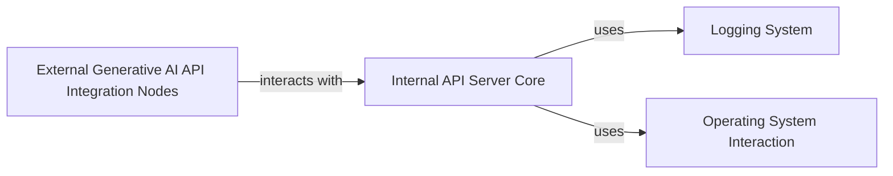

## Component Details

This component overview describes the 'API & External Integrations' subsystem of ComfyUI. It is divided into two main parts: the 'Internal API Server Core', which manages the internal API server, handles terminal services, and provides routes for logs and file access; and 'External Generative AI API Integration Nodes', which offers utilities and nodes for interacting with various external generative AI APIs, including data validation, format conversion, and API client management. The system also interacts with a 'Logging System' for recording events and an 'Operating System Interaction' component for low-level system operations.

### Internal API Server Core
Manages the core internal API server for ComfyUI, including terminal services, internal routes for logs and file access, and file operations for API interactions.

**Related Classes/Methods**:

- `ComfyUI.api_server.services.terminal_service` (full file reference)
- `ComfyUI.api_server.routes.internal.internal_routes` (full file reference)
- `ComfyUI.api_server.utils.file_operations` (full file reference)

### External Generative AI API Integration Nodes
Provides a collection of ComfyUI nodes and utilities specifically designed for interacting with various external generative AI APIs. It handles API client management, request logging, data validation, and format conversion for these external services.

**Related Classes/Methods**:

- `ComfyUI.comfy_api_nodes.apinode_utils` (full file reference)
- `ComfyUI.comfy_api_nodes.mapper_utils` (full file reference)
- `ComfyUI.comfy_api_nodes.apis.client` (full file reference)
- `ComfyUI.comfy_api_nodes.apis.request_logger` (full file reference)
- `ComfyUI.comfy_api_nodes.util.validation_utils` (full file reference)
- `ComfyUI.comfy_api_nodes.nodes_runway` (full file reference)
- `ComfyUI.comfy_api_nodes.nodes_ideogram` (full file reference)
- `ComfyUI.comfy_api_nodes.nodes_kling` (full file reference)
- `ComfyUI.comfy_api_nodes.nodes_bfl` (full file reference)
- `ComfyUI.comfy_api_nodes.nodes_stability` (full file reference)
- `ComfyUI.comfy_api_nodes.nodes_minimax` (full file reference)
- `ComfyUI.comfy_api_nodes.nodes_recraft` (full file reference)
- `ComfyUI.comfy_api_nodes.apis.recraft_api` (full file reference)
- `ComfyUI.comfy_api_nodes.nodes_openai` (full file reference)
- `ComfyUI.comfy_api_nodes.nodes_gemini` (full file reference)
- `ComfyUI.comfy_api_nodes.nodes_veo2` (full file reference)
- `ComfyUI.comfy_api_nodes.nodes_pika` (full file reference)
- `ComfyUI.comfy_api_nodes.nodes_luma` (full file reference)
- `ComfyUI.comfy_api_nodes.apis.luma_api` (full file reference)
- `ComfyUI.comfy_api_nodes.nodes_rodin` (full file reference)
- `ComfyUI.comfy_api_nodes.nodes_tripo` (full file reference)
- `ComfyUI.comfy_api_nodes.nodes_pixverse` (full file reference)
- `ComfyUI.comfy_api.input.video_types` (full file reference)
- `ComfyUI.comfy_api.input_impl.video_types` (full file reference)
- `ComfyUI.comfy_api.util.video_types` (full file reference)
- `ComfyUI.comfy_api.torch_helpers.torch_compile` (full file reference)
- `ComfyUI.comfy_extras.nodes_photomaker` (full file reference)
- `ComfyUI.comfy_extras.nodes_controlnet` (full file reference)

### Logging System
Provides logging functionalities for the application, used by various components to record events and messages.

**Related Classes/Methods**:

- `app.logger` (full file reference)

### Operating System Interaction
Handles interactions with the underlying operating system, such as retrieving terminal size and performing file system operations.

**Related Classes/Methods**:

- `os` (full file reference)
- `shutil` (full file reference)

### [FAQ](https://github.com/CodeBoarding/GeneratedOnBoardings/tree/main?tab=readme-ov-file#faq)