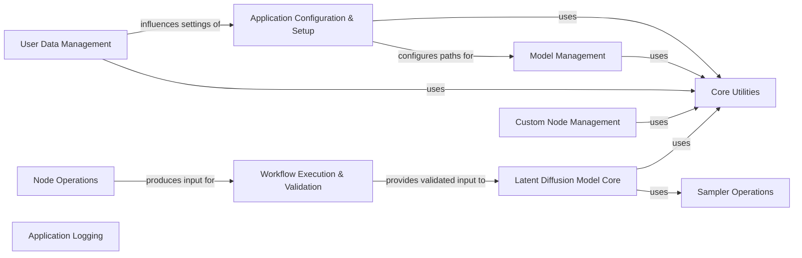

## Component Details

This graph illustrates the architectural overview of the ComfyUI application, detailing its core components and their interdependencies. The main flow involves application setup, user and model management, workflow execution, and the core latent diffusion model operations, all supported by a comprehensive set of utility functions and logging capabilities.

### Node Operations
This component encapsulates the logic for applying various types of nodes within the ComfyUI workflow, such as ControlNet, Style Models, and GLIGEN text boxes. It primarily involves appending data to lists for further processing.

**Related Classes/Methods**:

- <a href="https://github.com/comfyanonymous/ComfyUI/blob/master/nodes.py#L827-L841" target="_blank" rel="noopener noreferrer">`ComfyUI.nodes.ControlNetApply:apply_controlnet` (827:841)</a>
- <a href="https://github.com/comfyanonymous/ComfyUI/blob/master/nodes.py#L865-L891" target="_blank" rel="noopener noreferrer">`ComfyUI.nodes.ControlNetApplyAdvanced:apply_controlnet` (865:891)</a>
- <a href="https://github.com/comfyanonymous/ComfyUI/blob/master/nodes.py#L1042-L1087" target="_blank" rel="noopener noreferrer">`ComfyUI.nodes.StyleModelApply:apply_stylemodel` (1042:1087)</a>
- <a href="https://github.com/comfyanonymous/ComfyUI/blob/master/nodes.py#L1141-L1153" target="_blank" rel="noopener noreferrer">`ComfyUI.nodes.GLIGENTextBoxApply:append` (1141:1153)</a>

### Application Configuration & Setup
This component is responsible for the initial setup and configuration of the ComfyUI application, including applying custom paths for models and other resources. It interacts with utility functions for loading configuration.

**Related Classes/Methods**:

- <a href="https://github.com/comfyanonymous/ComfyUI/blob/master/main.py#L23-L55" target="_blank" rel="noopener noreferrer">`ComfyUI.main:apply_custom_paths` (23:55)</a>
- <a href="https://github.com/comfyanonymous/ComfyUI/blob/master/folder_paths.py#L110-L112" target="_blank" rel="noopener noreferrer">`folder_paths.set_input_directory` (110:112)</a>

### Workflow Execution & Validation
This component handles the validation of inputs for the ComfyUI workflow and retrieves necessary input data. It ensures that the data provided to the execution engine is in the correct format and complete.

**Related Classes/Methods**:

- <a href="https://github.com/comfyanonymous/ComfyUI/blob/master/execution.py#L557-L784" target="_blank" rel="noopener noreferrer">`ComfyUI.execution:validate_inputs` (557:784)</a>
- <a href="https://github.com/comfyanonymous/ComfyUI/blob/master/execution.py#L108-L151" target="_blank" rel="noopener noreferrer">`ComfyUI.execution.get_input_data` (108:151)</a>

### Model Management
This component is responsible for managing model files within ComfyUI. It provides functionalities to add routes for model access, list available models, and retrieve model previews, often interacting with file system utilities.

**Related Classes/Methods**:

- <a href="https://github.com/comfyanonymous/ComfyUI/blob/master/app/model_manager.py#L30-L77" target="_blank" rel="noopener noreferrer">`ComfyUI.app.model_manager.ModelFileManager:add_routes` (30:77)</a>
- <a href="https://github.com/comfyanonymous/ComfyUI/blob/master/app/model_manager.py#L112-L147" target="_blank" rel="noopener noreferrer">`ComfyUI.app.model_manager.ModelFileManager:recursive_search_models_` (112:147)</a>
- <a href="https://github.com/comfyanonymous/ComfyUI/blob/master/app/model_manager.py#L79-L93" target="_blank" rel="noopener noreferrer">`ComfyUI.app.model_manager.ModelFileManager:get_model_file_list` (79:93)</a>
- <a href="https://github.com/comfyanonymous/ComfyUI/blob/master/app/model_manager.py#L149-L181" target="_blank" rel="noopener noreferrer">`ComfyUI.app.model_manager.ModelFileManager:get_model_previews` (149:181)</a>

### User Data Management
This component manages user-specific data and file paths within the ComfyUI application. It handles operations like adding users, retrieving user file paths, and processing user-related file information.

**Related Classes/Methods**:

- <a href="https://github.com/comfyanonymous/ComfyUI/blob/master/app/user_manager.py#L112-L436" target="_blank" rel="noopener noreferrer">`ComfyUI.app.user_manager.UserManager:add_routes` (112:436)</a>
- <a href="https://github.com/comfyanonymous/ComfyUI/blob/master/app/user_manager.py#L66-L96" target="_blank" rel="noopener noreferrer">`ComfyUI.app.user_manager.UserManager.get_request_user_filepath` (66:96)</a>
- <a href="https://github.com/comfyanonymous/ComfyUI/blob/master/app/user_manager.py#L98-L110" target="_blank" rel="noopener noreferrer">`ComfyUI.app.user_manager.UserManager.add_user` (98:110)</a>
- <a href="https://github.com/comfyanonymous/ComfyUI/blob/master/app/user_manager.py#L25-L30" target="_blank" rel="noopener noreferrer">`ComfyUI.app.user_manager.get_file_info` (25:30)</a>
- `ComfyUI.app.user_manager.UserManager.add_routes.listuserdata.process_full_path` (full file reference)
- `ComfyUI.app.user_manager.UserManager.add_routes.get_user_data_path` (full file reference)
- <a href="https://github.com/comfyanonymous/ComfyUI/blob/master/app/app_settings.py#L36-L65" target="_blank" rel="noopener noreferrer">`ComfyUI.app.app_settings.AppSettings.add_routes` (36:65)</a>
- `shutil.move` (full file reference)

### Custom Node Management
This component is responsible for managing custom nodes, specifically handling the building and merging of translation files for these nodes. It relies on utility functions for JSON file operations.

**Related Classes/Methods**:

- <a href="https://github.com/comfyanonymous/ComfyUI/blob/master/app/custom_node_manager.py#L36-L92" target="_blank" rel="noopener noreferrer">`ComfyUI.app.custom_node_manager.CustomNodeManager:build_translations` (36:92)</a>
- <a href="https://github.com/comfyanonymous/ComfyUI/blob/master/app/custom_node_manager.py#L22-L31" target="_blank" rel="noopener noreferrer">`ComfyUI.app.custom_node_manager.safe_load_json_file` (22:31)</a>

### Application Logging
This component provides logging capabilities for the ComfyUI application, intercepting standard output streams to capture and process log messages. It allows for custom handling and flushing of log data.

**Related Classes/Methods**:

- <a href="https://github.com/comfyanonymous/ComfyUI/blob/master/app/logger.py#L14-L20" target="_blank" rel="noopener noreferrer">`ComfyUI.app.logger.LogInterceptor:__init__` (14:20)</a>
- <a href="https://github.com/comfyanonymous/ComfyUI/blob/master/app/logger.py#L22-L32" target="_blank" rel="noopener noreferrer">`ComfyUI.app.logger.LogInterceptor:write` (22:32)</a>
- <a href="https://github.com/comfyanonymous/ComfyUI/blob/master/app/logger.py#L34-L38" target="_blank" rel="noopener noreferrer">`ComfyUI.app.logger.LogInterceptor:flush` (34:38)</a>
- <a href="https://github.com/comfyanonymous/ComfyUI/blob/master/app/logger.py#L40-L41" target="_blank" rel="noopener noreferrer">`ComfyUI.app.logger.LogInterceptor:on_flush` (40:41)</a>
- <a href="https://github.com/comfyanonymous/ComfyUI/blob/master/app/logger.py#L90-L92" target="_blank" rel="noopener noreferrer">`ComfyUI.app.logger:log_startup_warning` (90:92)</a>
- `_io.TextIOWrapper.__init__` (full file reference)
- `_io.TextIOWrapper.write` (full file reference)
- `_io.TextIOWrapper.flush` (full file reference)
- `collections.deque.append` (full file reference)

### Core Utilities
This component provides a comprehensive collection of general-purpose utility functions and helper classes used throughout the ComfyUI codebase. It handles tasks such as JSON manipulation, configuration loading, basic file operations, loading/saving model files, data type conversions, image resizing, progress bar management, and other common helper functionalities.

**Related Classes/Methods**:

- `ComfyUI.comfy.utils` (full file reference)
- `ComfyUI.utils.json_util` (full file reference)
- `utils.extra_config` (full file reference)
- `shutil` (full file reference)
- `numpy` (full file reference)
- `comfy.ops` (full file reference)
- <a href="https://github.com/comfyanonymous/ComfyUI/blob/master/comfy/utils.py#L179-L189" target="_blank" rel="noopener noreferrer">`ComfyUI.comfy.utils:clip_text_transformers_convert` (179:189)</a>
- <a href="https://github.com/comfyanonymous/ComfyUI/blob/master/comfy/utils.py#L718-L719" target="_blank" rel="noopener noreferrer">`ComfyUI.comfy.utils:set_attr_param` (718:719)</a>
- <a href="https://github.com/comfyanonymous/ComfyUI/blob/master/comfy/utils.py#L753-L827" target="_blank" rel="noopener noreferrer">`ComfyUI.comfy.utils:bislerp` (753:827)</a>
- <a href="https://github.com/comfyanonymous/ComfyUI/blob/master/comfy/utils.py#L785-L795" target="_blank" rel="noopener noreferrer">`ComfyUI.comfy.utils.bislerp.generate_bilinear_data` (785:795)</a>
- <a href="https://github.com/comfyanonymous/ComfyUI/blob/master/comfy/utils.py#L754-L783" target="_blank" rel="noopener noreferrer">`ComfyUI.comfy.utils.bislerp.slerp` (754:783)</a>
- <a href="https://github.com/comfyanonymous/ComfyUI/blob/master/comfy/utils.py#L836-L868" target="_blank" rel="noopener noreferrer">`ComfyUI.comfy.utils:common_upscale` (836:868)</a>
- <a href="https://github.com/comfyanonymous/ComfyUI/blob/master/comfy/utils.py#L829-L834" target="_blank" rel="noopener noreferrer">`ComfyUI.comfy.utils:lanczos` (829:834)</a>
- <a href="https://github.com/comfyanonymous/ComfyUI/blob/master/comfy/utils.py#L876-L984" target="_blank" rel="noopener noreferrer">`ComfyUI.comfy.utils:tiled_scale_multidim` (876:984)</a>
- <a href="https://github.com/comfyanonymous/ComfyUI/blob/master/comfy/utils.py#L898-L903" target="_blank" rel="noopener noreferrer">`ComfyUI.comfy.utils.tiled_scale_multidim.get_downscale` (898:903)</a>
- <a href="https://github.com/comfyanonymous/ComfyUI/blob/master/comfy/utils.py#L926-L930" target="_blank" rel="noopener noreferrer">`ComfyUI.comfy.utils.tiled_scale_multidim.mult_list_upscale` (926:930)</a>
- <a href="https://github.com/comfyanonymous/ComfyUI/blob/master/comfy/utils.py#L912-L917" target="_blank" rel="noopener noreferrer">`ComfyUI.comfy.utils.tiled_scale_multidim.get_downscale_pos` (912:917)</a>
- <a href="https://github.com/comfyanonymous/ComfyUI/blob/master/comfy/utils.py#L986-L987" target="_blank" rel="noopener noreferrer">`ComfyUI.comfy.utils:tiled_scale` (986:987)</a>
- <a href="https://github.com/comfyanonymous/ComfyUI/blob/master/comfy/utils.py#L1015-L1016" target="_blank" rel="noopener noreferrer">`ComfyUI.comfy.utils.ProgressBar:update` (1015:1016)</a>
- <a href="https://github.com/comfyanonymous/ComfyUI/blob/master/comfy/utils.py#L1006-L1013" target="_blank" rel="noopener noreferrer">`ComfyUI.comfy.utils.ProgressBar.update_absolute` (1006:1013)</a>
- <a href="https://github.com/comfyanonymous/ComfyUI/blob/master/comfy/utils.py#L1018-L1037" target="_blank" rel="noopener noreferrer">`ComfyUI.comfy.utils:reshape_mask` (1018:1037)</a>
- <a href="https://github.com/comfyanonymous/ComfyUI/blob/master/comfy/utils.py#L669-L674" target="_blank" rel="noopener noreferrer">`ComfyUI.comfy.utils.repeat_to_batch_size` (669:674)</a>
- <a href="https://github.com/comfyanonymous/ComfyUI/blob/master/comfy/k_diffusion/utils.py#L37-L48" target="_blank" rel="noopener noreferrer">`ComfyUI.comfy.k_diffusion.utils:download_file` (37:48)</a>
- `shutil.copyfileobj` (full file reference)
- <a href="https://github.com/comfyanonymous/ComfyUI/blob/master/utils/json_util.py#L1-L26" target="_blank" rel="noopener noreferrer">`utils.json_util.merge_json_recursive` (1:26)</a>
- <a href="https://github.com/comfyanonymous/ComfyUI/blob/master/utils/extra_config.py#L6-L34" target="_blank" rel="noopener noreferrer">`utils.extra_config.load_extra_path_config` (6:34)</a>
- <a href="https://github.com/comfyanonymous/ComfyUI/blob/master/comfy/utils.py#L702-L708" target="_blank" rel="noopener noreferrer">`comfy.utils.safetensors_header` (702:708)</a>
- `numpy.lib._function_base_impl.append` (full file reference)
- <a href="https://github.com/comfyanonymous/ComfyUI/blob/master/comfy/ops.py#L29-L30" target="_blank" rel="noopener noreferrer">`comfy.ops.cast_to_input` (29:30)</a>
- `builtins.list.append` (full file reference)

### Latent Diffusion Model Core
This component forms the core of the latent diffusion model operations within ComfyUI. It includes functionalities for model application, timestep embedding, and various diffusion module operations, such as those found in UNet models and MMDiT architectures.

**Related Classes/Methods**:

- <a href="https://github.com/comfyanonymous/ComfyUI/blob/master/comfy/model_base.py#L154-L187" target="_blank" rel="noopener noreferrer">`ComfyUI.comfy.model_base.BaseModel:_apply_model` (154:187)</a>
- <a href="https://github.com/comfyanonymous/ComfyUI/blob/master/comfy/ldm/util.py#L12-L33" target="_blank" rel="noopener noreferrer">`ComfyUI.comfy.ldm.util:log_txt_as_img` (12:33)</a>
- <a href="https://github.com/comfyanonymous/ComfyUI/blob/master/comfy/ldm/aura/mmdit.py#L421-L436" target="_blank" rel="noopener noreferrer">`ComfyUI.comfy.ldm.aura.mmdit.MMDiT:apply_pos_embeds` (421:436)</a>
- <a href="https://github.com/comfyanonymous/ComfyUI/blob/master/comfy/ldm/modules/diffusionmodules/mmdit.py#L982-L1014" target="_blank" rel="noopener noreferrer">`ComfyUI.comfy.ldm.modules.diffusionmodules.mmdit.MMDiT:forward` (982:1014)</a>
- <a href="https://github.com/comfyanonymous/ComfyUI/blob/master/comfy/ldm/modules/diffusionmodules/mmdit.py#L734-L743" target="_blank" rel="noopener noreferrer">`ComfyUI.comfy.ldm.modules.diffusionmodules.mmdit.ContextProcessor` (734:743)</a>
- <a href="https://github.com/comfyanonymous/ComfyUI/blob/master/comfy/ldm/modules/diffusionmodules/mmdit.py#L57-L107" target="_blank" rel="noopener noreferrer">`ComfyUI.comfy.ldm.modules.diffusionmodules.mmdit.PatchEmbed` (57:107)</a>
- <a href="https://github.com/comfyanonymous/ComfyUI/blob/master/comfy/ldm/modules/diffusionmodules/mmdit.py#L885-L911" target="_blank" rel="noopener noreferrer">`ComfyUI.comfy.ldm.modules.diffusionmodules.mmdit.MMDiT.cropped_pos_embed` (885:911)</a>
- <a href="https://github.com/comfyanonymous/ComfyUI/blob/master/comfy/ldm/modules/diffusionmodules/mmdit.py#L209-L226" target="_blank" rel="noopener noreferrer">`ComfyUI.comfy.ldm.modules.diffusionmodules.mmdit.TimestepEmbedder` (209:226)</a>
- <a href="https://github.com/comfyanonymous/ComfyUI/blob/master/comfy/ldm/modules/diffusionmodules/mmdit.py#L913-L931" target="_blank" rel="noopener noreferrer">`ComfyUI.comfy.ldm.modules.diffusionmodules.mmdit.MMDiT.unpatchify` (913:931)</a>
- <a href="https://github.com/comfyanonymous/ComfyUI/blob/master/comfy/ldm/modules/diffusionmodules/model.py#L454-L500" target="_blank" rel="noopener noreferrer">`ComfyUI.comfy.ldm.modules.diffusionmodules.model.Model:forward` (454:500)</a>
- <a href="https://github.com/comfyanonymous/ComfyUI/blob/master/comfy/ldm/modules/diffusionmodules/model.py#L16-L34" target="_blank" rel="noopener noreferrer">`ComfyUI.comfy.ldm.modules.diffusionmodules.model.get_timestep_embedding` (16:34)</a>
- <a href="https://github.com/comfyanonymous/ComfyUI/blob/master/comfy/ldm/modules/diffusionmodules/model.py#L37-L39" target="_blank" rel="noopener noreferrer">`ComfyUI.comfy.ldm.modules.diffusionmodules.model.nonlinearity` (37:39)</a>
- <a href="https://github.com/comfyanonymous/ComfyUI/blob/master/comfy/ldm/modules/diffusionmodules/upscaling.py#L16-L41" target="_blank" rel="noopener noreferrer">`ComfyUI.comfy.ldm.modules.diffusionmodules.upscaling.AbstractLowScaleModel:register_schedule` (16:41)</a>
- <a href="https://github.com/comfyanonymous/ComfyUI/blob/master/comfy/ldm/modules/diffusionmodules/util.py#L89-L118" target="_blank" rel="noopener noreferrer">`ComfyUI.comfy.ldm.modules.diffusionmodules.util.make_beta_schedule` (89:118)</a>
- <a href="https://github.com/comfyanonymous/ComfyUI/blob/master/comfy/ldm/modules/diffusionmodules/util.py#L152-L168" target="_blank" rel="noopener noreferrer">`ComfyUI.comfy.ldm.modules.diffusionmodules.util:betas_for_alpha_bar` (152:168)</a>
- <a href="https://github.com/comfyanonymous/ComfyUI/blob/master/comfy/ldm/modules/diffusionmodules/openaimodel.py#L401-L828" target="_blank" rel="noopener noreferrer">`ComfyUI.comfy.ldm.modules.diffusionmodules.openaimodel.UNetModel:__init__` (401:828)</a>
- <a href="https://github.com/comfyanonymous/ComfyUI/blob/master/comfy/ldm/modules/diffusionmodules/openaimodel.py#L62-L69" target="_blank" rel="noopener noreferrer">`ComfyUI.comfy.ldm.modules.diffusionmodules.openaimodel.TimestepEmbedSequential` (62:69)</a>
- <a href="https://github.com/comfyanonymous/ComfyUI/blob/master/comfy/ldm/modules/diffusionmodules/openaimodel.py#L276-L354" target="_blank" rel="noopener noreferrer">`ComfyUI.comfy.ldm.modules.diffusionmodules.openaimodel.VideoResBlock` (276:354)</a>
- <a href="https://github.com/comfyanonymous/ComfyUI/blob/master/comfy/ldm/modules/diffusionmodules/openaimodel.py#L136-L273" target="_blank" rel="noopener noreferrer">`ComfyUI.comfy.ldm.modules.diffusionmodules.openaimodel.ResBlock` (136:273)</a>
- `ComfyUI.comfy.ldm.modules.diffusionmodules.openaimodel.UNetModel.__init__.get_resblock` (full file reference)
- `ComfyUI.comfy.ldm.modules.diffusionmodules.openaimodel.UNetModel.__init__.get_attention_layer` (full file reference)
- <a href="https://github.com/comfyanonymous/ComfyUI/blob/master/comfy/ldm/modules/diffusionmodules/openaimodel.py#L107-L133" target="_blank" rel="noopener noreferrer">`ComfyUI.comfy.ldm.modules.diffusionmodules.openaimodel.Downsample` (107:133)</a>
- <a href="https://github.com/comfyanonymous/ComfyUI/blob/master/comfy/ldm/modules/diffusionmodules/openaimodel.py#L71-L105" target="_blank" rel="noopener noreferrer">`ComfyUI.comfy.ldm.modules.diffusionmodules.openaimodel.Upsample` (71:105)</a>
- <a href="https://github.com/comfyanonymous/ComfyUI/blob/master/comfy/ldm/modules/diffusionmodules/openaimodel.py#L837-L913" target="_blank" rel="noopener noreferrer">`ComfyUI.comfy.ldm.modules.diffusionmodules.openaimodel.UNetModel:_forward` (837:913)</a>
- <a href="https://github.com/comfyanonymous/ComfyUI/blob/master/comfy/ldm/modules/diffusionmodules/util.py#L229-L249" target="_blank" rel="noopener noreferrer">`ComfyUI.comfy.ldm.modules.diffusionmodules.util.timestep_embedding` (229:249)</a>
- <a href="https://github.com/comfyanonymous/ComfyUI/blob/master/comfy/ldm/modules/diffusionmodules/openaimodel.py#L33-L60" target="_blank" rel="noopener noreferrer">`ComfyUI.comfy.ldm.modules.diffusionmodules.openaimodel.forward_timestep_embed` (33:60)</a>

### Sampler Operations
This component handles operations related to samplers, specifically the application of empty x values to achieve equal area distribution, which is crucial for certain sampling techniques in diffusion models.

**Related Classes/Methods**:

- <a href="https://github.com/comfyanonymous/ComfyUI/blob/master/comfy/samplers.py#L646-L679" target="_blank" rel="noopener noreferrer">`ComfyUI.comfy.samplers:apply_empty_x_to_equal_area` (646:679)</a>

### [FAQ](https://github.com/CodeBoarding/GeneratedOnBoardings/tree/main?tab=readme-ov-file#faq)