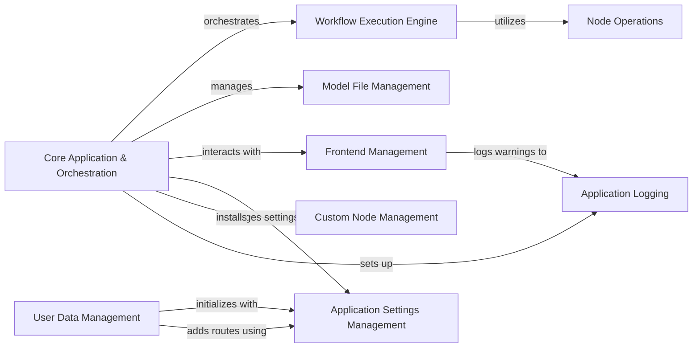

## Component Details

This graph illustrates the core components and their interactions within the ComfyUI application. The `Core Application & Orchestration` component serves as the central hub, managing startup, configuration, and orchestrating the main execution flow. It interacts with various specialized components for model management, frontend operations, user settings, custom node handling, and logging. The `Workflow Execution Engine` is responsible for processing computational graphs, utilizing `Node Operations` to perform specific tasks. Overall, this structure ensures a modular and extensible design for ComfyUI's operations.

### Core Application & Orchestration
Manages the fundamental operations of ComfyUI, including application startup, argument parsing, logger setup, custom path management, and orchestrating the main prompt execution loop. It also handles model file management, frontend interactions, user settings, and custom node installations. This component is responsible for the initial setup of the ComfyUI application, including applying custom paths and loading extra configuration settings.

**Related Classes/Methods**:

- `ComfyUI.main` (full file reference)
- `folder_paths` (full file reference)
- <a href="https://github.com/comfyanonymous/ComfyUI/blob/master/utils/extra_config.py#L6-L34" target="_blank" rel="noopener noreferrer">`utils.extra_config.load_extra_path_config` (6:34)</a>
- <a href="https://github.com/comfyanonymous/ComfyUI/blob/master/app/logger.py#L54-L84" target="_blank" rel="noopener noreferrer">`ComfyUI.app.logger:setup_logger` (54:84)</a>
- <a href="https://github.com/comfyanonymous/ComfyUI/blob/master/main.py#L23-L55" target="_blank" rel="noopener noreferrer">`ComfyUI.main:apply_custom_paths` (23:55)</a>
- <a href="https://github.com/comfyanonymous/ComfyUI/blob/master/folder_paths.py#L110-L112" target="_blank" rel="noopener noreferrer">`folder_paths.set_input_directory` (110:112)</a>

### Node Operations
This component encapsulates the core functionalities related to applying various models and operations within the ComfyUI workflow graph, such as ControlNet, Style Models, and GLIGEN text box operations.

**Related Classes/Methods**:

- <a href="https://github.com/comfyanonymous/ComfyUI/blob/master/nodes.py#L813-L841" target="_blank" rel="noopener noreferrer">`ComfyUI.nodes.ControlNetApply` (813:841)</a>
- <a href="https://github.com/comfyanonymous/ComfyUI/blob/master/nodes.py#L844-L891" target="_blank" rel="noopener noreferrer">`ComfyUI.nodes.ControlNetApplyAdvanced` (844:891)</a>
- <a href="https://github.com/comfyanonymous/ComfyUI/blob/master/nodes.py#L1028-L1087" target="_blank" rel="noopener noreferrer">`ComfyUI.nodes.StyleModelApply` (1028:1087)</a>
- <a href="https://github.com/comfyanonymous/ComfyUI/blob/master/nodes.py#L1124-L1153" target="_blank" rel="noopener noreferrer">`ComfyUI.nodes.GLIGENTextBoxApply` (1124:1153)</a>

### Workflow Execution Engine
This component manages the execution of ComfyUI workflows, including retrieving and validating input data, and building and manipulating the computational graph. It ensures the correct flow and processing of nodes.

**Related Classes/Methods**:

- `ComfyUI.execution` (full file reference)
- `ComfyUI.comfy_execution.graph_utils` (full file reference)
- <a href="https://github.com/comfyanonymous/ComfyUI/blob/master/comfy_execution/graph.py#L97-L169" target="_blank" rel="noopener noreferrer">`ComfyUI.comfy_execution.graph.TopologicalSort` (97:169)</a>

### Model File Management
This component is responsible for managing model files, including adding routes for model access, listing available models, caching model file lists, and handling model previews.

**Related Classes/Methods**:

- `ComfyUI.app.model_manager` (full file reference)

### Frontend Management
This component handles all aspects of the ComfyUI user interface, including checking frontend versions, managing frontend paths, initializing the frontend, and downloading release assets.

**Related Classes/Methods**:

- `ComfyUI.app.frontend_management` (full file reference)

### Application Settings Management
This component provides functionalities for managing application-wide settings, including retrieving and saving configuration parameters.

**Related Classes/Methods**:

- `ComfyUI.app.app_settings` (full file reference)

### User Data Management
This component is responsible for managing user-specific data, including user file paths, adding new users, and handling user data routes.

**Related Classes/Methods**:

- `ComfyUI.app.user_manager` (full file reference)

### Custom Node Management
This component handles the management of custom nodes, including building translations for them and adding routes for custom node functionalities.

**Related Classes/Methods**:

- `ComfyUI.app.custom_node_manager` (full file reference)

### Application Logging
This component provides logging capabilities for the ComfyUI application, intercepting standard output, writing log messages, and handling log flushing.

**Related Classes/Methods**:

- `ComfyUI.app.logger` (full file reference)

### [FAQ](https://github.com/CodeBoarding/GeneratedOnBoardings/tree/main?tab=readme-ov-file#faq)