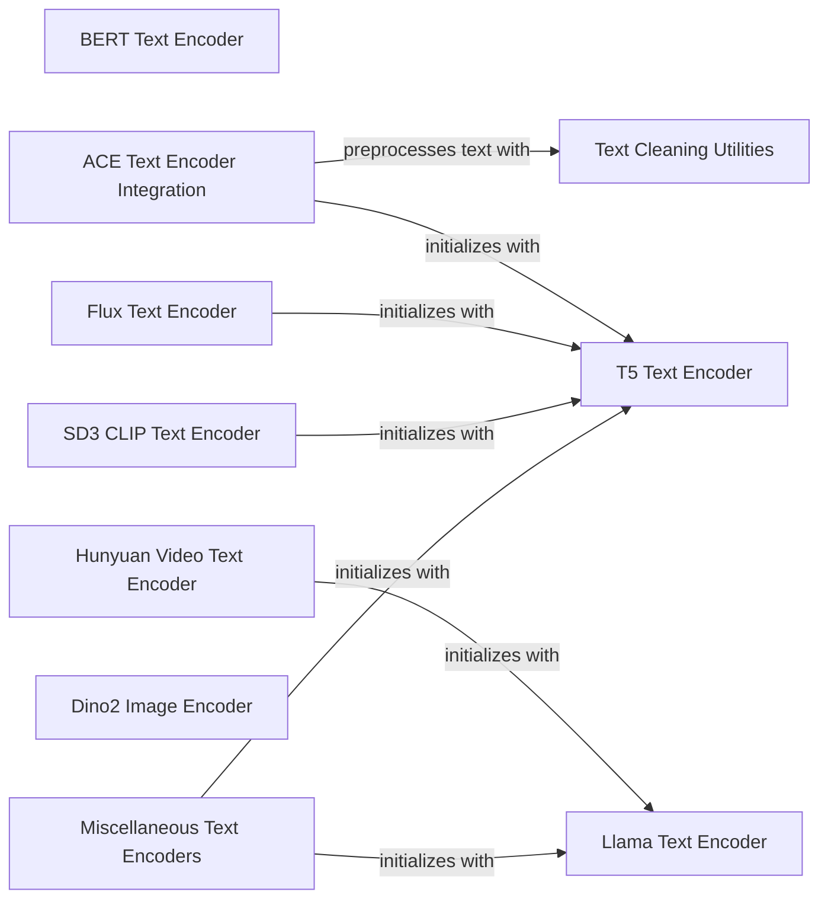

## Component Details

The 'Input Encoders' subsystem in ComfyUI is a comprehensive suite of modules designed to process and encode various input types, primarily text and images, into latent representations. This process is crucial for preparing data to be consumed by diffusion models. The subsystem includes specialized encoders for different text models like CLIP, T5, BERT, Llama, and others, as well as image encoders such as Dino2 for feature extraction. It also incorporates utilities for text cleaning and normalization, ensuring that input text is properly formatted before encoding. The overall purpose is to transform raw input data into a standardized, high-dimensional format suitable for generative AI tasks.

### Text Cleaning Utilities
This component provides a set of utility functions for cleaning and normalizing text, including converting Japanese to Romaji, expanding numbers (ordinals, currencies, decimals), abbreviations, and symbols, and handling whitespace and case. It's crucial for preparing text input for various text encoding models.

**Related Classes/Methods**:

- <a href="https://github.com/comfyanonymous/ComfyUI/blob/master/comfy/text_encoders/ace_text_cleaners.py#L7-L130" target="_blank" rel="noopener noreferrer">`ComfyUI.comfy.text_encoders.ace_text_cleaners:japanese_to_romaji` (7:130)</a>
- <a href="https://github.com/comfyanonymous/ComfyUI/blob/master/comfy/text_encoders/ace_text_cleaners.py#L132-L175" target="_blank" rel="noopener noreferrer">`ComfyUI.comfy.text_encoders.ace_text_cleaners:number_to_text` (132:175)</a>
- <a href="https://github.com/comfyanonymous/ComfyUI/blob/master/comfy/text_encoders/ace_text_cleaners.py#L178-L202" target="_blank" rel="noopener noreferrer">`ComfyUI.comfy.text_encoders.ace_text_cleaners:_int_to_text` (178:202)</a>
- <a href="https://github.com/comfyanonymous/ComfyUI/blob/master/comfy/text_encoders/ace_text_cleaners.py#L205-L208" target="_blank" rel="noopener noreferrer">`ComfyUI.comfy.text_encoders.ace_text_cleaners:_digit_to_text` (205:208)</a>
- <a href="https://github.com/comfyanonymous/ComfyUI/blob/master/comfy/text_encoders/ace_text_cleaners.py#L300-L302" target="_blank" rel="noopener noreferrer">`ComfyUI.comfy.text_encoders.ace_text_cleaners:_expand_decimal_point` (300:302)</a>
- <a href="https://github.com/comfyanonymous/ComfyUI/blob/master/comfy/text_encoders/ace_text_cleaners.py#L305-L331" target="_blank" rel="noopener noreferrer">`ComfyUI.comfy.text_encoders.ace_text_cleaners:_expand_currency` (305:331)</a>
- <a href="https://github.com/comfyanonymous/ComfyUI/blob/master/comfy/text_encoders/ace_text_cleaners.py#L334-L335" target="_blank" rel="noopener noreferrer">`ComfyUI.comfy.text_encoders.ace_text_cleaners:_expand_ordinal` (334:335)</a>
- <a href="https://github.com/comfyanonymous/ComfyUI/blob/master/comfy/text_encoders/ace_text_cleaners.py#L338-L339" target="_blank" rel="noopener noreferrer">`ComfyUI.comfy.text_encoders.ace_text_cleaners:_expand_number` (338:339)</a>
- <a href="https://github.com/comfyanonymous/ComfyUI/blob/master/comfy/text_encoders/ace_text_cleaners.py#L342-L357" target="_blank" rel="noopener noreferrer">`ComfyUI.comfy.text_encoders.ace_text_cleaners:expand_numbers_multilingual` (342:357)</a>
- <a href="https://github.com/comfyanonymous/ComfyUI/blob/master/comfy/text_encoders/ace_text_cleaners.py#L242-L245" target="_blank" rel="noopener noreferrer">`ComfyUI.comfy.text_encoders.ace_text_cleaners:expand_abbreviations_multilingual` (242:245)</a>
- <a href="https://github.com/comfyanonymous/ComfyUI/blob/master/comfy/text_encoders/ace_text_cleaners.py#L264-L268" target="_blank" rel="noopener noreferrer">`ComfyUI.comfy.text_encoders.ace_text_cleaners:expand_symbols_multilingual` (264:268)</a>
- <a href="https://github.com/comfyanonymous/ComfyUI/blob/master/comfy/text_encoders/ace_text_cleaners.py#L360-L361" target="_blank" rel="noopener noreferrer">`ComfyUI.comfy.text_encoders.ace_text_cleaners:lowercase` (360:361)</a>
- <a href="https://github.com/comfyanonymous/ComfyUI/blob/master/comfy/text_encoders/ace_text_cleaners.py#L364-L365" target="_blank" rel="noopener noreferrer">`ComfyUI.comfy.text_encoders.ace_text_cleaners:collapse_whitespace` (364:365)</a>
- <a href="https://github.com/comfyanonymous/ComfyUI/blob/master/comfy/text_encoders/ace_text_cleaners.py#L368-L388" target="_blank" rel="noopener noreferrer">`ComfyUI.comfy.text_encoders.ace_text_cleaners:multilingual_cleaners` (368:388)</a>
- <a href="https://github.com/comfyanonymous/ComfyUI/blob/master/comfy/text_encoders/ace_text_cleaners.py#L391-L395" target="_blank" rel="noopener noreferrer">`ComfyUI.comfy.text_encoders.ace_text_cleaners:basic_cleaners` (391:395)</a>

### Llama Text Encoder
This component encapsulates the implementation of Llama and Gemma2 transformer models for text encoding. It includes attention mechanisms, transformer blocks, and the overall model architecture, handling the forward pass for text embeddings.

**Related Classes/Methods**:

- <a href="https://github.com/comfyanonymous/ComfyUI/blob/master/comfy/text_encoders/llama.py#L82-L87" target="_blank" rel="noopener noreferrer">`ComfyUI.comfy.text_encoders.llama:apply_rope` (82:87)</a>
- <a href="https://github.com/comfyanonymous/ComfyUI/blob/master/comfy/text_encoders/llama.py#L106-L128" target="_blank" rel="noopener noreferrer">`ComfyUI.comfy.text_encoders.llama.Attention:forward` (106:128)</a>
- <a href="https://github.com/comfyanonymous/ComfyUI/blob/master/comfy/text_encoders/llama.py#L146-L151" target="_blank" rel="noopener noreferrer">`ComfyUI.comfy.text_encoders.llama.TransformerBlock:__init__` (146:151)</a>
- <a href="https://github.com/comfyanonymous/ComfyUI/blob/master/comfy/text_encoders/llama.py#L153-L177" target="_blank" rel="noopener noreferrer">`ComfyUI.comfy.text_encoders.llama.TransformerBlock:forward` (153:177)</a>
- <a href="https://github.com/comfyanonymous/ComfyUI/blob/master/comfy/text_encoders/llama.py#L180-L187" target="_blank" rel="noopener noreferrer">`ComfyUI.comfy.text_encoders.llama.TransformerBlockGemma2:__init__` (180:187)</a>
- <a href="https://github.com/comfyanonymous/ComfyUI/blob/master/comfy/text_encoders/llama.py#L189-L216" target="_blank" rel="noopener noreferrer">`ComfyUI.comfy.text_encoders.llama.TransformerBlockGemma2:forward` (189:216)</a>
- <a href="https://github.com/comfyanonymous/ComfyUI/blob/master/comfy/text_encoders/llama.py#L219-L241" target="_blank" rel="noopener noreferrer">`ComfyUI.comfy.text_encoders.llama.Llama2_:__init__` (219:241)</a>
- <a href="https://github.com/comfyanonymous/ComfyUI/blob/master/comfy/text_encoders/llama.py#L244-L301" target="_blank" rel="noopener noreferrer">`ComfyUI.comfy.text_encoders.llama.Llama2_:forward` (244:301)</a>
- <a href="https://github.com/comfyanonymous/ComfyUI/blob/master/comfy/text_encoders/llama.py#L315-L321" target="_blank" rel="noopener noreferrer">`ComfyUI.comfy.text_encoders.llama.Llama2:__init__` (315:321)</a>
- <a href="https://github.com/comfyanonymous/ComfyUI/blob/master/comfy/text_encoders/llama.py#L325-L331" target="_blank" rel="noopener noreferrer">`ComfyUI.comfy.text_encoders.llama.Gemma2_2B:__init__` (325:331)</a>

### T5 Text Encoder
This component provides the building blocks and full model for T5-based text encoding. It includes layer normalization, feed-forward networks, attention mechanisms, and the stacking of these blocks to form the complete T5 encoder.

**Related Classes/Methods**:

- <a href="https://github.com/comfyanonymous/ComfyUI/blob/master/comfy/text_encoders/t5.py#L12-L15" target="_blank" rel="noopener noreferrer">`ComfyUI.comfy.text_encoders.t5.T5LayerNorm:forward` (12:15)</a>
- <a href="https://github.com/comfyanonymous/ComfyUI/blob/master/comfy/text_encoders/t5.py#L54-L61" target="_blank" rel="noopener noreferrer">`ComfyUI.comfy.text_encoders.t5.T5LayerFF:__init__` (54:61)</a>
- <a href="https://github.com/comfyanonymous/ComfyUI/blob/master/comfy/text_encoders/t5.py#L64-L69" target="_blank" rel="noopener noreferrer">`ComfyUI.comfy.text_encoders.t5.T5LayerFF:forward` (64:69)</a>
- <a href="https://github.com/comfyanonymous/ComfyUI/blob/master/comfy/text_encoders/t5.py#L136-L149" target="_blank" rel="noopener noreferrer">`ComfyUI.comfy.text_encoders.t5.T5Attention:compute_bias` (136:149)</a>
- <a href="https://github.com/comfyanonymous/ComfyUI/blob/master/comfy/text_encoders/t5.py#L151-L165" target="_blank" rel="noopener noreferrer">`ComfyUI.comfy.text_encoders.t5.T5Attention:forward` (151:165)</a>
- <a href="https://github.com/comfyanonymous/ComfyUI/blob/master/comfy/text_encoders/t5.py#L168-L171" target="_blank" rel="noopener noreferrer">`ComfyUI.comfy.text_encoders.t5.T5LayerSelfAttention:__init__` (168:171)</a>
- <a href="https://github.com/comfyanonymous/ComfyUI/blob/master/comfy/text_encoders/t5.py#L174-L178" target="_blank" rel="noopener noreferrer">`ComfyUI.comfy.text_encoders.t5.T5LayerSelfAttention:forward` (174:178)</a>
- <a href="https://github.com/comfyanonymous/ComfyUI/blob/master/comfy/text_encoders/t5.py#L181-L185" target="_blank" rel="noopener noreferrer">`ComfyUI.comfy.text_encoders.t5.T5Block:__init__` (181:185)</a>
- <a href="https://github.com/comfyanonymous/ComfyUI/blob/master/comfy/text_encoders/t5.py#L193-L199" target="_blank" rel="noopener noreferrer">`ComfyUI.comfy.text_encoders.t5.T5Stack:__init__` (193:199)</a>
- <a href="https://github.com/comfyanonymous/ComfyUI/blob/master/comfy/text_encoders/t5.py#L202-L223" target="_blank" rel="noopener noreferrer">`ComfyUI.comfy.text_encoders.t5.T5Stack:forward` (202:223)</a>
- <a href="https://github.com/comfyanonymous/ComfyUI/blob/master/comfy/text_encoders/t5.py#L226-L234" target="_blank" rel="noopener noreferrer">`ComfyUI.comfy.text_encoders.t5.T5:__init__` (226:234)</a>
- <a href="https://github.com/comfyanonymous/ComfyUI/blob/master/comfy/text_encoders/t5.py#L242-L249" target="_blank" rel="noopener noreferrer">`ComfyUI.comfy.text_encoders.t5.T5:forward` (242:249)</a>

### BERT Text Encoder
This component implements the BERT model architecture for text encoding, including attention blocks, intermediate layers, output layers, and embeddings. It handles the processing of input text to generate BERT-style embeddings.

**Related Classes/Methods**:

- <a href="https://github.com/comfyanonymous/ComfyUI/blob/master/comfy/text_encoders/bert.py#L37-L40" target="_blank" rel="noopener noreferrer">`ComfyUI.comfy.text_encoders.bert.BertAttentionBlock:__init__` (37:40)</a>
- <a href="https://github.com/comfyanonymous/ComfyUI/blob/master/comfy/text_encoders/bert.py#L42-L44" target="_blank" rel="noopener noreferrer">`ComfyUI.comfy.text_encoders.bert.BertAttentionBlock:forward` (42:44)</a>
- <a href="https://github.com/comfyanonymous/ComfyUI/blob/master/comfy/text_encoders/bert.py#L57-L61" target="_blank" rel="noopener noreferrer">`ComfyUI.comfy.text_encoders.bert.BertBlock:__init__` (57:61)</a>
- <a href="https://github.com/comfyanonymous/ComfyUI/blob/master/comfy/text_encoders/bert.py#L63-L66" target="_blank" rel="noopener noreferrer">`ComfyUI.comfy.text_encoders.bert.BertBlock:forward` (63:66)</a>
- <a href="https://github.com/comfyanonymous/ComfyUI/blob/master/comfy/text_encoders/bert.py#L69-L71" target="_blank" rel="noopener noreferrer">`ComfyUI.comfy.text_encoders.bert.BertEncoder:__init__` (69:71)</a>
- <a href="https://github.com/comfyanonymous/ComfyUI/blob/master/comfy/text_encoders/bert.py#L96-L107" target="_blank" rel="noopener noreferrer">`ComfyUI.comfy.text_encoders.bert.BertEmbeddings:forward` (96:107)</a>
- <a href="https://github.com/comfyanonymous/ComfyUI/blob/master/comfy/text_encoders/bert.py#L111-L117" target="_blank" rel="noopener noreferrer">`ComfyUI.comfy.text_encoders.bert.BertModel_:__init__` (111:117)</a>
- <a href="https://github.com/comfyanonymous/ComfyUI/blob/master/comfy/text_encoders/bert.py#L119-L127" target="_blank" rel="noopener noreferrer">`ComfyUI.comfy.text_encoders.bert.BertModel_:forward` (119:127)</a>
- <a href="https://github.com/comfyanonymous/ComfyUI/blob/master/comfy/text_encoders/bert.py#L131-L134" target="_blank" rel="noopener noreferrer">`ComfyUI.comfy.text_encoders.bert.BertModel:__init__` (131:134)</a>
- <a href="https://github.com/comfyanonymous/ComfyUI/blob/master/comfy/text_encoders/bert.py#L142-L143" target="_blank" rel="noopener noreferrer">`ComfyUI.comfy.text_encoders.bert.BertModel:forward` (142:143)</a>

### ACE Text Encoder Integration
This component integrates various text encoding functionalities, specifically for the ACE model. It includes a VoiceBpeTokenizer for preprocessing and encoding text, and AceT5Tokenizer and AceT5Model for T5-based text encoding, potentially for lyrics or other specialized text inputs.

**Related Classes/Methods**:

- <a href="https://github.com/comfyanonymous/ComfyUI/blob/master/comfy/text_encoders/ace.py#L30-L32" target="_blank" rel="noopener noreferrer">`ComfyUI.comfy.text_encoders.ace.VoiceBpeTokenizer:preprocess_text` (30:32)</a>
- <a href="https://github.com/comfyanonymous/ComfyUI/blob/master/comfy/text_encoders/ace.py#L34-L41" target="_blank" rel="noopener noreferrer">`ComfyUI.comfy.text_encoders.ace.VoiceBpeTokenizer:encode` (34:41)</a>
- <a href="https://github.com/comfyanonymous/ComfyUI/blob/master/comfy/text_encoders/ace.py#L50-L84" target="_blank" rel="noopener noreferrer">`ComfyUI.comfy.text_encoders.ace.VoiceBpeTokenizer:__call__` (50:84)</a>
- <a href="https://github.com/comfyanonymous/ComfyUI/blob/master/comfy/text_encoders/ace.py#L87-L88" target="_blank" rel="noopener noreferrer">`ComfyUI.comfy.text_encoders.ace.VoiceBpeTokenizer:from_pretrained` (87:88)</a>
- <a href="https://github.com/comfyanonymous/ComfyUI/blob/master/comfy/text_encoders/ace.py#L113-L115" target="_blank" rel="noopener noreferrer">`ComfyUI.comfy.text_encoders.ace.AceT5Tokenizer:__init__` (113:115)</a>
- <a href="https://github.com/comfyanonymous/ComfyUI/blob/master/comfy/text_encoders/ace.py#L126-L127" target="_blank" rel="noopener noreferrer">`ComfyUI.comfy.text_encoders.ace.AceT5Tokenizer:state_dict` (126:127)</a>
- <a href="https://github.com/comfyanonymous/ComfyUI/blob/master/comfy/text_encoders/ace.py#L130-L135" target="_blank" rel="noopener noreferrer">`ComfyUI.comfy.text_encoders.ace.AceT5Model:__init__` (130:135)</a>

### Flux Text Encoder
This component provides the text encoding capabilities for the Flux model, including its specific tokenizer (FluxTokenizer) and CLIP model (FluxClipModel) which likely leverages a T5XXL architecture for robust text feature extraction.

**Related Classes/Methods**:

- <a href="https://github.com/comfyanonymous/ComfyUI/blob/master/comfy/text_encoders/flux.py#L16-L18" target="_blank" rel="noopener noreferrer">`ComfyUI.comfy.text_encoders.flux.FluxTokenizer:__init__` (16:18)</a>
- <a href="https://github.com/comfyanonymous/ComfyUI/blob/master/comfy/text_encoders/flux.py#L34-L39" target="_blank" rel="noopener noreferrer">`ComfyUI.comfy.text_encoders.flux.FluxClipModel:__init__` (34:39)</a>
- <a href="https://github.com/comfyanonymous/ComfyUI/blob/master/comfy/text_encoders/flux.py#L63-L70" target="_blank" rel="noopener noreferrer">`ComfyUI.comfy.text_encoders.flux:flux_clip` (63:70)</a>

### SD3 CLIP Text Encoder
This component is responsible for text encoding within the SD3 (Stable Diffusion 3) framework, utilizing a specialized tokenizer (SD3Tokenizer) and a CLIP model (SD3ClipModel) that is built upon a T5XXL architecture for advanced text understanding.

**Related Classes/Methods**:

- <a href="https://github.com/comfyanonymous/ComfyUI/blob/master/comfy/text_encoders/sd3_clip.py#L41-L44" target="_blank" rel="noopener noreferrer">`ComfyUI.comfy.text_encoders.sd3_clip.SD3Tokenizer:__init__` (41:44)</a>
- <a href="https://github.com/comfyanonymous/ComfyUI/blob/master/comfy/text_encoders/sd3_clip.py#L60-L83" target="_blank" rel="noopener noreferrer">`ComfyUI.comfy.text_encoders.sd3_clip.SD3ClipModel:__init__` (60:83)</a>
- <a href="https://github.com/comfyanonymous/ComfyUI/blob/master/comfy/text_encoders/sd3_clip.py#L159-L166" target="_blank" rel="noopener noreferrer">`ComfyUI.comfy.text_encoders.sd3_clip:sd3_clip` (159:166)</a>

### Hunyuan Video Text Encoder
This component handles text encoding specifically for the Hunyuan Video model. It includes a tokenizer (HunyuanVideoTokenizer) based on LLAMA3 and a CLIP-like model (HunyuanVideoClipModel) for encoding text with token weights, likely for video generation tasks.

**Related Classes/Methods**:

- <a href="https://github.com/comfyanonymous/ComfyUI/blob/master/comfy/text_encoders/hunyuan_video.py#L45-L48" target="_blank" rel="noopener noreferrer">`ComfyUI.comfy.text_encoders.hunyuan_video.HunyuanVideoTokenizer:__init__` (45:48)</a>
- <a href="https://github.com/comfyanonymous/ComfyUI/blob/master/comfy/text_encoders/hunyuan_video.py#L77-L82" target="_blank" rel="noopener noreferrer">`ComfyUI.comfy.text_encoders.hunyuan_video.HunyuanVideoClipModel:__init__` (77:82)</a>
- <a href="https://github.com/comfyanonymous/ComfyUI/blob/master/comfy/text_encoders/hunyuan_video.py#L92-L143" target="_blank" rel="noopener noreferrer">`ComfyUI.comfy.text_encoders.hunyuan_video.HunyuanVideoClipModel:encode_token_weights` (92:143)</a>
- <a href="https://github.com/comfyanonymous/ComfyUI/blob/master/comfy/text_encoders/hunyuan_video.py#L152-L159" target="_blank" rel="noopener noreferrer">`ComfyUI.comfy.text_encoders.hunyuan_video:hunyuan_video_clip` (152:159)</a>

### Dino2 Image Encoder
This component implements the Dino2 model for image encoding. It comprises attention blocks, transformer blocks, encoder layers, and embedding mechanisms to process image inputs and generate meaningful representations.

**Related Classes/Methods**:

- <a href="https://github.com/comfyanonymous/ComfyUI/blob/master/comfy/image_encoders/dino2.py#L17-L20" target="_blank" rel="noopener noreferrer">`ComfyUI.comfy.image_encoders.dino2.Dino2AttentionBlock:__init__` (17:20)</a>
- <a href="https://github.com/comfyanonymous/ComfyUI/blob/master/comfy/image_encoders/dino2.py#L22-L23" target="_blank" rel="noopener noreferrer">`ComfyUI.comfy.image_encoders.dino2.Dino2AttentionBlock:forward` (22:23)</a>
- <a href="https://github.com/comfyanonymous/ComfyUI/blob/master/comfy/image_encoders/dino2.py#L53-L60" target="_blank" rel="noopener noreferrer">`ComfyUI.comfy.image_encoders.dino2.Dino2Block:__init__` (53:60)</a>
- <a href="https://github.com/comfyanonymous/ComfyUI/blob/master/comfy/image_encoders/dino2.py#L62-L65" target="_blank" rel="noopener noreferrer">`ComfyUI.comfy.image_encoders.dino2.Dino2Block:forward` (62:65)</a>
- <a href="https://github.com/comfyanonymous/ComfyUI/blob/master/comfy/image_encoders/dino2.py#L69-L71" target="_blank" rel="noopener noreferrer">`ComfyUI.comfy.image_encoders.dino2.Dino2Encoder:__init__` (69:71)</a>
- <a href="https://github.com/comfyanonymous/ComfyUI/blob/master/comfy/image_encoders/dino2.py#L106-L114" target="_blank" rel="noopener noreferrer">`ComfyUI.comfy.image_encoders.dino2.Dino2Embeddings:__init__` (106:114)</a>
- <a href="https://github.com/comfyanonymous/ComfyUI/blob/master/comfy/image_encoders/dino2.py#L116-L121" target="_blank" rel="noopener noreferrer">`ComfyUI.comfy.image_encoders.dino2.Dino2Embeddings:forward` (116:121)</a>
- <a href="https://github.com/comfyanonymous/ComfyUI/blob/master/comfy/image_encoders/dino2.py#L125-L134" target="_blank" rel="noopener noreferrer">`ComfyUI.comfy.image_encoders.dino2.Dinov2Model:__init__` (125:134)</a>
- <a href="https://github.com/comfyanonymous/ComfyUI/blob/master/comfy/image_encoders/dino2.py#L136-L141" target="_blank" rel="noopener noreferrer">`ComfyUI.comfy.image_encoders.dino2.Dinov2Model:forward` (136:141)</a>

### Miscellaneous Text Encoders
This component serves as a collection for various specialized text encoders that are integrated into the ComfyUI system. These encoders cater to different models and purposes, such as LT, WAN, PixArt-T5, Genmo, SPiece, Cosmos, HiDream, and Lumina2, each providing unique text embedding capabilities.

**Related Classes/Methods**:

- <a href="https://github.com/comfyanonymous/ComfyUI/blob/master/comfy/text_encoders/lt.py#L17-L18" target="_blank" rel="noopener noreferrer">`ComfyUI.comfy.text_encoders.lt:ltxv_te` (17:18)</a>
- <a href="https://github.com/comfyanonymous/ComfyUI/blob/master/comfy/text_encoders/wan.py#L28-L37" target="_blank" rel="noopener noreferrer">`ComfyUI.comfy.text_encoders.wan:te` (28:37)</a>
- <a href="https://github.com/comfyanonymous/ComfyUI/blob/master/comfy/text_encoders/pixart_t5.py#L33-L42" target="_blank" rel="noopener noreferrer">`ComfyUI.comfy.text_encoders.pixart_t5:pixart_te` (33:42)</a>
- <a href="https://github.com/comfyanonymous/ComfyUI/blob/master/comfy/text_encoders/genmo.py#L29-L38" target="_blank" rel="noopener noreferrer">`ComfyUI.comfy.text_encoders.genmo:mochi_te` (29:38)</a>
- <a href="https://github.com/comfyanonymous/ComfyUI/blob/master/comfy/text_encoders/spiece_tokenizer.py#L6-L7" target="_blank" rel="noopener noreferrer">`ComfyUI.comfy.text_encoders.spiece_tokenizer.SPieceTokenizer:from_pretrained` (6:7)</a>
- <a href="https://github.com/comfyanonymous/ComfyUI/blob/master/comfy/text_encoders/cosmos.py#L33-L42" target="_blank" rel="noopener noreferrer">`ComfyUI.comfy.text_encoders.cosmos:te` (33:42)</a>
- <a href="https://github.com/comfyanonymous/ComfyUI/blob/master/comfy/text_encoders/hidream.py#L145-L155" target="_blank" rel="noopener noreferrer">`ComfyUI.comfy.text_encoders.hidream:hidream_clip` (145:155)</a>
- <a href="https://github.com/comfyanonymous/ComfyUI/blob/master/comfy/text_encoders/lumina2.py#L30-L39" target="_blank" rel="noopener noreferrer">`ComfyUI.comfy.text_encoders.lumina2:te` (30:39)</a>

### [FAQ](https://github.com/CodeBoarding/GeneratedOnBoardings/tree/main?tab=readme-ov-file#faq)