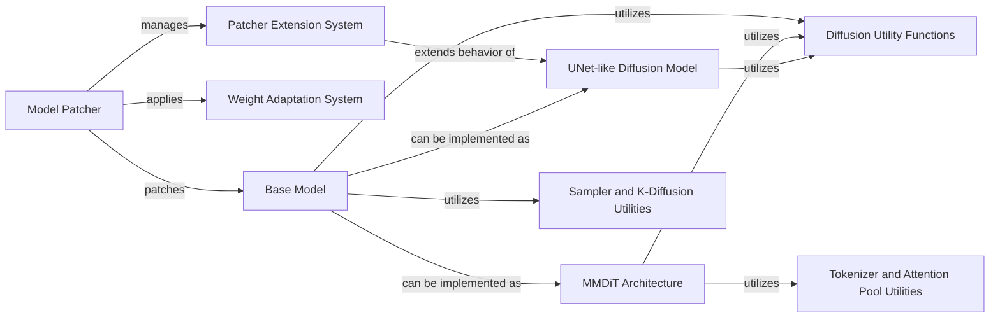

## Component Details

The Model Management & Diffusion Core component in ComfyUI is responsible for the dynamic modification and extension of diffusion models, enabling flexible integration of new functionalities like LoRA. It orchestrates the core Latent Diffusion Model operations, including denoising steps, by implementing various sampling algorithms and providing essential utilities for diffusion processes, such as K-diffusion specific functions, conditioning, and mask handling. This component acts as the central hub for adapting, running, and managing the lifecycle of diffusion models within the system.

### Model Patcher
The Model Patcher component is central to dynamically modifying and extending models within ComfyUI. It manages the application and removal of patches, handles memory management for model weights, and integrates with the Patcher Extension System for callbacks and wrappers. It also manages hook patches for advanced model modifications.

**Related Classes/Methods**:

- `ComfyUI.comfy.model_patcher` (full file reference)
- <a href="https://github.com/comfyanonymous/ComfyUI/blob/master/comfy/model_patcher.py#L880-L881" target="_blank" rel="noopener noreferrer">`comfy.model_patcher.ModelPatcher:add_wrapper` (880:881)</a>
- <a href="https://github.com/comfyanonymous/ComfyUI/blob/master/comfy/model_patcher.py#L883-L885" target="_blank" rel="noopener noreferrer">`comfy.model_patcher.ModelPatcher:add_wrapper_with_key` (883:885)</a>

### Patcher Extension System
This component provides a flexible mechanism for dynamically extending and modifying the behavior of functions and methods within the ComfyUI system. It allows for the injection of custom logic (wrappers and callbacks) at various points in the execution flow, enabling features like model patching and custom sampling behaviors without altering the original code. The WrapperExecutor class is central to managing the ordered execution of these wrappers.

**Related Classes/Methods**:

- `ComfyUI.comfy.patcher_extension` (full file reference)
- <a href="https://github.com/comfyanonymous/ComfyUI/blob/master/comfy/patcher_extension.py#L4-L20" target="_blank" rel="noopener noreferrer">`comfy.patcher_extension.CallbacksMP` (4:20)</a>
- <a href="https://github.com/comfyanonymous/ComfyUI/blob/master/comfy/patcher_extension.py#L22-L23" target="_blank" rel="noopener noreferrer">`comfy.patcher_extension.add_callback` (22:23)</a>
- <a href="https://github.com/comfyanonymous/ComfyUI/blob/master/comfy/patcher_extension.py#L25-L30" target="_blank" rel="noopener noreferrer">`comfy.patcher_extension.add_callback_with_key` (25:30)</a>
- <a href="https://github.com/comfyanonymous/ComfyUI/blob/master/comfy/patcher_extension.py#L32-L38" target="_blank" rel="noopener noreferrer">`comfy.patcher_extension.get_callbacks_with_key` (32:38)</a>
- <a href="https://github.com/comfyanonymous/ComfyUI/blob/master/comfy/patcher_extension.py#L40-L47" target="_blank" rel="noopener noreferrer">`comfy.patcher_extension.get_all_callbacks` (40:47)</a>
- <a href="https://github.com/comfyanonymous/ComfyUI/blob/master/comfy/patcher_extension.py#L49-L61" target="_blank" rel="noopener noreferrer">`comfy.patcher_extension.WrappersMP` (49:61)</a>
- <a href="https://github.com/comfyanonymous/ComfyUI/blob/master/comfy/patcher_extension.py#L63-L64" target="_blank" rel="noopener noreferrer">`comfy.patcher_extension.add_wrapper` (63:64)</a>
- <a href="https://github.com/comfyanonymous/ComfyUI/blob/master/comfy/patcher_extension.py#L66-L71" target="_blank" rel="noopener noreferrer">`comfy.patcher_extension.add_wrapper_with_key` (66:71)</a>
- <a href="https://github.com/comfyanonymous/ComfyUI/blob/master/comfy/patcher_extension.py#L73-L79" target="_blank" rel="noopener noreferrer">`comfy.patcher_extension.get_wrappers_with_key` (73:79)</a>
- <a href="https://github.com/comfyanonymous/ComfyUI/blob/master/comfy/patcher_extension.py#L81-L88" target="_blank" rel="noopener noreferrer">`comfy.patcher_extension.get_all_wrappers` (81:88)</a>
- <a href="https://github.com/comfyanonymous/ComfyUI/blob/master/comfy/patcher_extension.py#L90-L128" target="_blank" rel="noopener noreferrer">`comfy.patcher_extension.WrapperExecutor` (90:128)</a>
- <a href="https://github.com/comfyanonymous/ComfyUI/blob/master/comfy/patcher_extension.py#L130-L133" target="_blank" rel="noopener noreferrer">`comfy.patcher_extension.PatcherInjection` (130:133)</a>

### Weight Adaptation System
This component provides a modular framework for applying various weight adaptation techniques, such as LoRA, LoKr, BOFT, OFT, GLoRA, and LoHa. Each adapter type handles the loading and calculation of adapted weights, often relying on common base utilities for operations like weight decomposition.

**Related Classes/Methods**:

- `ComfyUI.comfy.weight_adapter.lora` (full file reference)
- <a href="https://github.com/comfyanonymous/ComfyUI/blob/master/comfy/weight_adapter/lora.py#L9-L142" target="_blank" rel="noopener noreferrer">`comfy.weight_adapter.lora.LoRAAdapter` (9:142)</a>
- `ComfyUI.comfy.weight_adapter.boft` (full file reference)
- <a href="https://github.com/comfyanonymous/ComfyUI/blob/master/comfy/weight_adapter/boft.py#L9-L115" target="_blank" rel="noopener noreferrer">`comfy.weight_adapter.boft.BOFTAdapter` (9:115)</a>
- `ComfyUI.comfy.weight_adapter.lokr` (full file reference)
- `ComfyUI.comfy.weight_adapter.oft` (full file reference)
- `ComfyUI.comfy.weight_adapter.glora` (full file reference)
- `ComfyUI.comfy.weight_adapter.loha` (full file reference)
- <a href="https://github.com/comfyanonymous/ComfyUI/blob/master/comfy/weight_adapter/base.py#L73-L104" target="_blank" rel="noopener noreferrer">`ComfyUI.comfy.weight_adapter.base.pad_tensor_to_shape` (73:104)</a>
- <a href="https://github.com/comfyanonymous/ComfyUI/blob/master/comfy/weight_adapter/base.py#L42-L70" target="_blank" rel="noopener noreferrer">`ComfyUI.comfy.weight_adapter.base.weight_decompose` (42:70)</a>

### Base Model
The Base Model component provides the fundamental structure and common functionalities for various diffusion models in ComfyUI. It defines the core `apply_model` method, handles input processing, and integrates with model sampling and conditioning mechanisms. Different model types inherit from this base class to implement specific diffusion architectures.

**Related Classes/Methods**:

- `ComfyUI.comfy.model_base` (full file reference)
- <a href="https://github.com/comfyanonymous/ComfyUI/blob/master/comfy/model_base.py#L147-L152" target="_blank" rel="noopener noreferrer">`comfy.model_base.BaseModel:apply_model` (147:152)</a>

### UNet-like Diffusion Model
This component provides the foundational building blocks for a UNet-like diffusion model, including encoder and decoder structures, residual blocks, attention mechanisms, and upsampling/downsampling layers. It forms the backbone for many generative models, processing latent representations during the diffusion process.

**Related Classes/Methods**:

- `ComfyUI.comfy.ldm.modules.diffusionmodules.model` (full file reference)
- <a href="https://github.com/comfyanonymous/ComfyUI/blob/master/comfy/ldm/modules/diffusionmodules/model.py#L79-L115" target="_blank" rel="noopener noreferrer">`ComfyUI.comfy.ldm.modules.diffusionmodules.model.Upsample` (79:115)</a>
- <a href="https://github.com/comfyanonymous/ComfyUI/blob/master/comfy/ldm/modules/diffusionmodules/model.py#L146-L206" target="_blank" rel="noopener noreferrer">`ComfyUI.comfy.ldm.modules.diffusionmodules.model.ResnetBlock` (146:206)</a>
- <a href="https://github.com/comfyanonymous/ComfyUI/blob/master/comfy/ldm/modules/diffusionmodules/model.py#L244-L258" target="_blank" rel="noopener noreferrer">`ComfyUI.comfy.ldm.modules.diffusionmodules.model:normal_attention` (244:258)</a>
- <a href="https://github.com/comfyanonymous/ComfyUI/blob/master/comfy/ldm/modules/diffusionmodules/model.py#L260-L275" target="_blank" rel="noopener noreferrer">`ComfyUI.comfy.ldm.modules.diffusionmodules.model:xformers_attention` (260:275)</a>
- <a href="https://github.com/comfyanonymous/ComfyUI/blob/master/comfy/ldm/modules/diffusionmodules/model.py#L277-L293" target="_blank" rel="noopener noreferrer">`ComfyUI.comfy.ldm.modules.diffusionmodules.model:pytorch_attention` (277:293)</a>
- <a href="https://github.com/comfyanonymous/ComfyUI/blob/master/comfy/ldm/modules/diffusionmodules/model.py#L307-L347" target="_blank" rel="noopener noreferrer">`ComfyUI.comfy.ldm.modules.diffusionmodules.model.AttnBlock` (307:347)</a>
- <a href="https://github.com/comfyanonymous/ComfyUI/blob/master/comfy/ldm/modules/diffusionmodules/model.py#L350-L351" target="_blank" rel="noopener noreferrer">`ComfyUI.comfy.ldm.modules.diffusionmodules.model:make_attn` (350:351)</a>
- <a href="https://github.com/comfyanonymous/ComfyUI/blob/master/comfy/ldm/modules/diffusionmodules/model.py#L354-L503" target="_blank" rel="noopener noreferrer">`ComfyUI.comfy.ldm.modules.diffusionmodules.model.Model` (354:503)</a>
- <a href="https://github.com/comfyanonymous/ComfyUI/blob/master/comfy/ldm/modules/diffusionmodules/model.py#L506-L609" target="_blank" rel="noopener noreferrer">`ComfyUI.comfy.ldm.modules.diffusionmodules.model.Encoder` (506:609)</a>
- <a href="https://github.com/comfyanonymous/ComfyUI/blob/master/comfy/ldm/modules/diffusionmodules/model.py#L612-L734" target="_blank" rel="noopener noreferrer">`ComfyUI.comfy.ldm.modules.diffusionmodules.model.Decoder` (612:734)</a>
- `ComfyUI.comfy.ldm.modules.diffusionmodules.openaimodel` (full file reference)
- <a href="https://github.com/comfyanonymous/ComfyUI/blob/master/comfy/ldm/modules/diffusionmodules/openaimodel.py#L62-L69" target="_blank" rel="noopener noreferrer">`ComfyUI.comfy.ldm.modules.diffusionmodules.openaimodel.TimestepEmbedSequential` (62:69)</a>
- <a href="https://github.com/comfyanonymous/ComfyUI/blob/master/comfy/ldm/modules/diffusionmodules/openaimodel.py#L107-L133" target="_blank" rel="noopener noreferrer">`ComfyUI.comfy.ldm.modules.diffusionmodules.openaimodel.Downsample` (107:133)</a>
- <a href="https://github.com/comfyanonymous/ComfyUI/blob/master/comfy/ldm/modules/diffusionmodules/openaimodel.py#L136-L273" target="_blank" rel="noopener noreferrer">`ComfyUI.comfy.ldm.modules.diffusionmodules.openaimodel.ResBlock` (136:273)</a>
- <a href="https://github.com/comfyanonymous/ComfyUI/blob/master/comfy/ldm/modules/diffusionmodules/openaimodel.py#L276-L354" target="_blank" rel="noopener noreferrer">`ComfyUI.comfy.ldm.modules.diffusionmodules.openaimodel.VideoResBlock` (276:354)</a>
- <a href="https://github.com/comfyanonymous/ComfyUI/blob/master/comfy/ldm/modules/diffusionmodules/openaimodel.py#L357-L363" target="_blank" rel="noopener noreferrer">`ComfyUI.comfy.ldm.modules.diffusionmodules.openaimodel.Timestep` (357:363)</a>
- <a href="https://github.com/comfyanonymous/ComfyUI/blob/master/comfy/ldm/modules/diffusionmodules/openaimodel.py#L375-L913" target="_blank" rel="noopener noreferrer">`ComfyUI.comfy.ldm.modules.diffusionmodules.openaimodel.UNetModel` (375:913)</a>

### MMDiT Architecture
This component implements the Multi-Modal Diffusion Transformer (MMDiT) architecture, a neural network design specifically tailored for diffusion models. It includes various specialized blocks like DismantledBlock, SelfAttention, ContextProcessorBlock, and JointBlock to process and transform multi-modal inputs effectively during the diffusion process.

**Related Classes/Methods**:

- `ComfyUI.comfy.ldm.modules.diffusionmodules.mmdit` (full file reference)
- <a href="https://github.com/comfyanonymous/ComfyUI/blob/master/comfy/ldm/modules/diffusionmodules/mmdit.py#L120-L148" target="_blank" rel="noopener noreferrer">`ComfyUI.comfy.ldm.modules.diffusionmodules.mmdit:get_2d_sincos_pos_embed` (120:148)</a>
- <a href="https://github.com/comfyanonymous/ComfyUI/blob/master/comfy/ldm/modules/diffusionmodules/mmdit.py#L151-L159" target="_blank" rel="noopener noreferrer">`ComfyUI.comfy.ldm.modules.diffusionmodules.mmdit:get_2d_sincos_pos_embed_from_grid` (151:159)</a>
- <a href="https://github.com/comfyanonymous/ComfyUI/blob/master/comfy/ldm/modules/diffusionmodules/mmdit.py#L193-L201" target="_blank" rel="noopener noreferrer">`ComfyUI.comfy.ldm.modules.diffusionmodules.mmdit:get_2d_sincos_pos_embed_torch` (193:201)</a>
- <a href="https://github.com/comfyanonymous/ComfyUI/blob/master/comfy/ldm/modules/diffusionmodules/mmdit.py#L209-L226" target="_blank" rel="noopener noreferrer">`ComfyUI.comfy.ldm.modules.diffusionmodules.mmdit.TimestepEmbedder` (209:226)</a>
- <a href="https://github.com/comfyanonymous/ComfyUI/blob/master/comfy/ldm/modules/diffusionmodules/mmdit.py#L257-L319" target="_blank" rel="noopener noreferrer">`ComfyUI.comfy.ldm.modules.diffusionmodules.mmdit.SelfAttention` (257:319)</a>
- <a href="https://github.com/comfyanonymous/ComfyUI/blob/master/comfy/ldm/modules/diffusionmodules/mmdit.py#L386-L595" target="_blank" rel="noopener noreferrer">`ComfyUI.comfy.ldm.modules.diffusionmodules.mmdit.DismantledBlock` (386:595)</a>
- <a href="https://github.com/comfyanonymous/ComfyUI/blob/master/comfy/ldm/modules/diffusionmodules/mmdit.py#L598-L604" target="_blank" rel="noopener noreferrer">`ComfyUI.comfy.ldm.modules.diffusionmodules.mmdit:block_mixing` (598:604)</a>
- <a href="https://github.com/comfyanonymous/ComfyUI/blob/master/comfy/ldm/modules/diffusionmodules/mmdit.py#L607-L642" target="_blank" rel="noopener noreferrer">`ComfyUI.comfy.ldm.modules.diffusionmodules.mmdit:_block_mixing` (607:642)</a>
- <a href="https://github.com/comfyanonymous/ComfyUI/blob/master/comfy/ldm/modules/diffusionmodules/mmdit.py#L645-L667" target="_blank" rel="noopener noreferrer">`ComfyUI.comfy.ldm.modules.diffusionmodules.mmdit.JointBlock` (645:667)</a>
- <a href="https://github.com/comfyanonymous/ComfyUI/blob/master/comfy/ldm/modules/diffusionmodules/mmdit.py#L670-L700" target="_blank" rel="noopener noreferrer">`ComfyUI.comfy.ldm.modules.diffusionmodules.mmdit.FinalLayer` (670:700)</a>
- <a href="https://github.com/comfyanonymous/ComfyUI/blob/master/comfy/ldm/modules/diffusionmodules/mmdit.py#L702-L719" target="_blank" rel="noopener noreferrer">`ComfyUI.comfy.ldm.modules.diffusionmodules.mmdit.SelfAttentionContext` (702:719)</a>
- <a href="https://github.com/comfyanonymous/ComfyUI/blob/master/comfy/ldm/modules/diffusionmodules/mmdit.py#L721-L732" target="_blank" rel="noopener noreferrer">`ComfyUI.comfy.ldm.modules.diffusionmodules.mmdit.ContextProcessorBlock` (721:732)</a>
- <a href="https://github.com/comfyanonymous/ComfyUI/blob/master/comfy/ldm/modules/diffusionmodules/mmdit.py#L734-L743" target="_blank" rel="noopener noreferrer">`ComfyUI.comfy.ldm.modules.diffusionmodules.mmdit.ContextProcessor` (734:743)</a>
- <a href="https://github.com/comfyanonymous/ComfyUI/blob/master/comfy/ldm/modules/diffusionmodules/mmdit.py#L745-L1014" target="_blank" rel="noopener noreferrer">`ComfyUI.comfy.ldm.modules.diffusionmodules.mmdit.MMDiT` (745:1014)</a>
- <a href="https://github.com/comfyanonymous/ComfyUI/blob/master/comfy/ldm/modules/diffusionmodules/mmdit.py#L1017-L1028" target="_blank" rel="noopener noreferrer">`ComfyUI.comfy.ldm.modules.diffusionmodules.mmdit.OpenAISignatureMMDITWrapper` (1017:1028)</a>
- `ComfyUI.comfy.ldm.aura.mmdit` (full file reference)
- <a href="https://github.com/comfyanonymous/ComfyUI/blob/master/comfy/ldm/aura/mmdit.py#L421-L436" target="_blank" rel="noopener noreferrer">`ComfyUI.comfy.ldm.aura.mmdit.MMDiT:apply_pos_embeds` (421:436)</a>

### Sampler and K-Diffusion Utilities
This component encompasses functionalities related to sampling processes in diffusion models, including specific sampler implementations and general utilities from the k-diffusion library. It handles aspects like applying empty x to equal area and managing learning rate schedules for optimization.

**Related Classes/Methods**:

- `ComfyUI.comfy.samplers` (full file reference)
- <a href="https://github.com/comfyanonymous/ComfyUI/blob/master/comfy/samplers.py#L646-L679" target="_blank" rel="noopener noreferrer">`ComfyUI.comfy.samplers:apply_empty_x_to_equal_area` (646:679)</a>
- `ComfyUI.comfy.extra_samplers.uni_pc` (full file reference)
- <a href="https://github.com/comfyanonymous/ComfyUI/blob/master/comfy/extra_samplers/uni_pc.py#L181-L349" target="_blank" rel="noopener noreferrer">`ComfyUI.comfy.extra_samplers.uni_pc:model_wrapper` (181:349)</a>
- `ComfyUI.comfy.k_diffusion` (full file reference)
- <a href="https://github.com/comfyanonymous/ComfyUI/blob/master/comfy/k_diffusion/utils.py#L37-L48" target="_blank" rel="noopener noreferrer">`ComfyUI.comfy.k_diffusion.utils:download_file` (37:48)</a>
- <a href="https://github.com/comfyanonymous/ComfyUI/blob/master/comfy/k_diffusion/utils.py#L63-L66" target="_blank" rel="noopener noreferrer">`ComfyUI.comfy.k_diffusion.utils:eval_mode` (63:66)</a>
- <a href="https://github.com/comfyanonymous/ComfyUI/blob/master/comfy/k_diffusion/utils.py#L136-L174" target="_blank" rel="noopener noreferrer">`ComfyUI.comfy.k_diffusion.utils.InverseLR` (136:174)</a>
- <a href="https://github.com/comfyanonymous/ComfyUI/blob/master/comfy/k_diffusion/utils.py#L177-L215" target="_blank" rel="noopener noreferrer">`ComfyUI.comfy.k_diffusion.utils.ExponentialLR` (177:215)</a>
- <a href="https://github.com/comfyanonymous/ComfyUI/blob/master/comfy/k_diffusion/utils.py#L284-L295" target="_blank" rel="noopener noreferrer">`ComfyUI.comfy.k_diffusion.utils.CSVLogger` (284:295)</a>

### Diffusion Utility Functions
This component encapsulates various utility functions and helper classes crucial for the operation of diffusion models. This includes functionalities for noise augmentation, managing beta schedules, sampling, and general utility methods like default and instantiate_from_config.

**Related Classes/Methods**:

- `ComfyUI.comfy.ldm.util` (full file reference)
- <a href="https://github.com/comfyanonymous/ComfyUI/blob/master/comfy/ldm/util.py#L12-L33" target="_blank" rel="noopener noreferrer">`ComfyUI.comfy.ldm.util:log_txt_as_img` (12:33)</a>
- <a href="https://github.com/comfyanonymous/ComfyUI/blob/master/comfy/ldm/util.py#L52-L55" target="_blank" rel="noopener noreferrer">`ComfyUI.comfy.ldm.util:default` (52:55)</a>
- <a href="https://github.com/comfyanonymous/ComfyUI/blob/master/comfy/ldm/util.py#L73-L80" target="_blank" rel="noopener noreferrer">`ComfyUI.comfy.ldm.util:instantiate_from_config` (73:80)</a>
- <a href="https://github.com/comfyanonymous/ComfyUI/blob/master/comfy/ldm/util.py#L91-L197" target="_blank" rel="noopener noreferrer">`ComfyUI.comfy.ldm.util.AdamWwithEMAandWings` (91:197)</a>
- `ComfyUI.comfy.ldm.modules.encoders.noise_aug_modules` (full file reference)
- <a href="https://github.com/comfyanonymous/ComfyUI/blob/master/comfy/ldm/modules/encoders/noise_aug_modules.py#L5-L35" target="_blank" rel="noopener noreferrer">`ComfyUI.comfy.ldm.modules.encoders.noise_aug_modules.CLIPEmbeddingNoiseAugmentation` (5:35)</a>
- `ComfyUI.comfy.ldm.modules.diffusionmodules.upscaling` (full file reference)
- <a href="https://github.com/comfyanonymous/ComfyUI/blob/master/comfy/ldm/modules/diffusionmodules/upscaling.py#L9-L56" target="_blank" rel="noopener noreferrer">`ComfyUI.comfy.ldm.modules.diffusionmodules.upscaling.AbstractLowScaleModel` (9:56)</a>
- <a href="https://github.com/comfyanonymous/ComfyUI/blob/master/comfy/ldm/modules/diffusionmodules/upscaling.py#L59-L67" target="_blank" rel="noopener noreferrer">`ComfyUI.comfy.ldm.modules.diffusionmodules.upscaling.SimpleImageConcat` (59:67)</a>
- <a href="https://github.com/comfyanonymous/ComfyUI/blob/master/comfy/ldm/modules/diffusionmodules/upscaling.py#L70-L81" target="_blank" rel="noopener noreferrer">`ComfyUI.comfy.ldm.modules.diffusionmodules.upscaling.ImageConcatWithNoiseAugmentation` (70:81)</a>
- `ComfyUI.comfy.ldm.modules.diffusionmodules.util` (full file reference)
- <a href="https://github.com/comfyanonymous/ComfyUI/blob/master/comfy/ldm/modules/diffusionmodules/util.py#L20-L86" target="_blank" rel="noopener noreferrer">`ComfyUI.comfy.ldm.modules.diffusionmodules.util.AlphaBlender` (20:86)</a>
- <a href="https://github.com/comfyanonymous/ComfyUI/blob/master/comfy/ldm/modules/diffusionmodules/util.py#L89-L118" target="_blank" rel="noopener noreferrer">`ComfyUI.comfy.ldm.modules.diffusionmodules.util:make_beta_schedule` (89:118)</a>
- <a href="https://github.com/comfyanonymous/ComfyUI/blob/master/comfy/ldm/modules/diffusionmodules/util.py#L152-L168" target="_blank" rel="noopener noreferrer">`ComfyUI.comfy.ldm.modules.diffusionmodules.util:betas_for_alpha_bar` (152:168)</a>
- <a href="https://github.com/comfyanonymous/ComfyUI/blob/master/comfy/ldm/modules/diffusionmodules/util.py#L177-L191" target="_blank" rel="noopener noreferrer">`ComfyUI.comfy.ldm.modules.diffusionmodules.util:checkpoint` (177:191)</a>
- <a href="https://github.com/comfyanonymous/ComfyUI/blob/master/comfy/ldm/modules/diffusionmodules/util.py#L303-L306" target="_blank" rel="noopener noreferrer">`ComfyUI.comfy.ldm.modules.diffusionmodules.util:noise_like` (303:306)</a>

### Tokenizer and Attention Pool Utilities
This component provides utility functions for tokenization processes, particularly within the context of the Cosmos tokenizer, and includes functionalities for attention pooling, which is often used in transformer-based models to aggregate information from sequences.

**Related Classes/Methods**:

- `ComfyUI.comfy.ldm.genmo` (full file reference)
- <a href="https://github.com/comfyanonymous/ComfyUI/blob/master/comfy/ldm/genmo/joint_model/utils.py#L36-L102" target="_blank" rel="noopener noreferrer">`ComfyUI.comfy.ldm.genmo.joint_model.utils.AttentionPool` (36:102)</a>
- <a href="https://github.com/comfyanonymous/ComfyUI/blob/master/comfy/ldm/genmo/joint_model/utils.py#L15-L33" target="_blank" rel="noopener noreferrer">`ComfyUI.comfy.ldm.genmo.joint_model.utils:pool_tokens` (15:33)</a>
- `ComfyUI.comfy.ldm.cosmos.cosmos_tokenizer.utils` (full file reference)
- <a href="https://github.com/comfyanonymous/ComfyUI/blob/master/comfy/ldm/cosmos/cosmos_tokenizer/utils.py#L56-L57" target="_blank" rel="noopener noreferrer">`ComfyUI.comfy.ldm.cosmos.cosmos_tokenizer.utils:is_odd` (56:57)</a>
- <a href="https://github.com/comfyanonymous/ComfyUI/blob/master/comfy/ldm/cosmos/cosmos_tokenizer/utils.py#L70-L87" target="_blank" rel="noopener noreferrer">`ComfyUI.comfy.ldm.cosmos.cosmos_tokenizer.utils.CausalNormalize` (70:87)</a>
- <a href="https://github.com/comfyanonymous/ComfyUI/blob/master/comfy/ldm/cosmos/cosmos_tokenizer/utils.py#L94-L98" target="_blank" rel="noopener noreferrer">`ComfyUI.comfy.ldm.cosmos.cosmos_tokenizer.utils:default` (94:98)</a>
- <a href="https://github.com/comfyanonymous/ComfyUI/blob/master/comfy/ldm/cosmos/cosmos_tokenizer/utils.py#L111-L112" target="_blank" rel="noopener noreferrer">`ComfyUI.comfy.ldm.cosmos.cosmos_tokenizer.utils:entropy` (111:112)</a>

### [FAQ](https://github.com/CodeBoarding/GeneratedOnBoardings/tree/main?tab=readme-ov-file#faq)