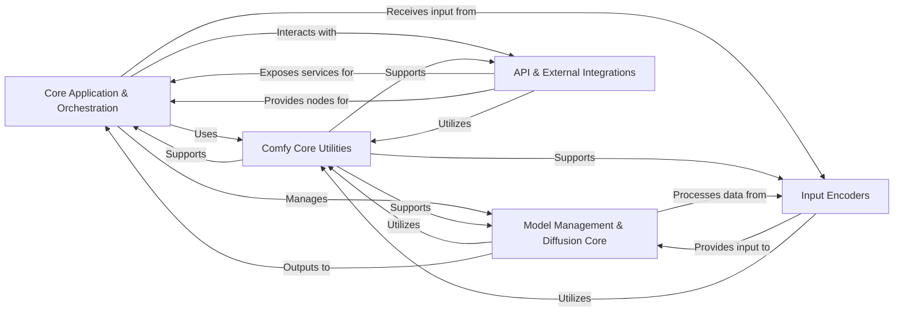

## Component Details

The ComfyUI architecture is centered around a `Core Application & Orchestration` component that manages the overall workflow, including application startup, prompt execution, and user interactions. This core system heavily relies on `Comfy Core Utilities` for common functionalities like file operations, data handling, and logging. The generative AI capabilities are encapsulated within the `Model Management & Diffusion Core`, which handles model loading, patching, sampling, and the core diffusion processes. Input data for these models is prepared by `Input Encoders`, which process text and images into suitable latent representations. Finally, `API & External Integrations` provides the necessary infrastructure for an internal API server and facilitates interaction with various external generative AI services, extending ComfyUI's capabilities.

### Core Application & Orchestration
Manages the fundamental operations of ComfyUI, including application startup, argument parsing, logger setup, custom path management, and orchestrating the main prompt execution loop. It also handles model file management, frontend interactions, user settings, and custom node installations.

**Related Classes/Methods**:

- `ComfyUI.main` (full file reference)
- `ComfyUI.execution` (full file reference)
- `ComfyUI.comfy_execution.graph_utils` (full file reference)
- <a href="https://github.com/comfyanonymous/ComfyUI/blob/master/comfy_execution/graph.py#L97-L169" target="_blank" rel="noopener noreferrer">`ComfyUI.comfy_execution.graph.TopologicalSort` (97:169)</a>
- `folder_paths` (full file reference)
- `ComfyUI.app.model_manager` (full file reference)
- `ComfyUI.app.frontend_management` (full file reference)
- `ComfyUI.app.app_settings` (full file reference)
- `ComfyUI.app.user_manager` (full file reference)
- `ComfyUI.app.custom_node_manager` (full file reference)
- `ComfyUI.app.logger` (full file reference)
- <a href="https://github.com/comfyanonymous/ComfyUI/blob/master/nodes.py#L813-L841" target="_blank" rel="noopener noreferrer">`ComfyUI.nodes.ControlNetApply` (813:841)</a>
- <a href="https://github.com/comfyanonymous/ComfyUI/blob/master/nodes.py#L844-L891" target="_blank" rel="noopener noreferrer">`ComfyUI.nodes.ControlNetApplyAdvanced` (844:891)</a>
- <a href="https://github.com/comfyanonymous/ComfyUI/blob/master/nodes.py#L1028-L1087" target="_blank" rel="noopener noreferrer">`ComfyUI.nodes.StyleModelApply` (1028:1087)</a>
- <a href="https://github.com/comfyanonymous/ComfyUI/blob/master/nodes.py#L1124-L1153" target="_blank" rel="noopener noreferrer">`ComfyUI.nodes.GLIGENTextBoxApply` (1124:1153)</a>

### Comfy Core Utilities
Provides a collection of general-purpose utility functions and helper classes used throughout the ComfyUI codebase for tasks like JSON manipulation, configuration loading, basic file operations, loading/saving model files, data type conversions, image resizing, and progress bar management.

**Related Classes/Methods**:

- `ComfyUI.comfy.utils` (full file reference)
- `ComfyUI.utils.json_util` (full file reference)
- `utils.extra_config` (full file reference)
- `shutil` (full file reference)
- `numpy` (full file reference)
- `builtins.list.append` (full file reference)
- `_io.TextIOWrapper` (full file reference)
- `collections.deque` (full file reference)
- `comfy.ops` (full file reference)

### Model Management & Diffusion Core
Manages the dynamic modification and extension of models, allowing for flexible integration of new functionalities and adaptations (e.g., LoRA). It implements various sampling algorithms and provides essential utilities for diffusion processes, including K-diffusion specific functions, conditioning, and mask handling, orchestrating the denoising steps and handling core Latent Diffusion Model operations.

**Related Classes/Methods**:

- `ComfyUI.comfy.model_patcher` (full file reference)
- `ComfyUI.comfy.patcher_extension` (full file reference)
- `ComfyUI.comfy.model_base` (full file reference)
- `ComfyUI.comfy.weight_adapter.lora` (full file reference)
- `ComfyUI.comfy.weight_adapter.boft` (full file reference)
- `ComfyUI.comfy.weight_adapter.lokr` (full file reference)
- `ComfyUI.comfy.weight_adapter.oft` (full file reference)
- `ComfyUI.comfy.weight_adapter.glora` (full file reference)
- `ComfyUI.comfy.weight_adapter.loha` (full file reference)
- `ComfyUI.comfy.samplers` (full file reference)
- `ComfyUI.comfy.extra_samplers.uni_pc` (full file reference)
- `ComfyUI.comfy.k_diffusion` (full file reference)
- `ComfyUI.comfy.ldm.util` (full file reference)
- `ComfyUI.comfy.ldm.genmo` (full file reference)
- `ComfyUI.comfy.ldm.modules.encoders.noise_aug_modules` (full file reference)
- `ComfyUI.comfy.ldm.aura.mmdit` (full file reference)
- `ComfyUI.comfy.ldm.cosmos.cosmos_tokenizer.utils` (full file reference)
- `ComfyUI.comfy.ldm.modules.diffusionmodules.model` (full file reference)
- `ComfyUI.comfy.ldm.modules.diffusionmodules.mmdit` (full file reference)
- `ComfyUI.comfy.ldm.modules.diffusionmodules.upscaling` (full file reference)
- `ComfyUI.comfy.ldm.modules.diffusionmodules.util` (full file reference)
- `ComfyUI.comfy.ldm.modules.diffusionmodules.openaimodel` (full file reference)

### Input Encoders
A comprehensive suite of modules responsible for processing and encoding various input types, such as text (using models like CLIP, T5, BERT) and images (e.g., Dino2 for feature extraction), into latent representations suitable for diffusion models.

**Related Classes/Methods**:

- `ComfyUI.comfy.text_encoders.ace_text_cleaners` (full file reference)
- `ComfyUI.comfy.text_encoders.llama` (full file reference)
- `ComfyUI.comfy.text_encoders.flux` (full file reference)
- `ComfyUI.comfy.text_encoders.lt` (full file reference)
- `ComfyUI.comfy.text_encoders.wan` (full file reference)
- `ComfyUI.comfy.text_encoders.pixart_t5` (full file reference)
- `ComfyUI.comfy.text_encoders.t5` (full file reference)
- `ComfyUI.comfy.text_encoders.hydit` (full file reference)
- `ComfyUI.comfy.text_encoders.genmo` (full file reference)
- <a href="https://github.com/comfyanonymous/ComfyUI/blob/master/comfy/text_encoders/sd3_clip.py#L159-L166" target="_blank" rel="noopener noreferrer">`ComfyUI.comfy.text_encoders.sd3_clip` (159:166)</a>
- `ComfyUI.comfy.text_encoders.bert` (full file reference)
- `ComfyUI.comfy.text_encoders.ace` (full file reference)
- `ComfyUI.comfy.text_encoders.spiece_tokenizer` (full file reference)
- `ComfyUI.comfy.text_encoders.cosmos` (full file reference)
- `ComfyUI.comfy.text_encoders.hidream` (full file reference)
- `ComfyUI.comfy.text_encoders.lumina2` (full file reference)
- `ComfyUI.comfy.text_encoders.hunyuan_video` (full file reference)
- `ComfyUI.comfy.image_encoders.dino2` (full file reference)

### API & External Integrations
Establishes and manages the internal API server for ComfyUI, handling terminal services, setting up internal routes for logs and file access, and managing file operations for API interactions. It also provides utilities and nodes for interacting with various external generative AI APIs (e.g., RunwayML, Ideogram, Stability AI), including data validation, format conversion, and API client management.

**Related Classes/Methods**:

- `ComfyUI.comfy_api.input.video_types` (full file reference)
- `ComfyUI.comfy_api.input_impl.video_types` (full file reference)
- `ComfyUI.comfy_api.util.video_types` (full file reference)
- `ComfyUI.comfy_api.torch_helpers.torch_compile` (full file reference)
- `ComfyUI.api_server.services.terminal_service` (full file reference)
- `ComfyUI.api_server.routes.internal.internal_routes` (full file reference)
- `api_server.utils.file_operations` (full file reference)
- `aiohttp.web_app.Application` (full file reference)
- `ComfyUI.comfy_extras.nodes_photomaker` (full file reference)
- `ComfyUI.comfy_extras.nodes_controlnet` (full file reference)
- `ComfyUI.comfy_api_nodes.apinode_utils` (full file reference)
- `ComfyUI.comfy_api_nodes.mapper_utils` (full file reference)
- `ComfyUI.comfy_api_nodes.apis.client` (full file reference)
- `ComfyUI.comfy_api_nodes.apis.request_logger` (full file reference)
- `ComfyUI.comfy_api_nodes.util.validation_utils` (full file reference)
- `ComfyUI.comfy_api_nodes.nodes_runway` (full file reference)
- `ComfyUI.comfy_api_nodes.nodes_ideogram` (full file reference)
- `ComfyUI.comfy_api_nodes.nodes_kling` (full file reference)
- `ComfyUI.comfy_api_nodes.nodes_bfl` (full file reference)
- `ComfyUI.comfy_api_nodes.nodes_stability` (full file reference)
- `ComfyUI.comfy_api_nodes.nodes_minimax` (full file reference)
- `ComfyUI.comfy_api_nodes.nodes_recraft` (full file reference)
- `ComfyUI.comfy_api_nodes.apis.recraft_api` (full file reference)
- `ComfyUI.comfy_api_nodes.nodes_openai` (full file reference)
- `ComfyUI.comfy_api_nodes.nodes_gemini` (full file reference)
- `ComfyUI.comfy_api_nodes.nodes_veo2` (full file reference)
- `ComfyUI.comfy_api_nodes.nodes_pika` (full file reference)
- `ComfyUI.comfy_api_nodes.nodes_luma` (full file reference)
- `ComfyUI.comfy_api_nodes.apis.luma_api` (full file reference)
- `ComfyUI.comfy_api_nodes.nodes_rodin` (full file reference)
- `ComfyUI.comfy_api_nodes.nodes_tripo` (full file reference)
- `ComfyUI.comfy_api_nodes.nodes_pixverse` (full file reference)

### [FAQ](https://github.com/CodeBoarding/GeneratedOnBoardings/tree/main?tab=readme-ov-file#faq)