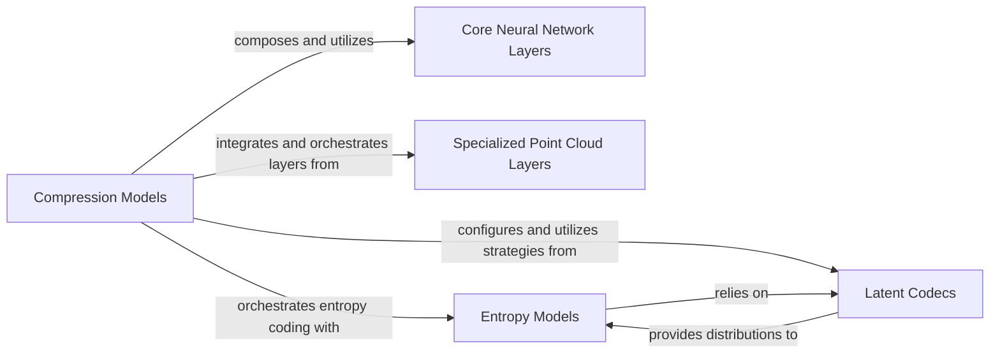

## Details

The `Core Compression Models` subsystem is central to `CompressAI`, encapsulating the neural network architectures and their foundational building blocks for data compression and decompression. It focuses on transforming raw data into efficient latent representations and vice-versa, leveraging specialized layers, entropy coding, and latent code manipulation.

### Compression Models [[Expand]](./Compression_Models.md)
These components represent the complete neural network architectures for specific compression/decompression tasks (e.g., image, video, point cloud). They orchestrate the encoder, decoder, and hyperprior networks to transform raw data into latent representations and vice-versa. This component acts as the high-level orchestrator for the compression pipeline.

**Related Classes/Methods**:

- <a href="https://github.com/InterDigitalInc/CompressAI/blob/master/compressai/models/google.py" target="_blank" rel="noopener noreferrer">`compressai.models.google`</a>
- <a href="https://github.com/InterDigitalInc/CompressAI/blob/master/compressai/models/vbr.py" target="_blank" rel="noopener noreferrer">`compressai.models.vbr`</a>
- <a href="https://github.com/InterDigitalInc/CompressAI/blob/master/compressai/models/pointcloud/hrtzxf2022.py" target="_blank" rel="noopener noreferrer">`compressai.models.pointcloud.hrtzxf2022`</a>
- <a href="https://github.com/InterDigitalInc/CompressAI/blob/master/compressai/models/pointcloud/sfu_pointnet2.py" target="_blank" rel="noopener noreferrer">`compressai.models.pointcloud.sfu_pointnet2`</a>

### Core Neural Network Layers
Provides fundamental, reusable neural network building blocks (e.g., convolutional layers, residual units) that are common across various compression models. These are the basic architectural primitives upon which complex models are built.

**Related Classes/Methods**:

- <a href="https://github.com/InterDigitalInc/CompressAI/blob/master/compressai/layers/layers.py" target="_blank" rel="noopener noreferrer">`compressai.layers.layers`</a>

### Specialized Point Cloud Layers
Implements specialized layers and operations tailored for point cloud data processing within compression models, such as PointNet++ operations or HRTZXF2022 specific layers. These layers address the unique challenges of 3D data compression.

**Related Classes/Methods**:

- <a href="https://github.com/InterDigitalInc/CompressAI/blob/master/compressai/layers/pointcloud/pointnet2.py" target="_blank" rel="noopener noreferrer">`compressai.layers.pointcloud.pointnet2`</a>
- <a href="https://github.com/InterDigitalInc/CompressAI/blob/master/compressai/layers/pointcloud/hrtzxf2022.py" target="_blank" rel="noopener noreferrer">`compressai.layers.pointcloud.hrtzxf2022`</a>

### Entropy Models
Handles the entropy coding aspects of compression, including quantization of latent representations and estimation of their likelihoods (probability distributions). This component is critical for achieving high compression ratios by efficiently encoding the latent data.

**Related Classes/Methods**:

- <a href="https://github.com/InterDigitalInc/CompressAI/blob/master/compressai/entropy_models/entropy_models.py" target="_blank" rel="noopener noreferrer">`compressai.entropy_models.entropy_models`</a>

### Latent Codecs
Provides mechanisms for manipulating, transforming, and potentially context-modeling latent codes generated by the encoders before entropy coding. It also provides probability distributions to the Entropy Models, enabling adaptive coding.

**Related Classes/Methods**:

- <a href="https://github.com/InterDigitalInc/CompressAI/blob/master/compressai/latent_codecs/__init__.py" target="_blank" rel="noopener noreferrer">`compressai.latent_codecs`</a>

### [FAQ](https://github.com/CodeBoarding/GeneratedOnBoardings/tree/main?tab=readme-ov-file#faq)