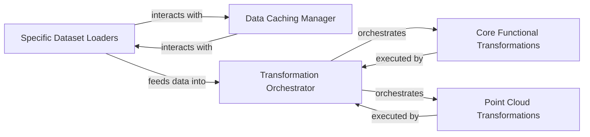

## Details

The Data Management & Preprocessing subsystem is crucial for preparing diverse data types for consumption by machine learning models within CompressAI. It encompasses all stages from raw data acquisition to its transformation into a model-ready format.

### Specific Dataset Loaders
Responsible for initializing, downloading (if necessary), and parsing various dataset types, acting as the primary interface for acquiring raw data. This component abstracts the complexities of different data sources.

**Related Classes/Methods**:

- <a href="https://github.com/InterDigitalInc/CompressAI/blob/master/compressai/datasets/pregenerated.py" target="_blank" rel="noopener noreferrer">`compressai.datasets.pregenerated`</a>
- <a href="https://github.com/InterDigitalInc/CompressAI/blob/master/compressai/datasets/vimeo90k.py" target="_blank" rel="noopener noreferrer">`compressai.datasets.vimeo90k`</a>
- <a href="https://github.com/InterDigitalInc/CompressAI/blob/master/compressai/datasets/pointcloud/modelnet.py" target="_blank" rel="noopener noreferrer">`compressai.datasets.pointcloud.modelnet`</a>
- <a href="https://github.com/InterDigitalInc/CompressAI/blob/master/compressai/datasets/rawvideo.py" target="_blank" rel="noopener noreferrer">`compressai.datasets.rawvideo`</a>
- <a href="https://github.com/InterDigitalInc/CompressAI/blob/master/compressai/datasets/pointcloud/s3dis.py" target="_blank" rel="noopener noreferrer">`compressai.datasets.pointcloud.s3dis`</a>
- <a href="https://github.com/InterDigitalInc/CompressAI/blob/master/compressai/datasets/pointcloud/semantic_kitti.py" target="_blank" rel="noopener noreferrer">`compressai.datasets.pointcloud.semantic_kitti`</a>
- <a href="https://github.com/InterDigitalInc/CompressAI/blob/master/compressai/datasets/pointcloud/shapenet.py" target="_blank" rel="noopener noreferrer">`compressai.datasets.pointcloud.shapenet`</a>
- <a href="https://github.com/InterDigitalInc/CompressAI/blob/master/compressai/datasets/stack.py" target="_blank" rel="noopener noreferrer">`compressai.datasets.stack`</a>

### Data Caching Manager
Manages the generation, loading, and retrieval of cached dataset information and individual data items. This component optimizes data access and reduces redundant processing, especially for large datasets, by persisting processed data.

**Related Classes/Methods**:

- <a href="https://github.com/InterDigitalInc/CompressAI/blob/master/compressai/datasets/cache.py" target="_blank" rel="noopener noreferrer">`compressai.datasets.cache`</a>

### Transformation Orchestrator
Provides a unified, callable interface for applying a sequence of image and video transformations. It acts as the central entry point for defining and executing complex transformation pipelines, ensuring data consistency.

**Related Classes/Methods**:

- <a href="https://github.com/InterDigitalInc/CompressAI/blob/master/compressai/transforms/transforms.py" target="_blank" rel="noopener noreferrer">`compressai.transforms.transforms`</a>
- <a href="https://github.com/InterDigitalInc/CompressAI/blob/master/compressai/registry/transforms.py" target="_blank" rel="noopener noreferrer">`compressai.registry.transforms`</a>

### Core Functional Transformations
Implements fundamental, reusable transformation logic, primarily focusing on common operations like color space conversions (e.g., RGB to YUV) and sampling. These are the atomic, low-level units of transformation that can be composed.

**Related Classes/Methods**:

- <a href="https://github.com/InterDigitalInc/CompressAI/blob/master/compressai/transforms/functional.py" target="_blank" rel="noopener noreferrer">`compressai.transforms.functional`</a>

### Point Cloud Transformations
Specializes in transformations specifically designed for point cloud data, including operations such as normalization, rotation, and other geometric manipulations. This component addresses the unique requirements of 3D data.

**Related Classes/Methods**:

- <a href="https://github.com/InterDigitalInc/CompressAI/blob/master/compressai/transforms/point" target="_blank" rel="noopener noreferrer">`compressai.transforms.point`</a>

### [FAQ](https://github.com/CodeBoarding/GeneratedOnBoardings/tree/main?tab=readme-ov-file#faq)