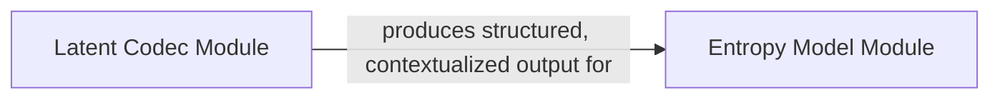

## Details

This subsystem is critical for the efficient compression and decompression of latent representations within the `CompressAI` framework. It encapsulates the core logic for transforming continuous latent features into a discrete, bitstream-ready format and vice-versa, directly impacting the overall bit-rate performance.

### Latent Codec Module
This module is responsible for preparing continuous latent representations for efficient entropy coding. It implements various strategies to exploit spatial and channel dependencies within the latent space, providing a structured and contextualized input to the entropy models. This aligns with the "Functional Grouping" and "Pipeline Stages" patterns, acting as a pre-processing step that optimizes the latent features for subsequent compression.

**Related Classes/Methods**:

- <a href="https://github.com/InterDigitalInc/CompressAI/blob/master/compressai/latent_codecs/channel_groups.py" target="_blank" rel="noopener noreferrer">`channel_groups.py`</a>
- <a href="https://github.com/InterDigitalInc/CompressAI/blob/master/compressai/latent_codecs/checkerboard.py" target="_blank" rel="noopener noreferrer">`checkerboard.py`</a>
- <a href="https://github.com/InterDigitalInc/CompressAI/blob/master/compressai/latent_codecs/gaussian_conditional.py" target="_blank" rel="noopener noreferrer">`gaussian_conditional.py`</a>
- <a href="https://github.com/InterDigitalInc/CompressAI/blob/master/compressai/latent_codecs/rasterscan.py" target="_blank" rel="noopener noreferrer">`rasterscan.py`</a>

### Entropy Model Module
This module performs the core quantization and entropy coding/decoding. It discretizes continuous latent values, estimates their probabilities, builds Cumulative Distribution Functions (CDFs), and uses these to compress data into a bitstream or decompress a bitstream back into latent values. It also handles the update of its internal probability models. This represents the critical "Performance Optimization" stage for bit-rate reduction, directly implementing the theoretical principles of entropy coding.

**Related Classes/Methods**:

- <a href="https://github.com/InterDigitalInc/CompressAI/blob/master/compressai/entropy_models/entropy_models.py" target="_blank" rel="noopener noreferrer">`entropy_models.py`</a>
- <a href="https://github.com/InterDigitalInc/CompressAI/blob/master/compressai/entropy_models/entropy_models_vbr.py" target="_blank" rel="noopener noreferrer">`entropy_models_vbr.py`</a>

### [FAQ](https://github.com/CodeBoarding/GeneratedOnBoardings/tree/main?tab=readme-ov-file#faq)