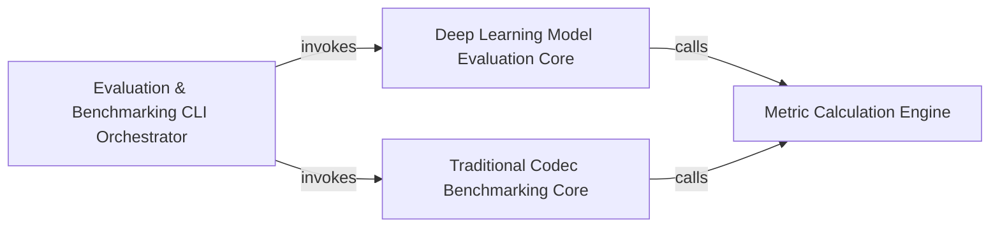

## Details

The `Evaluation & Benchmarking Suite` subsystem is designed to provide comprehensive tools for assessing the performance of both deep learning-based compression models and traditional codecs. It follows an "ML Toolkit/Library with an Evaluation Platform" pattern by separating orchestration, core evaluation logic, and metric computation.

### Evaluation & Benchmarking CLI Orchestrator
This component serves as the primary command-line interface for the entire evaluation and benchmarking suite. It is responsible for parsing user arguments, configuring the evaluation environment, and dispatching control to the appropriate deep learning model evaluation or traditional codec benchmarking pipelines for both image and video data.

**Related Classes/Methods**:

- <a href="https://github.com/InterDigitalInc/CompressAI/blob/master/compressai/utils/eval_model/__main__.py#L386-L510" target="_blank" rel="noopener noreferrer">`compressai.utils.eval_model.__main__.main`:386-510</a>
- <a href="https://github.com/InterDigitalInc/CompressAI/blob/master/compressai/utils/bench/__main__.py#L151-L176" target="_blank" rel="noopener noreferrer">`compressai.utils.bench.__main__.main`:151-176</a>
- <a href="https://github.com/InterDigitalInc/CompressAI/blob/master/compressai/utils/video/bench/__main__.py#L320-L360" target="_blank" rel="noopener noreferrer">`compressai.utils.video.bench.__main__.main`:320-360</a>
- <a href="https://github.com/InterDigitalInc/CompressAI/blob/master/compressai/utils/video/eval_model/__main__.py#L516-L595" target="_blank" rel="noopener noreferrer">`compressai.utils.video.eval_model.__main__.main`:516-595</a>

### Deep Learning Model Evaluation Core
This component encapsulates the core logic for evaluating deep learning-based compression models. It handles tasks such as loading trained models, performing forward passes (inference) on input data (images or video frames), and preparing the model outputs for subsequent metric calculation. It abstracts away the specifics of image vs. video model inference.

**Related Classes/Methods**:

- <a href="https://github.com/InterDigitalInc/CompressAI/blob/master/compressai/utils/eval_model/__main__.py#L210-L264" target="_blank" rel="noopener noreferrer">`compressai.utils.eval_model.__main__.eval_model`:210-264</a>
- <a href="https://github.com/InterDigitalInc/CompressAI/blob/master/compressai/utils/video/eval_model/__main__.py#L233-L300" target="_blank" rel="noopener noreferrer">`compressai.utils.video.eval_model.__main__.eval_model`:233-300</a>

### Traditional Codec Benchmarking Core
This component is responsible for executing and evaluating traditional (non-deep learning) image and video compression codecs. It manages the interaction with external codec binaries, handles file input/output for compressed bitstreams, and prepares the decoded outputs for metric computation.

**Related Classes/Methods**:

- <a href="https://github.com/InterDigitalInc/CompressAI/blob/master/compressai/utils/bench/codecs.py#L177-L188" target="_blank" rel="noopener noreferrer">`compressai.utils.bench.codecs.run`:177-188</a>
- <a href="https://github.com/InterDigitalInc/CompressAI/blob/master/compressai/utils/video/bench/__main__.py#L168-L225" target="_blank" rel="noopener noreferrer">`compressai.utils.video.bench.__main__.evaluate`:168-225</a>

### Metric Calculation Engine
This component provides a standardized set of functions for computing various quality metrics (e.g., PSNR, MS-SSIM) between original and reconstructed data. It supports both image and video data, including necessary pre-processing steps like color space transformations (e.g., YUV to RGB) for video frames.

**Related Classes/Methods**:

- <a href="https://github.com/InterDigitalInc/CompressAI/blob/master/compressai/utils/eval_model/__main__.py#L89-L97" target="_blank" rel="noopener noreferrer">`compressai.utils.eval_model.__main__.compute_metrics`:89-97</a>
- <a href="https://github.com/InterDigitalInc/CompressAI/blob/master/compressai/utils/video/eval_model/__main__.py#L131-L163" target="_blank" rel="noopener noreferrer">`compressai.utils.video.eval_model.__main__.compute_metrics_for_frame`:131-163</a>

### [FAQ](https://github.com/CodeBoarding/GeneratedOnBoardings/tree/main?tab=readme-ov-file#faq)