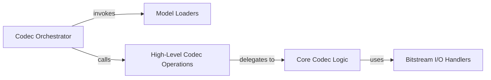

## Details

The `Model Zoo & Codec Utilities` subsystem provides convenient access to pre-trained compression models and general utilities for encoding and decoding data using these models.

### Model Loaders
This component is responsible for providing access to and loading pre-trained deep learning models for image and video compression. It handles generic model loading and key remapping, serving as the entry point for different model types within the `compressai.zoo`.

**Related Classes/Methods**:

- <a href="https://github.com/InterDigitalInc/CompressAI/blob/master/compressai/zoo/image.py#L1-L9999" target="_blank" rel="noopener noreferrer">`compressai.zoo.image`:1-9999</a>
- <a href="https://github.com/InterDigitalInc/CompressAI/blob/master/compressai/zoo/image_vbr.py#L1-L9999" target="_blank" rel="noopener noreferrer">`compressai.zoo.image_vbr`:1-9999</a>
- <a href="https://github.com/InterDigitalInc/CompressAI/blob/master/compressai/zoo/video.py#L1-L9999" target="_blank" rel="noopener noreferrer">`compressai.zoo.video`:1-9999</a>
- <a href="https://github.com/InterDigitalInc/CompressAI/blob/master/compressai/zoo/pretrained.py#L1-L9999" target="_blank" rel="noopener noreferrer">`compressai.zoo.pretrained`:1-9999</a>

### Codec Orchestrator
Serves as the primary command-line interface (CLI) entry point for the codec utilities. It parses user arguments, determines the required operation (encode/decode), and orchestrates the loading of the appropriate model and the subsequent execution of high-level codec operations.

**Related Classes/Methods**:

- <a href="https://github.com/InterDigitalInc/CompressAI/blob/master/examples/codec.py#L1-L9999" target="_blank" rel="noopener noreferrer">`examples.codec:main`:1-9999</a>

### High-Level Codec Operations
Offers simplified, high-level interfaces for initiating the overall encoding and decoding processes. This component abstracts away the lower-level details of the compression pipeline, providing a clean entry point for the `Codec Orchestrator`.

**Related Classes/Methods**:

- <a href="https://github.com/InterDigitalInc/CompressAI/blob/master/examples/codec.py#L1-L9999" target="_blank" rel="noopener noreferrer">`examples.codec:encode`:1-9999</a>
- <a href="https://github.com/InterDigitalInc/CompressAI/blob/master/examples/codec.py#L1-L9999" target="_blank" rel="noopener noreferrer">`examples.codec:decode`:1-9999</a>

### Core Codec Logic
Encapsulates the fundamental steps of the compression and decompression algorithms. This includes managing headers, preparing data for model inference, interacting with the loaded models, and handling the core algorithmic flow.

**Related Classes/Methods**:

- <a href="https://github.com/InterDigitalInc/CompressAI/blob/master/examples/codec.py#L1-L9999" target="_blank" rel="noopener noreferrer">`examples.codec:_encode`:1-9999</a>
- <a href="https://github.com/InterDigitalInc/CompressAI/blob/master/examples/codec.py#L1-L9999" target="_blank" rel="noopener noreferrer">`examples.codec:_decode`:1-9999</a>

### Bitstream I/O Handlers
Manages the low-level reading from and writing to files of the actual compressed bitstream data (the "body" of the compressed file). This component ensures efficient and correct handling of the binary output/input.

**Related Classes/Methods**:

- <a href="https://github.com/InterDigitalInc/CompressAI/blob/master/examples/codec.py#L1-L9999" target="_blank" rel="noopener noreferrer">`examples.codec:read_body`:1-9999</a>
- <a href="https://github.com/InterDigitalInc/CompressAI/blob/master/examples/codec.py#L1-L9999" target="_blank" rel="noopener noreferrer">`examples.codec:write_body`:1-9999</a>

### [FAQ](https://github.com/CodeBoarding/GeneratedOnBoardings/tree/main?tab=readme-ov-file#faq)