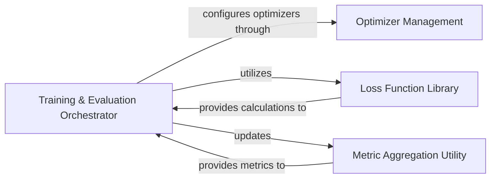

## Details

The Training & Optimization Engine subsystem is central to CompressAI, providing the necessary framework for training and optimizing compression models. It adheres to the "ML Toolkit/Library with an Evaluation Platform" architectural patterns by modularizing core training logic, optimizer management, and loss function definitions.

### Training & Evaluation Orchestrator
This component manages the entire training and evaluation lifecycle. It orchestrates the execution of training and testing epochs, handles model checkpointing, and coordinates the overall flow of the training process. It acts as the primary control unit for model training experiments.

**Related Classes/Methods**:

- <a href="https://github.com/InterDigitalInc/CompressAI/blob/master/examples/train.py" target="_blank" rel="noopener noreferrer">`examples.train:main`</a>
- <a href="https://github.com/InterDigitalInc/CompressAI/blob/master/examples/train_pointcloud.py" target="_blank" rel="noopener noreferrer">`examples.train_pointcloud:main`</a>
- <a href="https://github.com/InterDigitalInc/CompressAI/blob/master/examples/train_video.py" target="_blank" rel="noopener noreferrer">`examples.train_video:main`</a>
- <a href="https://github.com/InterDigitalInc/CompressAI/blob/master/examples/train.py" target="_blank" rel="noopener noreferrer">`examples.train:train_one_epoch`</a>
- <a href="https://github.com/InterDigitalInc/CompressAI/blob/master/examples/train_pointcloud.py" target="_blank" rel="noopener noreferrer">`examples.train_pointcloud:train_one_epoch`</a>
- <a href="https://github.com/InterDigitalInc/CompressAI/blob/master/examples/train_video.py" target="_blank" rel="noopener noreferrer">`examples.train_video:train_one_epoch`</a>
- <a href="https://github.com/InterDigitalInc/CompressAI/blob/master/examples/train.py" target="_blank" rel="noopener noreferrer">`examples.train:test_epoch`</a>
- <a href="https://github.com/InterDigitalInc/CompressAI/blob/master/examples/train_pointcloud.py" target="_blank" rel="noopener noreferrer">`examples.train_pointcloud:test_epoch`</a>
- <a href="https://github.com/InterDigitalInc/CompressAI/blob/master/examples/train_video.py" target="_blank" rel="noopener noreferrer">`examples.train_video:test_epoch`</a>

### Optimizer Management
This component is responsible for the instantiation, configuration, and management of various PyTorch optimizers. It provides standardized methods for creating optimizers for both the main network and any auxiliary components, ensuring consistency and reusability across different training scripts.

**Related Classes/Methods**:

- <a href="https://github.com/InterDigitalInc/CompressAI/blob/master/examples/train.py" target="_blank" rel="noopener noreferrer">`examples.train:configure_optimizers`</a>
- <a href="https://github.com/InterDigitalInc/CompressAI/blob/master/examples/train_pointcloud.py" target="_blank" rel="noopener noreferrer">`examples.train_pointcloud:configure_optimizers`</a>
- <a href="https://github.com/InterDigitalInc/CompressAI/blob/master/examples/train_video.py" target="_blank" rel="noopener noreferrer">`examples.train_video:configure_optimizers`</a>
- <a href="https://github.com/InterDigitalInc/CompressAI/blob/master/compressai/optimizers/net.py" target="_blank" rel="noopener noreferrer">`compressai.optimizers.net:net_optimizer`</a>
- <a href="https://github.com/InterDigitalInc/CompressAI/blob/master/compressai/optimizers/net.py" target="_blank" rel="noopener noreferrer">`compressai.optimizers.net:make_optimizer`</a>
- <a href="https://github.com/InterDigitalInc/CompressAI/blob/master/compressai/optimizers/net_aux.py" target="_blank" rel="noopener noreferrer">`compressai.optimizers.net_aux:net_aux_optimizer`</a>
- <a href="https://github.com/InterDigitalInc/CompressAI/blob/master/compressai/optimizers/net_aux.py" target="_blank" rel="noopener noreferrer">`compressai.optimizers.net_aux:make_optimizer`</a>

### Loss Function Library
This component defines and implements a collection of loss functions specifically tailored for different data compression models (e.g., point cloud, video). It encapsulates the logic for calculating rate-distortion, reconstruction, and auxiliary losses, providing a flexible and extensible set of objectives for model training.

**Related Classes/Methods**:

- <a href="https://github.com/InterDigitalInc/CompressAI/blob/master/compressai/losses/pointcloud/chamfer.py" target="_blank" rel="noopener noreferrer">`compressai.losses.pointcloud.chamfer`</a>
- <a href="https://github.com/InterDigitalInc/CompressAI/blob/master/compressai/losses/pointcloud/hrtzxf2022.py" target="_blank" rel="noopener noreferrer">`compressai.losses.pointcloud.hrtzxf2022`</a>
- <a href="https://github.com/InterDigitalInc/CompressAI/blob/master/examples/train_video.py" target="_blank" rel="noopener noreferrer">`examples.train_video:RateDistortionLoss`</a>
- <a href="https://github.com/InterDigitalInc/CompressAI/blob/master/examples/train_video.py" target="_blank" rel="noopener noreferrer">`examples.train_video:compute_aux_loss`</a>

### Metric Aggregation Utility
This utility component is designed to accumulate and average numerical metrics over a specified period, typically an epoch. It provides a standardized way to track and summarize model performance statistics, such as loss values, PSNR, or other relevant evaluation metrics.

**Related Classes/Methods**:

- <a href="https://github.com/InterDigitalInc/CompressAI/blob/master/examples/train.py" target="_blank" rel="noopener noreferrer">`examples.train:AverageMeter`</a>
- <a href="https://github.com/InterDigitalInc/CompressAI/blob/master/examples/train_pointcloud.py" target="_blank" rel="noopener noreferrer">`examples.train_pointcloud:AverageMeter`</a>
- <a href="https://github.com/InterDigitalInc/CompressAI/blob/master/examples/train_video.py" target="_blank" rel="noopener noreferrer">`examples.train_video:AverageMeter`</a>

### [FAQ](https://github.com/CodeBoarding/GeneratedOnBoardings/tree/main?tab=readme-ov-file#faq)