```mermaid
graph LR
    Data_Management_Preprocessing["Data Management & Preprocessing"]
    Core_Compression_Models["Core Compression Models"]
    Entropy_Latent_Codec["Entropy & Latent Codec"]
    Training_Optimization_Engine["Training & Optimization Engine"]
    Evaluation_Benchmarking_Suite["Evaluation & Benchmarking Suite"]
    Model_Zoo_Codec_Utilities["Model Zoo & Codec Utilities"]
    Data_Management_Preprocessing -- "provides preprocessed input data to" --> Core_Compression_Models
    Data_Management_Preprocessing -- "supplies data for evaluation to" --> Evaluation_Benchmarking_Suite
    Data_Management_Preprocessing -- "handles data I/O for" --> Model_Zoo_Codec_Utilities
    Core_Compression_Models -- "generates latent representations for" --> Entropy_Latent_Codec
    Entropy_Latent_Codec -- "processes latent bitstreams for" --> Core_Compression_Models
    Training_Optimization_Engine -- "optimizes parameters of" --> Core_Compression_Models
    Training_Optimization_Engine -- "optimizes parameters of" --> Entropy_Latent_Codec
    Evaluation_Benchmarking_Suite -- "evaluates the performance of" --> Core_Compression_Models
    Model_Zoo_Codec_Utilities -- "provides pre-trained instances of" --> Core_Compression_Models
    Model_Zoo_Codec_Utilities -- "integrates with" --> Evaluation_Benchmarking_Suite
    click Data_Management_Preprocessing href "https://github.com/CodeBoarding/GeneratedOnBoardings/blob/main/CompressAI/Data_Management_Preprocessing.md" "Details"
    click Core_Compression_Models href "https://github.com/CodeBoarding/GeneratedOnBoardings/blob/main/CompressAI/Core_Compression_Models.md" "Details"
    click Entropy_Latent_Codec href "https://github.com/CodeBoarding/GeneratedOnBoardings/blob/main/CompressAI/Entropy_Latent_Codec.md" "Details"
    click Training_Optimization_Engine href "https://github.com/CodeBoarding/GeneratedOnBoardings/blob/main/CompressAI/Training_Optimization_Engine.md" "Details"
    click Evaluation_Benchmarking_Suite href "https://github.com/CodeBoarding/GeneratedOnBoardings/blob/main/CompressAI/Evaluation_Benchmarking_Suite.md" "Details"
    click Model_Zoo_Codec_Utilities href "https://github.com/CodeBoarding/GeneratedOnBoardings/blob/main/CompressAI/Model_Zoo_Codec_Utilities.md" "Details"
```

## Details

The `CompressAI` architecture is designed as a modular ML toolkit for data compression, centered around a clear data processing pipeline. Data originates from the `Data Management & Preprocessing` component, which feeds into the `Core Compression Models` for neural network-based compression. The resulting latent representations are then handled by the `Entropy & Latent Codec` for efficient bitstream management. Model development is facilitated by the `Training & Optimization Engine`, which iteratively refines both the core models and the codec. Post-development, the `Evaluation & Benchmarking Suite` rigorously assesses model performance. Finally, the `Model Zoo & Codec Utilities` provides a user-facing interface for leveraging pre-trained models and performing encoding/decoding operations. This structure ensures a clear separation of concerns, enabling extensibility and efficient development within the deep learning compression domain.

### Data Management & Preprocessing [[Expand]](./Data_Management_Preprocessing.md)
Responsible for loading, caching, and initial preprocessing of diverse data types (images, videos, point clouds), ensuring data is in the correct format for model consumption.

**Related Classes/Methods**:

- <a href="https://github.com/InterDigitalInc/CompressAI/blob/master/compressai/datasets/stack.py" target="_blank" rel="noopener noreferrer">`datasets`</a>
- <a href="https://github.com/InterDigitalInc/CompressAI/blob/master/compressai/registry/transforms.py" target="_blank" rel="noopener noreferrer">`transforms`</a>

### Core Compression Models [[Expand]](./Core_Compression_Models.md)
Contains the neural network architectures that perform the actual compression and decompression, transforming raw data into latent representations and vice-versa.

**Related Classes/Methods**:

- <a href="https://github.com/InterDigitalInc/CompressAI/blob/master/compressai/registry/torch.py" target="_blank" rel="noopener noreferrer">`models`</a>
- <a href="https://github.com/InterDigitalInc/CompressAI/blob/master/compressai/layers/layers.py" target="_blank" rel="noopener noreferrer">`layers`</a>

### Entropy & Latent Codec [[Expand]](./Entropy_Latent_Codec.md)
Manages the quantization and entropy coding/decoding of latent representations, crucial for efficient bit-rate reduction and decodability.

**Related Classes/Methods**:

- <a href="https://github.com/InterDigitalInc/CompressAI/blob/master/compressai/entropy_models/" target="_blank" rel="noopener noreferrer">`entropy_models`</a>
- <a href="https://github.com/InterDigitalInc/CompressAI/blob/master/compressai/latent_codecs/" target="_blank" rel="noopener noreferrer">`latent_codecs`</a>

### Training & Optimization Engine [[Expand]](./Training_Optimization_Engine.md)
Provides the comprehensive framework for training compression models, including defining loss functions, configuring optimizers, and managing training loops and schedules.

**Related Classes/Methods**:

- <a href="https://github.com/InterDigitalInc/CompressAI/blob/master/examples/train.py" target="_blank" rel="noopener noreferrer">`train.py`</a>
- <a href="https://github.com/InterDigitalInc/CompressAI/blob/master/examples/train_pointcloud.py" target="_blank" rel="noopener noreferrer">`train_pointcloud.py`</a>
- <a href="https://github.com/InterDigitalInc/CompressAI/blob/master/examples/train_video.py" target="_blank" rel="noopener noreferrer">`train_video.py`</a>
- <a href="https://github.com/InterDigitalInc/CompressAI/blob/master/compressai/registry/torch.py" target="_blank" rel="noopener noreferrer">`optimizers`</a>
- <a href="https://github.com/InterDigitalInc/CompressAI/blob/master/compressai/losses/" target="_blank" rel="noopener noreferrer">`losses`</a>

### Evaluation & Benchmarking Suite [[Expand]](./Evaluation_Benchmarking_Suite.md)
Offers a robust set of tools for evaluating the performance of trained compression models, including generating rate-distortion curves, calculating metrics like PSNR, and benchmarking against established codecs.

**Related Classes/Methods**:

- <a href="https://github.com/InterDigitalInc/CompressAI/blob/master/compressai/utils/eval_model/__main__.py#L210-L264" target="_blank" rel="noopener noreferrer">`eval_model`:210-264</a>
- <a href="https://github.com/InterDigitalInc/CompressAI/blob/master/compressai/utils/bench/" target="_blank" rel="noopener noreferrer">`bench`</a>
- <a href="https://github.com/InterDigitalInc/CompressAI/blob/master/compressai/utils/eval_model/__main__.py#L210-L264" target="_blank" rel="noopener noreferrer">`eval_model`:210-264</a>
- <a href="https://github.com/InterDigitalInc/CompressAI/blob/master/compressai/utils/video/bench/" target="_blank" rel="noopener noreferrer">`bench`</a>

### Model Zoo & Codec Utilities [[Expand]](./Model_Zoo_Codec_Utilities.md)
Provides convenient access to a collection of pre-trained compression models, allowing users to quickly utilize state-of-the-art codecs. It also includes general utilities for encoding and decoding data using these pre-trained models.

**Related Classes/Methods**:

- <a href="https://github.com/InterDigitalInc/CompressAI/blob/master/compressai/zoo/" target="_blank" rel="noopener noreferrer">`zoo`</a>
- <a href="https://github.com/InterDigitalInc/CompressAI/blob/master/examples/codec.py" target="_blank" rel="noopener noreferrer">`codec.py`</a>

### [FAQ](https://github.com/CodeBoarding/GeneratedOnBoardings/tree/main?tab=readme-ov-file#faq)