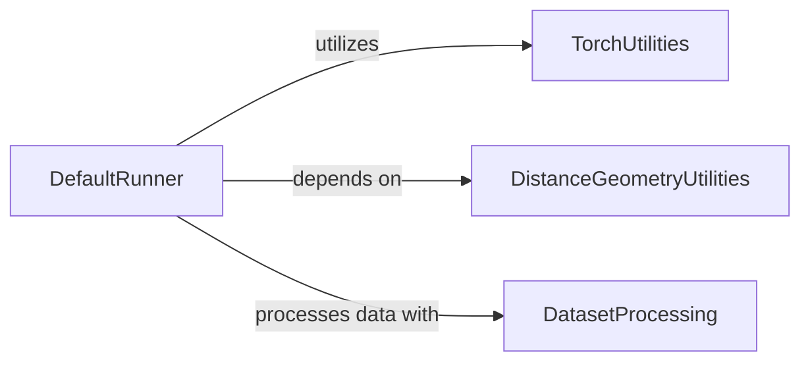

## Component Details

The ConfGF Runner subsystem serves as the central orchestration component for the entire ConfGF pipeline. Its primary purpose is to manage the lifecycle of molecular conformation generation, encompassing the training and evaluation of the distance score model, and the generation of molecular conformations using both distance-based and position-based Langevin Dynamics. It coordinates interactions with various utility modules for data handling, model execution, and evaluation, ensuring a cohesive workflow from raw SMILES input to generated 3D molecular structures.

### DefaultRunner
The central orchestrator for the ConfGF model, handling training, evaluation, saving, and the core generation processes using Langevin Dynamics for both position and distance-based sampling.

**Related Classes/Methods**:

- <a href="https://github.com/DeepGraphLearning/ConfGF/blob/master/confgf/runner/default_runner.py#L18-L395" target="_blank" rel="noopener noreferrer">`ConfGF.confgf.runner.default_runner.DefaultRunner` (18:395)</a>
- <a href="https://github.com/DeepGraphLearning/ConfGF/blob/master/confgf/runner/default_runner.py#L110-L183" target="_blank" rel="noopener noreferrer">`ConfGF.confgf.runner.default_runner.DefaultRunner.train` (110:183)</a>
- <a href="https://github.com/DeepGraphLearning/ConfGF/blob/master/confgf/runner/default_runner.py#L79-L107" target="_blank" rel="noopener noreferrer">`ConfGF.confgf.runner.default_runner.DefaultRunner.evaluate` (79:107)</a>
- <a href="https://github.com/DeepGraphLearning/ConfGF/blob/master/confgf/runner/default_runner.py#L195-L218" target="_blank" rel="noopener noreferrer">`ConfGF.confgf.runner.default_runner.DefaultRunner.distance_Langevin_Dynamics` (195:218)</a>
- <a href="https://github.com/DeepGraphLearning/ConfGF/blob/master/confgf/runner/default_runner.py#L222-L258" target="_blank" rel="noopener noreferrer">`ConfGF.confgf.runner.default_runner.DefaultRunner.position_Langevin_Dynamics` (222:258)</a>
- <a href="https://github.com/DeepGraphLearning/ConfGF/blob/master/confgf/runner/default_runner.py#L40-L51" target="_blank" rel="noopener noreferrer">`ConfGF.confgf.runner.default_runner.DefaultRunner.save` (40:51)</a>
- <a href="https://github.com/DeepGraphLearning/ConfGF/blob/master/confgf/runner/default_runner.py#L260-L280" target="_blank" rel="noopener noreferrer">`ConfGF.confgf.runner.default_runner.DefaultRunner.ConfGF_generator` (260:280)</a>
- <a href="https://github.com/DeepGraphLearning/ConfGF/blob/master/confgf/runner/default_runner.py#L283-L304" target="_blank" rel="noopener noreferrer">`ConfGF.confgf.runner.default_runner.DefaultRunner.ConfGFDist_generator` (283:304)</a>
- <a href="https://github.com/DeepGraphLearning/ConfGF/blob/master/confgf/runner/default_runner.py#L307-L351" target="_blank" rel="noopener noreferrer">`ConfGF.confgf.runner.default_runner.DefaultRunner.generate_samples_from_smiles` (307:351)</a>
- <a href="https://github.com/DeepGraphLearning/ConfGF/blob/master/confgf/runner/default_runner.py#L354-L395" target="_blank" rel="noopener noreferrer">`ConfGF.confgf.runner.default_runner.DefaultRunner.generate_samples_from_testset` (354:395)</a>
- <a href="https://github.com/DeepGraphLearning/ConfGF/blob/master/confgf/runner/default_runner.py#L187-L191" target="_blank" rel="noopener noreferrer">`ConfGF.confgf.runner.default_runner.DefaultRunner.convert_score_d` (187:191)</a>

### TorchUtilities
Provides essential PyTorch-related utility functions, such as norm clipping and data repetition, crucial for numerical stability and data manipulation within the ConfGF framework.

**Related Classes/Methods**:

- <a href="https://github.com/DeepGraphLearning/ConfGF/blob/master/confgf/utils/torch.py#L8-L11" target="_blank" rel="noopener noreferrer">`confgf.utils.torch.clip_norm` (8:11)</a>
- <a href="https://github.com/DeepGraphLearning/ConfGF/blob/master/confgf/utils/torch.py#L14-L16" target="_blank" rel="noopener noreferrer">`confgf.utils.torch.repeat_data` (14:16)</a>

### DistanceGeometryUtilities
Offers utility functions for handling distance geometry, including calculating distances from positions and embedding 3D structures, which are fundamental for molecular conformation generation.

**Related Classes/Methods**:

- <a href="https://github.com/DeepGraphLearning/ConfGF/blob/master/confgf/utils/distgeom.py#L59-L60" target="_blank" rel="noopener noreferrer">`confgf.utils.distgeom.get_d_from_pos` (59:60)</a>
- <a href="https://github.com/DeepGraphLearning/ConfGF/blob/master/confgf/utils/distgeom.py#L39-L57" target="_blank" rel="noopener noreferrer">`confgf.utils.distgeom.Embed3D` (39:57)</a>

### DatasetProcessing
Manages the conversion of SMILES strings into a data format suitable for the ConfGF model, acting as an interface between raw molecular data and the model's input requirements.

**Related Classes/Methods**:

- <a href="https://github.com/DeepGraphLearning/ConfGF/blob/master/confgf/dataset/dataset.py#L77-L124" target="_blank" rel="noopener noreferrer">`confgf.dataset.dataset.smiles_to_data` (77:124)</a>

### [FAQ](https://github.com/CodeBoarding/GeneratedOnBoardings/tree/main?tab=readme-ov-file#faq)