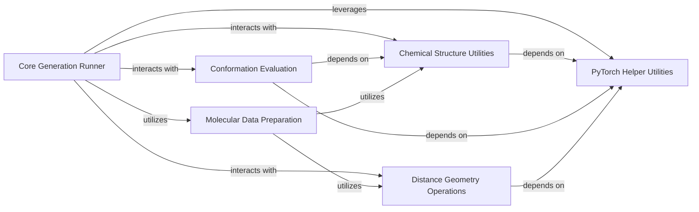

## Component Details

The Conformation Generation & Evaluation subsystem is responsible for creating 3D molecular conformations from distance matrices using distance geometry and assessing their quality. It integrates core generation runners that orchestrate Langevin Dynamics simulations for both position and distance-based approaches, leveraging PyTorch utilities for numerical stability and data handling. The generated conformations are then evaluated using metrics like RMSD and Maximum Mean Discrepancy (MMD), with essential chemical structure utilities supporting molecular data manipulation and analysis throughout the process. Molecular data preparation, including SMILES to data conversion, forms the initial step in this pipeline.

### Core Generation Runner
This component orchestrates the molecular conformation generation process, including Langevin Dynamics simulations for both position and distance-based approaches. It serves as the primary interface for generating samples from SMILES strings or test sets.

**Related Classes/Methods**:

- <a href="https://github.com/DeepGraphLearning/ConfGF/blob/master/confgf/runner/default_runner.py#L222-L258" target="_blank" rel="noopener noreferrer">`ConfGF.confgf.runner.default_runner.DefaultRunner.position_Langevin_Dynamics` (222:258)</a>
- <a href="https://github.com/DeepGraphLearning/ConfGF/blob/master/confgf/runner/default_runner.py#L260-L280" target="_blank" rel="noopener noreferrer">`ConfGF.confgf.runner.default_runner.DefaultRunner.ConfGF_generator` (260:280)</a>
- <a href="https://github.com/DeepGraphLearning/ConfGF/blob/master/confgf/runner/default_runner.py#L283-L304" target="_blank" rel="noopener noreferrer">`ConfGF.confgf.runner.default_runner.DefaultRunner.ConfGFDist_generator` (283:304)</a>
- <a href="https://github.com/DeepGraphLearning/ConfGF/blob/master/confgf/runner/default_runner.py#L307-L351" target="_blank" rel="noopener noreferrer">`ConfGF.confgf.runner.default_runner.DefaultRunner.generate_samples_from_smiles` (307:351)</a>
- <a href="https://github.com/DeepGraphLearning/ConfGF/blob/master/confgf/runner/default_runner.py#L354-L395" target="_blank" rel="noopener noreferrer">`ConfGF.confgf.runner.default_runner.DefaultRunner.generate_samples_from_testset` (354:395)</a>
- <a href="https://github.com/DeepGraphLearning/ConfGF/blob/master/confgf/runner/default_runner.py#L187-L191" target="_blank" rel="noopener noreferrer">`ConfGF.confgf.runner.default_runner.DefaultRunner.convert_score_d` (187:191)</a>
- <a href="https://github.com/DeepGraphLearning/ConfGF/blob/master/confgf/runner/default_runner.py#L195-L218" target="_blank" rel="noopener noreferrer">`ConfGF.confgf.runner.default_runner.DefaultRunner.distance_Langevin_Dynamics` (195:218)</a>

### Chemical Structure Utilities
Provides essential functions for manipulating and analyzing chemical structures, such as setting atom positions in RDKit molecules, calculating RMSD, and retrieving atom symbols. These utilities are fundamental for handling molecular data.

**Related Classes/Methods**:

- <a href="https://github.com/DeepGraphLearning/ConfGF/blob/master/confgf/utils/chem.py#L49-L57" target="_blank" rel="noopener noreferrer">`ConfGF.confgf.utils.chem.set_rdmol_positions` (49:57)</a>
- <a href="https://github.com/DeepGraphLearning/ConfGF/blob/master/confgf/utils/chem.py#L60-L68" target="_blank" rel="noopener noreferrer">`ConfGF.confgf.utils.chem.set_rdmol_positions_` (60:68)</a>
- <a href="https://github.com/DeepGraphLearning/ConfGF/blob/master/confgf/utils/chem.py#L134-L138" target="_blank" rel="noopener noreferrer">`ConfGF.confgf.utils.chem.GetBestRMSD` (134:138)</a>
- <a href="https://github.com/DeepGraphLearning/ConfGF/blob/master/confgf/utils/chem.py#L71-L72" target="_blank" rel="noopener noreferrer">`ConfGF.confgf.utils.chem.get_atom_symbol` (71:72)</a>

### Conformation Evaluation
This component is responsible for evaluating the quality and diversity of generated molecular conformations. It includes functions for computing RMSD confusion matrices and evaluating distance-based metrics like Maximum Mean Discrepancy (MMD) using Gaussian kernels.

**Related Classes/Methods**:

- <a href="https://github.com/DeepGraphLearning/ConfGF/blob/master/confgf/utils/evaluation.py#L11-L32" target="_blank" rel="noopener noreferrer">`ConfGF.confgf.utils.evaluation.get_rmsd_confusion_matrix` (11:32)</a>
- <a href="https://github.com/DeepGraphLearning/ConfGF/blob/master/confgf/utils/evaluation.py#L35-L38" target="_blank" rel="noopener noreferrer">`ConfGF.confgf.utils.evaluation.evaluate_conf` (35:38)</a>
- <a href="https://github.com/DeepGraphLearning/ConfGF/blob/master/confgf/utils/evaluation.py#L41-L133" target="_blank" rel="noopener noreferrer">`ConfGF.confgf.utils.evaluation.evaluate_distance` (41:133)</a>
- <a href="https://github.com/DeepGraphLearning/ConfGF/blob/master/confgf/utils/evaluation.py#L162-L180" target="_blank" rel="noopener noreferrer">`ConfGF.confgf.utils.evaluation.compute_mmd` (162:180)</a>
- <a href="https://github.com/DeepGraphLearning/ConfGF/blob/master/confgf/utils/evaluation.py#L135-L160" target="_blank" rel="noopener noreferrer">`ConfGF.confgf.utils.evaluation.guassian_kernel` (135:160)</a>

### Distance Geometry Operations
Handles operations related to molecular distance geometry, including embedding 3D coordinates from distance matrices and calculating distance matrices from atomic positions. These are crucial for working with molecular conformations in a distance space.

**Related Classes/Methods**:

- <a href="https://github.com/DeepGraphLearning/ConfGF/blob/master/confgf/utils/distgeom.py#L39-L57" target="_blank" rel="noopener noreferrer">`ConfGF.confgf.utils.distgeom.Embed3D` (39:57)</a>
- <a href="https://github.com/DeepGraphLearning/ConfGF/blob/master/confgf/utils/distgeom.py#L3-L36" target="_blank" rel="noopener noreferrer">`ConfGF.confgf.utils.distgeom.embed_3D` (3:36)</a>
- <a href="https://github.com/DeepGraphLearning/ConfGF/blob/master/confgf/utils/distgeom.py#L59-L60" target="_blank" rel="noopener noreferrer">`ConfGF.confgf.utils.distgeom.get_d_from_pos` (59:60)</a>

### PyTorch Helper Utilities
Contains general utility functions that leverage PyTorch, such as clipping tensor norms and repeating data, which are commonly used in deep learning contexts to ensure numerical stability and data preparation.

**Related Classes/Methods**:

- <a href="https://github.com/DeepGraphLearning/ConfGF/blob/master/confgf/utils/torch.py#L8-L11" target="_blank" rel="noopener noreferrer">`confgf.utils.torch.clip_norm` (8:11)</a>
- <a href="https://github.com/DeepGraphLearning/ConfGF/blob/master/confgf/utils/torch.py#L14-L16" target="_blank" rel="noopener noreferrer">`confgf.utils.torch.repeat_data` (14:16)</a>

### Molecular Data Preparation
Manages the conversion of chemical identifiers, specifically SMILES strings, into structured data formats suitable for processing by the molecular generation models.

**Related Classes/Methods**:

- <a href="https://github.com/DeepGraphLearning/ConfGF/blob/master/confgf/dataset/dataset.py#L77-L124" target="_blank" rel="noopener noreferrer">`confgf.dataset.dataset.smiles_to_data` (77:124)</a>

### [FAQ](https://github.com/CodeBoarding/GeneratedOnBoardings/tree/main?tab=readme-ov-file#faq)