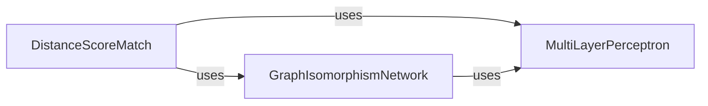

## Component Details

Implements the core graph neural network model, DistanceScoreMatch, which learns to predict scores related to inter-atomic distances. This model is central to the ConfGF framework, utilizing graph convolutions and transformations to process molecular graphs and output distance-based scores.

### DistanceScoreMatch
Implements the core graph neural network model, DistanceScoreMatch, which learns to predict scores related to inter-atomic distances. This model is central to the ConfGF framework, utilizing graph convolutions and transformations to process molecular graphs and output distance-based scores. It orchestrates graph extension, distance calculation, and score prediction.

**Related Classes/Methods**:

- <a href="https://github.com/DeepGraphLearning/ConfGF/blob/master/confgf/models/scorenet.py#L12-L200" target="_blank" rel="noopener noreferrer">`ConfGF.confgf.models.scorenet.DistanceScoreMatch` (12:200)</a>
- <a href="https://github.com/DeepGraphLearning/ConfGF/blob/master/confgf/models/scorenet.py#L48-L91" target="_blank" rel="noopener noreferrer">`ConfGF.confgf.models.scorenet.DistanceScoreMatch.extend_graph` (48:91)</a>
- <a href="https://github.com/DeepGraphLearning/ConfGF/blob/master/confgf/models/scorenet.py#L94-L99" target="_blank" rel="noopener noreferrer">`ConfGF.confgf.models.scorenet.DistanceScoreMatch.get_distance` (94:99)</a>
- <a href="https://github.com/DeepGraphLearning/ConfGF/blob/master/confgf/models/scorenet.py#L103-L122" target="_blank" rel="noopener noreferrer">`ConfGF.confgf.models.scorenet.DistanceScoreMatch.get_score` (103:122)</a>
- <a href="https://github.com/DeepGraphLearning/ConfGF/blob/master/confgf/models/scorenet.py#L124-L200" target="_blank" rel="noopener noreferrer">`ConfGF.confgf.models.scorenet.DistanceScoreMatch.forward` (124:200)</a>

### GraphIsomorphismNetwork
The GraphIsomorphismNetwork (GIN) component implements a type of Graph Neural Network designed to process and learn representations from graph-structured data. It consists of multiple convolutional layers that iteratively update node and graph features. This component is crucial for extracting meaningful features from the molecular graphs, which are then used by the DistanceScoreMatch model for score estimation.

**Related Classes/Methods**:

- <a href="https://github.com/DeepGraphLearning/ConfGF/blob/master/confgf/layers/gin.py#L64-L130" target="_blank" rel="noopener noreferrer">`ConfGF.confgf.layers.gin.GraphIsomorphismNetwork` (64:130)</a>
- <a href="https://github.com/DeepGraphLearning/ConfGF/blob/master/confgf/layers/gin.py#L14-L61" target="_blank" rel="noopener noreferrer">`ConfGF.confgf.layers.gin.GINEConv` (14:61)</a>

### MultiLayerPerceptron
The MultiLayerPerceptron (MLP) component is a fundamental feed-forward neural network used as a versatile building block throughout the ConfGF subsystem. It comprises multiple linear layers with optional activation functions and dropout. MLPs are utilized for various transformations, including processing input features, generating output scores, and as sub-components within the GraphIsomorphismNetwork's convolutional layers.

**Related Classes/Methods**:

- <a href="https://github.com/DeepGraphLearning/ConfGF/blob/master/confgf/layers/common.py#L47-L94" target="_blank" rel="noopener noreferrer">`ConfGF.confgf.layers.common.MultiLayerPerceptron` (47:94)</a>

### [FAQ](https://github.com/CodeBoarding/GeneratedOnBoardings/tree/main?tab=readme-ov-file#faq)