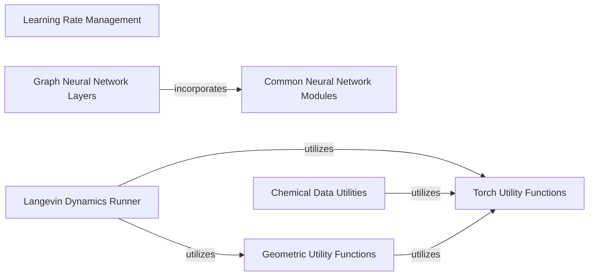

## Component Details

This graph illustrates the structure and interdependencies within the `General Utilities` subsystem of the ConfGF project. It highlights foundational helper functions for PyTorch operations, learning rate management, geometric calculations, and chemical data processing, along with core neural network components. The relationships show how different utility modules support the Langevin Dynamics simulations and how common neural network modules are integrated into graph neural network layers.

### Learning Rate Management
Handles the creation and management of learning rate schedulers, including a custom exponential decay with a minimum learning rate, crucial for stable model training.

**Related Classes/Methods**:

- <a href="https://github.com/DeepGraphLearning/ConfGF/blob/master/confgf/utils/torch.py#L61-L75" target="_blank" rel="noopener noreferrer">`ConfGF.confgf.utils.torch.get_scheduler` (61:75)</a>
- <a href="https://github.com/DeepGraphLearning/ConfGF/blob/master/confgf/utils/torch.py#L28-L46" target="_blank" rel="noopener noreferrer">`ConfGF.confgf.utils.torch.ExponentialLR_with_minLr` (28:46)</a>

### Langevin Dynamics Runner
Orchestrates the Langevin dynamics simulations for molecular structures, managing both distance and position-based updates, and converting score distances.

**Related Classes/Methods**:

- <a href="https://github.com/DeepGraphLearning/ConfGF/blob/master/confgf/runner/default_runner.py#L195-L218" target="_blank" rel="noopener noreferrer">`ConfGF.confgf.runner.default_runner.DefaultRunner.distance_Langevin_Dynamics` (195:218)</a>
- <a href="https://github.com/DeepGraphLearning/ConfGF/blob/master/confgf/runner/default_runner.py#L222-L258" target="_blank" rel="noopener noreferrer">`ConfGF.confgf.runner.default_runner.DefaultRunner.position_Langevin_Dynamics` (222:258)</a>
- <a href="https://github.com/DeepGraphLearning/ConfGF/blob/master/confgf/runner/default_runner.py#L187-L191" target="_blank" rel="noopener noreferrer">`ConfGF.confgf.runner.default_runner.DefaultRunner.convert_score_d` (187:191)</a>

### Graph Neural Network Layers
Provides the core building blocks for Graph Isomorphism Networks, including the GINE convolution and the overall network structure for processing graph-structured data.

**Related Classes/Methods**:

- <a href="https://github.com/DeepGraphLearning/ConfGF/blob/master/confgf/layers/gin.py#L66-L91" target="_blank" rel="noopener noreferrer">`ConfGF.confgf.layers.gin.GraphIsomorphismNetwork.__init__` (66:91)</a>
- <a href="https://github.com/DeepGraphLearning/ConfGF/blob/master/confgf/layers/gin.py#L95-L130" target="_blank" rel="noopener noreferrer">`ConfGF.confgf.layers.gin.GraphIsomorphismNetwork.forward` (95:130)</a>
- <a href="https://github.com/DeepGraphLearning/ConfGF/blob/master/confgf/layers/gin.py#L14-L61" target="_blank" rel="noopener noreferrer">`ConfGF.confgf.layers.gin.GINEConv` (14:61)</a>

### Common Neural Network Modules
Contains fundamental neural network components like Multi-Layer Perceptrons and various readout mechanisms (sum and mean) used across different models.

**Related Classes/Methods**:

- <a href="https://github.com/DeepGraphLearning/ConfGF/blob/master/confgf/layers/common.py#L47-L94" target="_blank" rel="noopener noreferrer">`ConfGF.confgf.layers.common.MultiLayerPerceptron` (47:94)</a>
- <a href="https://github.com/DeepGraphLearning/ConfGF/blob/master/confgf/layers/common.py#L28-L43" target="_blank" rel="noopener noreferrer">`ConfGF.confgf.layers.common.SumReadout` (28:43)</a>
- <a href="https://github.com/DeepGraphLearning/ConfGF/blob/master/confgf/layers/common.py#L10-L25" target="_blank" rel="noopener noreferrer">`ConfGF.confgf.layers.common.MeanReadout` (10:25)</a>

### Torch Utility Functions
A collection of general-purpose utility functions for PyTorch operations, such as norm clipping and other tensor manipulations.

**Related Classes/Methods**:

- <a href="https://github.com/DeepGraphLearning/ConfGF/blob/master/confgf/utils/torch.py#L8-L11" target="_blank" rel="noopener noreferrer">`ConfGF.confgf.utils.torch.clip_norm` (8:11)</a>

### Geometric Utility Functions
Provides functions for geometric calculations, specifically for deriving distances from positional data, essential for molecular structure analysis.

**Related Classes/Methods**:

- <a href="https://github.com/DeepGraphLearning/ConfGF/blob/master/confgf/utils/distgeom.py#L59-L60" target="_blank" rel="noopener noreferrer">`ConfGF.confgf.utils.distgeom.get_d_from_pos` (59:60)</a>

### Chemical Data Utilities
Offers functionalities for processing chemical data, including operations like removing duplicate molecules and converting molecular representations to SMILES strings.

**Related Classes/Methods**:

- <a href="https://github.com/DeepGraphLearning/ConfGF/blob/master/confgf/utils/chem.py#L83-L97" target="_blank" rel="noopener noreferrer">`ConfGF.confgf.utils.chem.remove_duplicate_mols` (83:97)</a>
- <a href="https://github.com/DeepGraphLearning/ConfGF/blob/master/confgf/utils/chem.py#L75-L76" target="_blank" rel="noopener noreferrer">`ConfGF.confgf.utils.chem.mol_to_smiles` (75:76)</a>

### [FAQ](https://github.com/CodeBoarding/GeneratedOnBoardings/tree/main?tab=readme-ov-file#faq)