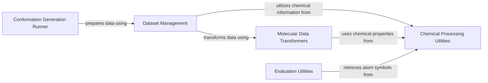

## Component Details

The Molecular Data Processing subsystem in ConfGF is responsible for the comprehensive handling of molecular data, from initial input to its transformation into a graph-based representation suitable for neural network models. This involves converting raw SMILES strings or RDKit molecular objects, managing various datasets, and enriching the molecular graphs with higher-order edges and essential chemical properties. It acts as the foundational layer for preparing all molecular inputs for subsequent model operations, ensuring data consistency and model readiness.

### Chemical Processing Utilities
Provides fundamental chemical utility functions, such as converting molecular objects to SMILES strings and retrieving atom symbols, which are crucial for various data processing and representation tasks within the ConfGF system.

**Related Classes/Methods**:

- <a href="https://github.com/DeepGraphLearning/ConfGF/blob/master/confgf/utils/chem.py#L83-L97" target="_blank" rel="noopener noreferrer">`confgf.utils.chem.remove_duplicate_mols` (83:97)</a>
- <a href="https://github.com/DeepGraphLearning/ConfGF/blob/master/confgf/utils/chem.py#L75-L76" target="_blank" rel="noopener noreferrer">`confgf.utils.chem.mol_to_smiles` (75:76)</a>
- <a href="https://github.com/DeepGraphLearning/ConfGF/blob/master/confgf/utils/chem.py#L71-L72" target="_blank" rel="noopener noreferrer">`confgf.utils.chem.get_atom_symbol` (71:72)</a>

### Molecular Data Transformers
Contains classes and methods for transforming molecular data structures, including adding higher-order edges, calculating edge lengths, and assigning edge names, which are essential steps in preparing data for graph-based models.

**Related Classes/Methods**:

- <a href="https://github.com/DeepGraphLearning/ConfGF/blob/master/confgf/utils/transforms.py#L18-L34" target="_blank" rel="noopener noreferrer">`confgf.utils.transforms.AddHigherOrderEdges.get_higher_order_adj_matrix` (18:34)</a>
- <a href="https://github.com/DeepGraphLearning/ConfGF/blob/master/confgf/utils/transforms.py#L36-L57" target="_blank" rel="noopener noreferrer">`confgf.utils.transforms.AddHigherOrderEdges.__call__` (36:57)</a>
- <a href="https://github.com/DeepGraphLearning/ConfGF/blob/master/confgf/utils/transforms.py#L88-L108" target="_blank" rel="noopener noreferrer">`confgf.utils.transforms.AddEdgeName.__call__` (88:108)</a>
- <a href="https://github.com/DeepGraphLearning/ConfGF/blob/master/confgf/utils/transforms.py#L59-L67" target="_blank" rel="noopener noreferrer">`confgf.utils.transforms.AddEdgeLength` (59:67)</a>
- <a href="https://github.com/DeepGraphLearning/ConfGF/blob/master/confgf/utils/transforms.py#L71-L76" target="_blank" rel="noopener noreferrer">`confgf.utils.transforms.AddPlaceHolder` (71:76)</a>

### Dataset Management
Manages the loading, preprocessing, and conversion of chemical datasets (like ISO17 and GEOM) into a format suitable for the ConfGF model. It includes functionalities to convert SMILES strings or RDKit molecular objects into data structures and to handle dataset initialization.

**Related Classes/Methods**:

- <a href="https://github.com/DeepGraphLearning/ConfGF/blob/master/confgf/dataset/dataset.py#L77-L124" target="_blank" rel="noopener noreferrer">`confgf.dataset.dataset.smiles_to_data` (77:124)</a>
- <a href="https://github.com/DeepGraphLearning/ConfGF/blob/master/confgf/dataset/dataset.py#L127-L158" target="_blank" rel="noopener noreferrer">`confgf.dataset.dataset.preprocess_iso17_dataset` (127:158)</a>
- <a href="https://github.com/DeepGraphLearning/ConfGF/blob/master/confgf/dataset/dataset.py#L164-L296" target="_blank" rel="noopener noreferrer">`confgf.dataset.dataset.preprocess_GEOM_dataset` (164:296)</a>
- <a href="https://github.com/DeepGraphLearning/ConfGF/blob/master/confgf/dataset/dataset.py#L299-L401" target="_blank" rel="noopener noreferrer">`confgf.dataset.dataset.get_GEOM_testset` (299:401)</a>
- <a href="https://github.com/DeepGraphLearning/ConfGF/blob/master/confgf/dataset/dataset.py#L27-L75" target="_blank" rel="noopener noreferrer">`confgf.dataset.dataset.rdmol_to_data` (27:75)</a>
- <a href="https://github.com/DeepGraphLearning/ConfGF/blob/master/confgf/dataset/dataset.py#L409-L414" target="_blank" rel="noopener noreferrer">`confgf.dataset.dataset.GEOMDataset.__init__` (409:414)</a>
- <a href="https://github.com/DeepGraphLearning/ConfGF/blob/master/confgf/dataset/dataset.py#L446-L448" target="_blank" rel="noopener noreferrer">`confgf.dataset.dataset.GEOMDataset_PackedConf.__init__` (446:448)</a>
- <a href="https://github.com/DeepGraphLearning/ConfGF/blob/master/confgf/dataset/dataset.py#L427-L432" target="_blank" rel="noopener noreferrer">`confgf.dataset.dataset.GEOMDataset._atom_types` (427:432)</a>
- <a href="https://github.com/DeepGraphLearning/ConfGF/blob/master/confgf/dataset/dataset.py#L434-L439" target="_blank" rel="noopener noreferrer">`confgf.dataset.dataset.GEOMDataset._edge_types` (434:439)</a>
- <a href="https://github.com/DeepGraphLearning/ConfGF/blob/master/confgf/dataset/dataset.py#L450-L481" target="_blank" rel="noopener noreferrer">`confgf.dataset.dataset.GEOMDataset_PackedConf._pack_data_by_mol` (450:481)</a>

### Conformation Generation Runner
Orchestrates the process of generating molecular conformations from SMILES strings using different ConfGF generator models (ConfGF and ConfGFDist). It handles data preparation, model invocation, and result processing.

**Related Classes/Methods**:

- <a href="https://github.com/DeepGraphLearning/ConfGF/blob/master/confgf/runner/default_runner.py#L307-L351" target="_blank" rel="noopener noreferrer">`confgf.runner.default_runner.DefaultRunner.generate_samples_from_smiles` (307:351)</a>
- <a href="https://github.com/DeepGraphLearning/ConfGF/blob/master/confgf/runner/default_runner.py#L260-L280" target="_blank" rel="noopener noreferrer">`confgf.runner.default_runner.DefaultRunner.ConfGF_generator` (260:280)</a>
- <a href="https://github.com/DeepGraphLearning/ConfGF/blob/master/confgf/runner/default_runner.py#L283-L304" target="_blank" rel="noopener noreferrer">`confgf.runner.default_runner.DefaultRunner.ConfGFDist_generator` (283:304)</a>

### Evaluation Utilities
Provides tools for evaluating the quality of generated molecular conformations, primarily by computing distance metrics like Maximum Mean Discrepancy (MMD) between generated and reference bond lengths.

**Related Classes/Methods**:

- <a href="https://github.com/DeepGraphLearning/ConfGF/blob/master/confgf/utils/evaluation.py#L41-L133" target="_blank" rel="noopener noreferrer">`confgf.utils.evaluation.evaluate_distance` (41:133)</a>
- <a href="https://github.com/DeepGraphLearning/ConfGF/blob/master/confgf/utils/evaluation.py#L162-L180" target="_blank" rel="noopener noreferrer">`confgf.utils.evaluation.compute_mmd` (162:180)</a>

### [FAQ](https://github.com/CodeBoarding/GeneratedOnBoardings/tree/main?tab=readme-ov-file#faq)