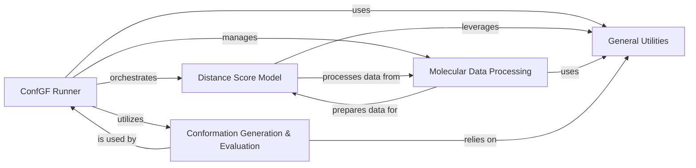

## Component Details

The ConfGF project implements a framework for generating molecular conformations using a score-based generative model. The main flow involves training a Distance Score Model to learn the distribution of inter-atomic distances, which is then used by the ConfGF Runner to generate 3D molecular structures through Langevin Dynamics. Molecular data is prepared and transformed by the Molecular Data Processing component, and the quality of generated conformations is assessed by the Conformation Generation & Evaluation module. Various General Utilities support these core functionalities.

### ConfGF Runner
The central orchestration component responsible for managing the entire ConfGF pipeline, including training the distance score model, evaluating its performance, and generating molecular conformations using Langevin Dynamics. It coordinates interactions between data handling, model execution, and evaluation modules.

**Related Classes/Methods**:

- <a href="https://github.com/DeepGraphLearning/ConfGF/blob/master/confgf/runner/default_runner.py#L18-L395" target="_blank" rel="noopener noreferrer">`ConfGF.confgf.runner.default_runner.DefaultRunner` (18:395)</a>
- <a href="https://github.com/DeepGraphLearning/ConfGF/blob/master/confgf/runner/default_runner.py#L110-L183" target="_blank" rel="noopener noreferrer">`ConfGF.confgf.runner.default_runner.DefaultRunner.train` (110:183)</a>
- <a href="https://github.com/DeepGraphLearning/ConfGF/blob/master/confgf/runner/default_runner.py#L79-L107" target="_blank" rel="noopener noreferrer">`ConfGF.confgf.runner.default_runner.DefaultRunner.evaluate` (79:107)</a>
- <a href="https://github.com/DeepGraphLearning/ConfGF/blob/master/confgf/runner/default_runner.py#L195-L218" target="_blank" rel="noopener noreferrer">`ConfGF.confgf.runner.default_runner.DefaultRunner.distance_Langevin_Dynamics` (195:218)</a>
- <a href="https://github.com/DeepGraphLearning/ConfGF/blob/master/confgf/runner/default_runner.py#L222-L258" target="_blank" rel="noopener noreferrer">`ConfGF.confgf.runner.default_runner.DefaultRunner.position_Langevin_Dynamics` (222:258)</a>

### Distance Score Model
Implements the core graph neural network model, DistanceScoreMatch, which learns to predict scores related to inter-atomic distances. This model is central to the ConfGF framework, utilizing graph convolutions and transformations to process molecular graphs and output distance-based scores.

**Related Classes/Methods**:

- <a href="https://github.com/DeepGraphLearning/ConfGF/blob/master/confgf/models/scorenet.py#L12-L200" target="_blank" rel="noopener noreferrer">`ConfGF.confgf.models.scorenet.DistanceScoreMatch` (12:200)</a>
- <a href="https://github.com/DeepGraphLearning/ConfGF/blob/master/confgf/models/scorenet.py#L48-L91" target="_blank" rel="noopener noreferrer">`ConfGF.confgf.models.scorenet.DistanceScoreMatch.extend_graph` (48:91)</a>
- <a href="https://github.com/DeepGraphLearning/ConfGF/blob/master/confgf/models/scorenet.py#L103-L122" target="_blank" rel="noopener noreferrer">`ConfGF.confgf.models.scorenet.DistanceScoreMatch.get_score` (103:122)</a>
- <a href="https://github.com/DeepGraphLearning/ConfGF/blob/master/confgf/models/scorenet.py#L124-L200" target="_blank" rel="noopener noreferrer">`ConfGF.confgf.models.scorenet.DistanceScoreMatch.forward` (124:200)</a>
- <a href="https://github.com/DeepGraphLearning/ConfGF/blob/master/confgf/layers/gin.py#L64-L130" target="_blank" rel="noopener noreferrer">`ConfGF.confgf.layers.gin.GraphIsomorphismNetwork` (64:130)</a>
- <a href="https://github.com/DeepGraphLearning/ConfGF/blob/master/confgf/layers/gin.py#L14-L61" target="_blank" rel="noopener noreferrer">`ConfGF.confgf.layers.gin.GINEConv` (14:61)</a>
- <a href="https://github.com/DeepGraphLearning/ConfGF/blob/master/confgf/layers/common.py#L47-L94" target="_blank" rel="noopener noreferrer">`ConfGF.confgf.layers.common.MultiLayerPerceptron` (47:94)</a>

### Molecular Data Processing
Handles the entire lifecycle of molecular data, from loading raw SMILES strings or RDKit molecules to transforming them into graph representations suitable for the neural network. This includes managing datasets, adding higher-order edges, and incorporating chemical properties.

**Related Classes/Methods**:

- <a href="https://github.com/DeepGraphLearning/ConfGF/blob/master/confgf/dataset/dataset.py#L77-L124" target="_blank" rel="noopener noreferrer">`ConfGF.confgf.dataset.dataset.smiles_to_data` (77:124)</a>
- <a href="https://github.com/DeepGraphLearning/ConfGF/blob/master/confgf/dataset/dataset.py#L27-L75" target="_blank" rel="noopener noreferrer">`ConfGF.confgf.dataset.dataset.rdmol_to_data` (27:75)</a>
- <a href="https://github.com/DeepGraphLearning/ConfGF/blob/master/confgf/dataset/dataset.py#L407-L439" target="_blank" rel="noopener noreferrer">`ConfGF.confgf.dataset.dataset.GEOMDataset` (407:439)</a>
- <a href="https://github.com/DeepGraphLearning/ConfGF/blob/master/confgf/dataset/dataset.py#L444-L492" target="_blank" rel="noopener noreferrer">`ConfGF.confgf.dataset.dataset.GEOMDataset_PackedConf` (444:492)</a>
- <a href="https://github.com/DeepGraphLearning/ConfGF/blob/master/confgf/utils/transforms.py#L8-L57" target="_blank" rel="noopener noreferrer">`ConfGF.confgf.utils.transforms.AddHigherOrderEdges` (8:57)</a>
- <a href="https://github.com/DeepGraphLearning/ConfGF/blob/master/confgf/utils/transforms.py#L59-L67" target="_blank" rel="noopener noreferrer">`ConfGF.confgf.utils.transforms.AddEdgeLength` (59:67)</a>
- <a href="https://github.com/DeepGraphLearning/ConfGF/blob/master/confgf/utils/chem.py#L75-L76" target="_blank" rel="noopener noreferrer">`ConfGF.confgf.utils.chem.mol_to_smiles` (75:76)</a>
- <a href="https://github.com/DeepGraphLearning/ConfGF/blob/master/confgf/utils/chem.py#L71-L72" target="_blank" rel="noopener noreferrer">`ConfGF.confgf.utils.chem.get_atom_symbol` (71:72)</a>

### Conformation Generation & Evaluation
Provides functionalities for generating 3D molecular conformations from distance matrices using distance geometry and for evaluating the quality of these generated conformations. It includes metrics like RMSD and MMD to assess structural accuracy.

**Related Classes/Methods**:

- <a href="https://github.com/DeepGraphLearning/ConfGF/blob/master/confgf/utils/distgeom.py#L39-L57" target="_blank" rel="noopener noreferrer">`ConfGF.confgf.utils.distgeom.Embed3D` (39:57)</a>
- <a href="https://github.com/DeepGraphLearning/ConfGF/blob/master/confgf/utils/distgeom.py#L3-L36" target="_blank" rel="noopener noreferrer">`ConfGF.confgf.utils.distgeom.embed_3D` (3:36)</a>
- <a href="https://github.com/DeepGraphLearning/ConfGF/blob/master/confgf/utils/distgeom.py#L59-L60" target="_blank" rel="noopener noreferrer">`ConfGF.confgf.utils.distgeom.get_d_from_pos` (59:60)</a>
- <a href="https://github.com/DeepGraphLearning/ConfGF/blob/master/confgf/utils/evaluation.py#L11-L32" target="_blank" rel="noopener noreferrer">`ConfGF.confgf.utils.evaluation.get_rmsd_confusion_matrix` (11:32)</a>
- <a href="https://github.com/DeepGraphLearning/ConfGF/blob/master/confgf/utils/evaluation.py#L35-L38" target="_blank" rel="noopener noreferrer">`ConfGF.confgf.utils.evaluation.evaluate_conf` (35:38)</a>
- <a href="https://github.com/DeepGraphLearning/ConfGF/blob/master/confgf/utils/evaluation.py#L162-L180" target="_blank" rel="noopener noreferrer">`ConfGF.confgf.utils.evaluation.compute_mmd` (162:180)</a>
- <a href="https://github.com/DeepGraphLearning/ConfGF/blob/master/confgf/utils/chem.py#L49-L57" target="_blank" rel="noopener noreferrer">`ConfGF.confgf.utils.chem.set_rdmol_positions` (49:57)</a>

### General Utilities
A collection of foundational helper functions that support various operations across the ConfGF project. This includes general PyTorch utilities for learning rate scheduling and tensor manipulation, as well as common readout functions for graph neural networks.

**Related Classes/Methods**:

- <a href="https://github.com/DeepGraphLearning/ConfGF/blob/master/confgf/utils/torch.py#L61-L75" target="_blank" rel="noopener noreferrer">`ConfGF.confgf.utils.torch.get_scheduler` (61:75)</a>
- <a href="https://github.com/DeepGraphLearning/ConfGF/blob/master/confgf/utils/torch.py#L8-L11" target="_blank" rel="noopener noreferrer">`ConfGF.confgf.utils.torch.clip_norm` (8:11)</a>
- <a href="https://github.com/DeepGraphLearning/ConfGF/blob/master/confgf/layers/common.py#L28-L43" target="_blank" rel="noopener noreferrer">`ConfGF.confgf.layers.common.SumReadout` (28:43)</a>
- <a href="https://github.com/DeepGraphLearning/ConfGF/blob/master/confgf/layers/common.py#L10-L25" target="_blank" rel="noopener noreferrer">`ConfGF.confgf.layers.common.MeanReadout` (10:25)</a>
- <a href="https://github.com/DeepGraphLearning/ConfGF/blob/master/confgf/utils/chem.py#L83-L97" target="_blank" rel="noopener noreferrer">`ConfGF.confgf.utils.chem.remove_duplicate_mols` (83:97)</a>

### [FAQ](https://github.com/CodeBoarding/GeneratedOnBoardings/tree/main?tab=readme-ov-file#faq)