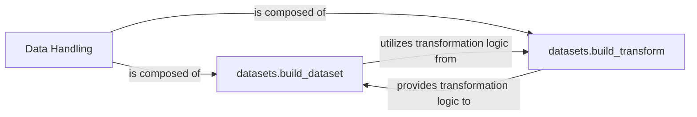

## Details

The Data Handling subsystem is central to the project's data pipeline, ensuring that raw input is transformed into a model-ready format. It is primarily implemented within the `datasets.py` module. The `build_dataset` function acts as the main entry point, orchestrating the data loading and integrating the necessary transformations. These transformations are meticulously defined and applied by the `build_transform` function, which encapsulates various preprocessing and augmentation techniques. This clear separation of concerns allows for flexible and robust data preparation, forming the foundation for subsequent model training and evaluation phases.

### Data Handling [[Expand]](./Data_Handling.md)
This is the overarching component responsible for the entire data preparation pipeline. It orchestrates the loading of raw datasets, the application of necessary transformations, and data augmentation to ensure data is in an optimal format for model consumption. It acts as the foundational layer for feeding data into the training and evaluation processes.

**Related Classes/Methods**:

- <a href="https://github.com/facebookresearch/ConvNeXt-V2/blob/main/datasets.py#L1-L99999" target="_blank" rel="noopener noreferrer">`datasets`:1-99999</a>

### datasets.build_dataset
This component is the orchestrator for dataset creation. It handles the loading of raw data and integrates the transformation logic to produce a ready-to-use dataset. It serves as the primary entry point for dataset instantiation within the system, abstracting the complexities of data source integration.

**Related Classes/Methods**:

- <a href="https://github.com/facebookresearch/ConvNeXt-V2/blob/main/datasets.py#L16-L47" target="_blank" rel="noopener noreferrer">`datasets.build_dataset`:16-47</a>

### datasets.build_transform
This component specializes in constructing the data transformation pipeline. It defines and applies various preprocessing steps such as resizing, cropping, normalization, and color jittering, which are crucial for preparing raw data into a suitable format for model input. It encapsulates the logic for data augmentation and normalization.

**Related Classes/Methods**:

- <a href="https://github.com/facebookresearch/ConvNeXt-V2/blob/main/datasets.py#L50-L96" target="_blank" rel="noopener noreferrer">`datasets.build_transform`:50-96</a>

### [FAQ](https://github.com/CodeBoarding/GeneratedOnBoardings/tree/main?tab=readme-ov-file#faq)