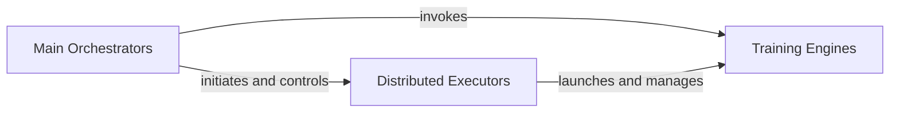

## Details

The Experiment Orchestration subsystem is the central control unit for managing the entire lifecycle of machine learning experiments, encompassing both pretraining and finetuning. It orchestrates data flow, model interaction, and optimization, acting as the primary pipeline manager.

### Main Orchestrators
These components serve as the primary entry points for experiments. They are responsible for parsing command-line arguments, setting up the execution environment (e.g., distributed mode), initializing the model, data loaders, and optimizers. They orchestrate the overall training and evaluation pipeline, acting as the top-level coordinators.

**Related Classes/Methods**:

- <a href="https://github.com/facebookresearch/ConvNeXt-V2/blob/main/main_finetune.py#L184-L430" target="_blank" rel="noopener noreferrer">`main_finetune.main`:184-430</a>
- <a href="https://github.com/facebookresearch/ConvNeXt-V2/blob/main/main_pretrain.py#L102-L216" target="_blank" rel="noopener noreferrer">`main_pretrain.main`:102-216</a>

### Distributed Executors
These components facilitate the execution of experiments in distributed environments, primarily leveraging tools like Submitit. They manage the distributed setup, job submission, and encapsulate the training logic to be executed across multiple nodes or GPUs, abstracting away the complexities of distributed training.

**Related Classes/Methods**:

- <a href="https://github.com/facebookresearch/ConvNeXt-V2/blob/main/submitit_finetune.py" target="_blank" rel="noopener noreferrer">`submitit_finetune.Trainer`</a>
- <a href="https://github.com/facebookresearch/ConvNeXt-V2/blob/main/submitit_pretrain.py" target="_blank" rel="noopener noreferrer">`submitit_pretrain.Trainer`</a>

### Training Engines
These components implement the core training and evaluation logic for a single epoch. This includes iterating over data, performing forward and backward passes, updating model weights, and accumulating performance metrics. They are the workhorses that execute the actual learning process.

**Related Classes/Methods**:

- <a href="https://github.com/facebookresearch/ConvNeXt-V2/blob/main/engine_finetune.py#L20-L117" target="_blank" rel="noopener noreferrer">`engine_finetune.train_one_epoch`:20-117</a>
- <a href="https://github.com/facebookresearch/ConvNeXt-V2/blob/main/engine_pretrain.py#L16-L70" target="_blank" rel="noopener noreferrer">`engine_pretrain.train_one_epoch`:16-70</a>

### [FAQ](https://github.com/CodeBoarding/GeneratedOnBoardings/tree/main?tab=readme-ov-file#faq)