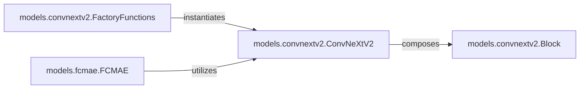

## Details

The ConvNeXtV2 subsystem is centered around the `ConvNeXtV2` model, which is fundamentally built from modular `Block` components. Each `Block` represents a core processing unit, and `ConvNeXtV2` sequences these blocks to form the complete neural network. To facilitate easy model creation, `FactoryFunctions` provide pre-configured instances of `ConvNeXtV2`. Furthermore, the `FCMAE` component demonstrates a practical application of the ConvNeXtV2 architecture, leveraging it as an encoder within a larger autoencoder framework for self-supervised learning. This structure highlights a clear separation of concerns: modular building blocks, a composite model, and higher-level applications.

### models.convnextv2.ConvNeXtV2
This class defines the complete neural network structure for the ConvNeXtV2 model, encompassing layer definitions, weight initialization, and the forward pass logic. It orchestrates the data flow through the network by composing and processing data through its internal `Block` instances.

**Related Classes/Methods**:

- <a href="https://github.com/facebookresearch/ConvNeXt-V2/blob/main/models/convnextv2.py#L45-L106" target="_blank" rel="noopener noreferrer">`models.convnextv2.ConvNeXtV2`:45-106</a>

### models.convnextv2.Block
This component encapsulates a specific set of operations, such as convolutions, normalizations, and activations, forming a single, reusable layer or stage within the ConvNeXtV2 network. It processes input data and passes the output to the next Block in the sequence, contributing to the overall forward pass.

**Related Classes/Methods**:

- <a href="https://github.com/facebookresearch/ConvNeXt-V2/blob/main/models/convnextv2.py#L14-L43" target="_blank" rel="noopener noreferrer">`models.convnextv2.Block`:14-43</a>

### models.convnextv2.FactoryFunctions
These functions (`convnextv2_atto`, `convnextv2_tiny`, etc.) provide a standardized and abstracted way to create different scaled or configured instances of the `ConvNeXtV2` model. They abstract the complex instantiation logic and configuration details, allowing users to easily select and instantiate desired model variants.

**Related Classes/Methods**:

- <a href="https://github.com/facebookresearch/ConvNeXt-V2/blob/main/models/convnextv2.py#L108-L110" target="_blank" rel="noopener noreferrer">`models.convnextv2.convnextv2_atto`:108-110</a>
- <a href="https://github.com/facebookresearch/ConvNeXt-V2/blob/main/models/convnextv2.py#L124-L126" target="_blank" rel="noopener noreferrer">`models.convnextv2.convnextv2_tiny`:124-126</a>

### models.fcmae.FCMAE
This class implements the Fully Convolutional Masked Autoencoder (FCMAE) architecture. It leverages a `SparseConvNeXtV2` (a variant of ConvNeXtV2) as its encoder and includes a decoder and prediction head for reconstructing masked image patches, primarily for self-supervised pre-training.

**Related Classes/Methods**:

- <a href="https://github.com/facebookresearch/ConvNeXt-V2/blob/main/models/fcmae.py#L22-L190" target="_blank" rel="noopener noreferrer">`models.fcmae.FCMAE`:22-190</a>

### [FAQ](https://github.com/CodeBoarding/GeneratedOnBoardings/tree/main?tab=readme-ov-file#faq)