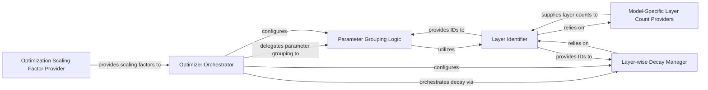

## Details

The `Optimization & Scheduling` subsystem is primarily encapsulated within the `optim_factory.py` module. This module is responsible for the comprehensive creation, configuration, and management of optimizers, including advanced strategies like layer-wise learning rate decay and parameter grouping, which are crucial for efficient and effective model training, especially in fine-tuning scenarios.

### Optimizer Orchestrator
Acts as the primary entry point for constructing and configuring the optimizer. It integrates various parameter grouping and decay strategies to produce a ready-to-use optimizer instance.

**Related Classes/Methods**:

- <a href="https://github.com/facebookresearch/ConvNeXt-V2/blob/main/optim_factory.py#L140-L222" target="_blank" rel="noopener noreferrer">`optim_factory.create_optimizer`:140-222</a>

### Parameter Grouping Logic
Organizes model parameters into distinct groups, allowing for the application of different optimization settings (e.g., learning rates, weight decays) to different parts of the model. This is crucial for advanced optimization strategies.

**Related Classes/Methods**:

- <a href="https://github.com/facebookresearch/ConvNeXt-V2/blob/main/optim_factory.py#L97-L137" target="_blank" rel="noopener noreferrer">`optim_factory.get_parameter_groups`:97-137</a>

### Layer-wise Decay Manager
Manages the assignment of specific learning rate decay values to different layers of the model, enabling fine-grained control over the optimization process, particularly for transfer learning or fine-tuning scenarios.

**Related Classes/Methods**:

- <a href="https://github.com/facebookresearch/ConvNeXt-V2/blob/main/optim_factory.py#L81-L94" target="_blank" rel="noopener noreferrer">`optim_factory.LayerDecayValueAssigner`:81-94</a>

### Layer Identifier
Determines the unique numerical ID of a given module or layer within the neural network architecture. This identification is fundamental for implementing layer-wise decay and parameter grouping.

**Related Classes/Methods**:

- <a href="https://github.com/facebookresearch/ConvNeXt-V2/blob/main/optim_factory.py#L90-L94" target="_blank" rel="noopener noreferrer">`optim_factory.get_layer_id`:90-94</a>

### Model-Specific Layer Count Providers
Provide the total number of layers specific to ConvNeXt model variants. These utility functions assist the `Layer Identifier` in correctly calculating layer IDs based on the model's architecture.

**Related Classes/Methods**:

- <a href="https://github.com/facebookresearch/ConvNeXt-V2/blob/main/optim_factory.py#L51-L79" target="_blank" rel="noopener noreferrer">`optim_factory.get_num_layer_for_convnext`:51-79</a>
- <a href="https://github.com/facebookresearch/ConvNeXt-V2/blob/main/optim_factory.py#L32-L48" target="_blank" rel="noopener noreferrer">`optim_factory.get_num_layer_for_convnext_single`:32-48</a>

### Optimization Scaling Factor Provider
Supplies scaling factors that can be applied to learning rates or other optimization parameters. This is likely used for fine-tuning or specific training regimes, allowing external configuration to influence optimization behavior.

**Related Classes/Methods**:

- <a href="https://github.com/facebookresearch/ConvNeXt-V2/blob/main/optim_factory.py#L87-L88" target="_blank" rel="noopener noreferrer">`optim_factory.get_scale`:87-88</a>

### [FAQ](https://github.com/CodeBoarding/GeneratedOnBoardings/tree/main?tab=readme-ov-file#faq)