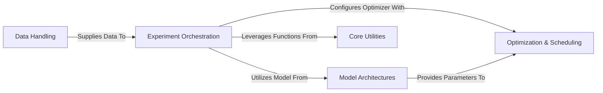

## Details

The ConvNeXt-V2 project is structured as an ML toolkit, primarily focused on computer vision tasks, with a strong emphasis on model-centric design. The core data flow revolves around the Experiment Orchestration component, which acts as the central coordinator. It initiates the process by requesting and receiving prepared data from the Data Handling component. Subsequently, it utilizes models defined within the Model Architectures component and configures their training process using optimizers and schedulers provided by the Optimization & Scheduling component. Throughout these operations, Experiment Orchestration leverages various helper functions from the Core Utilities component for tasks like distributed training and model saving. This pipeline-like structure allows for clear separation of concerns, making the system modular and extensible for different pretraining and finetuning experiments. The ConvNeXt-V2 architecture is designed as a modular ML toolkit, centered around the Experiment Orchestration component. This orchestrator drives the entire machine learning workflow, from data ingestion to model training and evaluation. It begins by interacting with the Data Handling component to acquire and preprocess datasets. These datasets are then fed into models defined within the Model Architectures component. The training process for these models is meticulously managed by the Optimization & Scheduling component, which provides the necessary optimizers and learning rate strategies. Throughout these operations, the Core Utilities component offers essential support, particularly for distributed computing and model persistence. This clear separation of concerns facilitates independent development and maintenance of each component, promoting reusability and scalability within the ConvNeXt-V2 project.

### Data Handling [[Expand]](./Data_Handling.md)
Manages the entire data pipeline, from loading raw datasets to applying necessary transformations and augmentations, ensuring data is in a suitable format for model consumption.

**Related Classes/Methods**:

- <a href="https://github.com/facebookresearch/ConvNeXt-V2/blob/main/datasets.py" target="_blank" rel="noopener noreferrer">`datasets.py`</a>
- <a href="https://github.com/facebookresearch/ConvNeXt-V2/blob/main/datasets.py#L16-L47" target="_blank" rel="noopener noreferrer">`datasets.build_dataset`:16-47</a>
- <a href="https://github.com/facebookresearch/ConvNeXt-V2/blob/main/datasets.py#L50-L96" target="_blank" rel="noopener noreferrer">`datasets.build_transform`:50-96</a>

### Model Architectures [[Expand]](./Model_Architectures.md)
Encapsulates the definitions and forward pass logic for the ConvNeXtV2 and FCMAE models. This component is the intellectual core, defining the neural network structures.

**Related Classes/Methods**:

- <a href="https://github.com/facebookresearch/ConvNeXt-V2/blob/main/models/convnextv2.py" target="_blank" rel="noopener noreferrer">`models/convnextv2.py`</a>
- <a href="https://github.com/facebookresearch/ConvNeXt-V2/blob/main/models/fcmae.py" target="_blank" rel="noopener noreferrer">`models/fcmae.py`</a>
- <a href="https://github.com/facebookresearch/ConvNeXt-V2/blob/main/models/convnextv2.py#L56-L90" target="_blank" rel="noopener noreferrer">`models.convnextv2.__init__`:56-90</a>
- <a href="https://github.com/facebookresearch/ConvNeXt-V2/blob/main/models/convnextv2.py#L103-L106" target="_blank" rel="noopener noreferrer">`models.convnextv2.forward`:103-106</a>
- <a href="https://github.com/facebookresearch/ConvNeXt-V2/blob/main/models/fcmae.py#L186-L190" target="_blank" rel="noopener noreferrer">`models.fcmae.forward`:186-190</a>
- <a href="https://github.com/facebookresearch/ConvNeXt-V2/blob/main/models/fcmae.py#L164-L184" target="_blank" rel="noopener noreferrer">`models.fcmae.forward_loss`:164-184</a>

### Optimization & Scheduling [[Expand]](./Optimization_Scheduling.md)
Handles the creation and configuration of optimizers, learning rate schedulers, and advanced parameter grouping strategies, crucial for efficient model training.

**Related Classes/Methods**:

- <a href="https://github.com/facebookresearch/ConvNeXt-V2/blob/main/optim_factory.py" target="_blank" rel="noopener noreferrer">`optim_factory.py`</a>
- <a href="https://github.com/facebookresearch/ConvNeXt-V2/blob/main/optim_factory.py#L140-L222" target="_blank" rel="noopener noreferrer">`optim_factory.create_optimizer`:140-222</a>
- <a href="https://github.com/facebookresearch/ConvNeXt-V2/blob/main/optim_factory.py#L81-L94" target="_blank" rel="noopener noreferrer">`optim_factory.LayerDecayValueAssigner`:81-94</a>

### Experiment Orchestration [[Expand]](./Experiment_Orchestration.md)
The central control unit for managing the entire lifecycle of machine learning experiments, including both pretraining and finetuning. It orchestrates data flow, model interaction, and optimization, acting as the primary pipeline manager.

**Related Classes/Methods**:

- <a href="https://github.com/facebookresearch/ConvNeXt-V2/blob/main/main_finetune.py" target="_blank" rel="noopener noreferrer">`main_finetune.py`</a>
- <a href="https://github.com/facebookresearch/ConvNeXt-V2/blob/main/submitit_finetune.py" target="_blank" rel="noopener noreferrer">`submitit_finetune.py`</a>
- <a href="https://github.com/facebookresearch/ConvNeXt-V2/blob/main/engine_finetune.py" target="_blank" rel="noopener noreferrer">`engine_finetune.py`</a>
- <a href="https://github.com/facebookresearch/ConvNeXt-V2/blob/main/main_pretrain.py" target="_blank" rel="noopener noreferrer">`main_pretrain.py`</a>
- <a href="https://github.com/facebookresearch/ConvNeXt-V2/blob/main/submitit_pretrain.py" target="_blank" rel="noopener noreferrer">`submitit_pretrain.py`</a>
- <a href="https://github.com/facebookresearch/ConvNeXt-V2/blob/main/engine_pretrain.py" target="_blank" rel="noopener noreferrer">`engine_pretrain.py`</a>
- <a href="https://github.com/facebookresearch/ConvNeXt-V2/blob/main/main_finetune.py#L184-L430" target="_blank" rel="noopener noreferrer">`main_finetune.main`:184-430</a>
- <a href="https://github.com/facebookresearch/ConvNeXt-V2/blob/main/submitit_finetune.py" target="_blank" rel="noopener noreferrer">`submitit_finetune.Trainer`</a>
- <a href="https://github.com/facebookresearch/ConvNeXt-V2/blob/main/engine_finetune.py#L20-L117" target="_blank" rel="noopener noreferrer">`engine_finetune.train_one_epoch`:20-117</a>
- <a href="https://github.com/facebookresearch/ConvNeXt-V2/blob/main/main_pretrain.py#L102-L216" target="_blank" rel="noopener noreferrer">`main_pretrain.main`:102-216</a>
- <a href="https://github.com/facebookresearch/ConvNeXt-V2/blob/main/submitit_pretrain.py" target="_blank" rel="noopener noreferrer">`submitit_pretrain.Trainer`</a>
- <a href="https://github.com/facebookresearch/ConvNeXt-V2/blob/main/engine_pretrain.py#L16-L70" target="_blank" rel="noopener noreferrer">`engine_pretrain.train_one_epoch`:16-70</a>

### Core Utilities
Provides a set of foundational helper functions that support various aspects of the ML pipeline, particularly distributed training, model persistence, and process management.

**Related Classes/Methods**:

- <a href="https://github.com/facebookresearch/ConvNeXt-V2/blob/main/utils.py" target="_blank" rel="noopener noreferrer">`utils.py`</a>
- <a href="https://github.com/facebookresearch/ConvNeXt-V2/blob/main/utils.py#L310-L346" target="_blank" rel="noopener noreferrer">`utils.init_distributed_mode`:310-346</a>
- <a href="https://github.com/facebookresearch/ConvNeXt-V2/blob/main/utils.py#L450-L472" target="_blank" rel="noopener noreferrer">`utils.save_model`:450-472</a>
- <a href="https://github.com/facebookresearch/ConvNeXt-V2/blob/main/utils.py#L302-L303" target="_blank" rel="noopener noreferrer">`utils.is_main_process`:302-303</a>

### [FAQ](https://github.com/CodeBoarding/GeneratedOnBoardings/tree/main?tab=readme-ov-file#faq)