```mermaid
graph LR
    SDK_Core_Backend_AI_Orchestration["SDK Core / Backend AI Orchestration"]
    Agent_Abstraction_Layer["Agent Abstraction Layer"]
    Agent_Framework_Integrations["Agent Framework Integrations"]
    SDK_Core_Backend_AI_Orchestration -- "initiates and manages workflows through" --> Agent_Abstraction_Layer
    Agent_Abstraction_Layer -- "defines contract for" --> Agent_Framework_Integrations
    Agent_Framework_Integrations -- "adheres to contract of" --> Agent_Abstraction_Layer
    click Agent_Abstraction_Layer href "https://github.com/CodeBoarding/GeneratedOnBoardings/blob/main/CopilotKit/Agent_Abstraction_Layer.md" "Details"
    click Agent_Framework_Integrations href "https://github.com/CodeBoarding/GeneratedOnBoardings/blob/main/CopilotKit/Agent_Framework_Integrations.md" "Details"
```

## Details

Abstract Components Overview

### SDK Core / Backend AI Orchestration
This component represents the core backend logic responsible for orchestrating and managing AI workflows within the CopilotKit. It acts as the primary consumer of the `Agent Abstraction Layer`, initiating and coordinating interactions with various AI agents to fulfill user requests or system tasks. It handles the high-level flow of operations, delegating specific AI-related tasks to the abstracted agent interfaces.

**Related Classes/Methods**: _None_

### Agent Abstraction Layer [[Expand]](./Agent_Abstraction_Layer.md)
This component establishes a standardized interface and contract for all AI agents integrated within the CopilotKit ecosystem. Its primary role is to ensure interoperability, enabling the SDK Core and other high-level components to interact uniformly with diverse underlying agent frameworks (e.g., LangGraph, CrewAI). It provides a common abstraction that simplifies the integration and management of various AI agent implementations.

**Related Classes/Methods**:

- <a href="https://github.com/CopilotKit/CopilotKit/blob/main/sdk-python/copilotkit/agent.py#L14-L65" target="_blank" rel="noopener noreferrer">`copilotkit.agent.agent:Agent` (14:65)</a>

### Agent Framework Integrations [[Expand]](./Agent_Framework_Integrations.md)
This component encompasses the concrete implementations of various AI agent frameworks (e.g., LangGraph, CrewAI) that are integrated into the CopilotKit. These integrations adhere to the contract defined by the `Agent Abstraction Layer`, providing the actual logic and functionality for specific agent types. They translate the abstract agent interface calls into framework-specific operations.

**Related Classes/Methods**:

- <a href="https://github.com/CopilotKit/CopilotKit/blob/main/sdk-python/copilotkit/crewai/crewai_agent.py#L1-L1" target="_blank" rel="noopener noreferrer">`copilotkit.crewai.crewai_agent:CrewAIAgent` (1:1)</a>
- <a href="https://github.com/CopilotKit/CopilotKit/blob/main/sdk-python/copilotkit/langgraph_agent.py#L84-L717" target="_blank" rel="noopener noreferrer">`copilotkit.langgraph_agent.langgraph_agent:LangGraphAgent` (84:717)</a>

### [FAQ](https://github.com/CodeBoarding/GeneratedOnBoardings/tree/main?tab=readme-ov-file#faq)