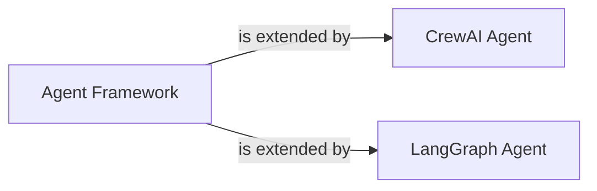

## Details

This subsystem forms the core of AI agent definition and management within CopilotKit, providing a flexible and extensible foundation for integrating various AI orchestration frameworks.

### Agent Framework [[Expand]](./Agent_Framework.md)
This foundational component defines the core abstractions and extensible interfaces for AI agents within CopilotKit. It includes base classes for agents, mechanisms for defining actions, and managing parameters, enabling a modular approach to agent development. It serves as the blueprint for all specialized agent implementations.

**Related Classes/Methods**:

- `copilotkit.agent`

### CrewAI Agent
A specialized implementation of the `Agent Framework` tailored for integration with the CrewAI orchestration framework. It adapts the generic agent interface to leverage CrewAI's specific features for multi-agent systems and task management.

**Related Classes/Methods**:

- <a href="https://github.com/CopilotKit/CopilotKit/blob/main/sdk-python/copilotkit/crewai/crewai_agent.py" target="_blank" rel="noopener noreferrer">`copilotkit.crewai.crewai_agent.CrewAIAgent`</a>

### LangGraph Agent
A specialized implementation of the `Agent Framework` designed for integration with the LangGraph library. It provides the necessary adaptations to utilize LangGraph's capabilities for building complex, stateful agentic workflows and graphs.

**Related Classes/Methods**:

- <a href="https://github.com/CopilotKit/CopilotKit/blob/main/sdk-python/copilotkit/langgraph_agent.py#L84-L716" target="_blank" rel="noopener noreferrer">`copilotkit.langgraph_agent.LangGraphAgent` (84:716)</a>

### [FAQ](https://github.com/CodeBoarding/GeneratedOnBoardings/tree/main?tab=readme-ov-file#faq)